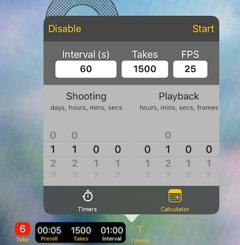
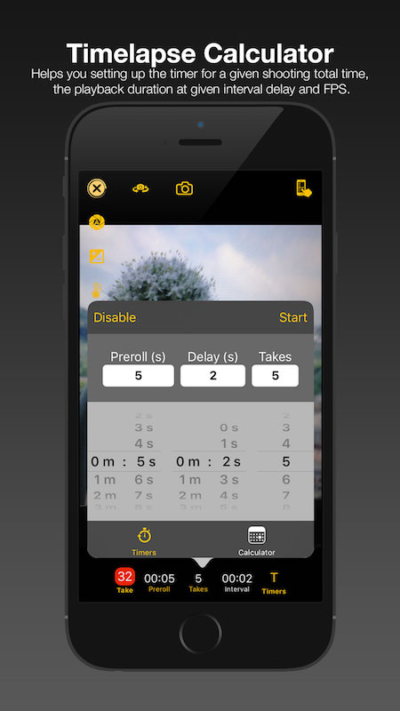
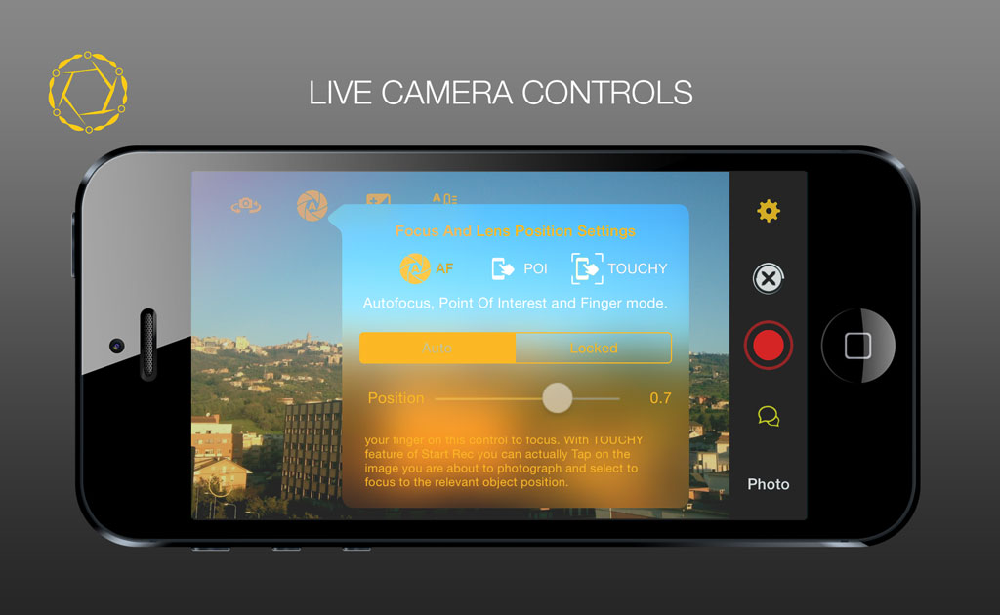

# Startrec

For some years I worked with and published mobile apps. Albeit mostly on the iOS Apple platform, I ventured into porting onto Android (JAVA, Kotlin) as well.
This post lists the apps I worked on, worth of being published. Make sure you check those open-source ones, as their code is available for download.

> Modern software programs usually known as Apps...



Unless otherwise stated, I took care of
- designing all the graphical elements of the apps
- designing the UI/UX
- creating the promo videos
- writing/arranging the musics
- everything else



# STARTREC multicam timelapse

A multi-camera audio/video/photo recording app with time-synchronization across all networked instances.

Sadly, the project is at the moment paused due to lack of time.

## Feature List

- audio, video and timelapse photography;
- media gallery;
- time-lapse calculator;
- time synchronization;
- media synchronization;
- GIF generator;
- supported **iCloud Drive**
- fully customizable touch interface for camera controls;

## Timelapse calculator

There are two ways you can use the timelapse calculator combined with:

- Entering the desired *interval* duration, expected *takes* and *fps* rate,
- Selecting the desired *shooting duration*, *interval* time, *fps* rate, and *playback time*.

Either ways, the calculator will inform you about:

- the required time to complete the timelapse recording with the displayed parameters.
- the resulting playing time at the given FPS rate.

## Timed recordings

Start Rec App runs two timers that can be run pressing the trigger button while in camera preview:

- A **preroll** timer which runs only once when the recording commences.
- An **interval** timer which waits between each take operation.

If the audio or video recording mode is selected when a timed recording is starting, for each expected take there will be a `start` trigger and a subsequent `stop` trigger.

## MANUAL CAMERA CONTROLS

Activate the Touchy feature and when using the Camera, you can change focus and exposure by sliding your finger across the display.

## Videos

StartRec App Promo Video



Touch live controls



Live session footage



## Music Credits
 The promo music is composed and performed by Christian Cellini used with permission.

