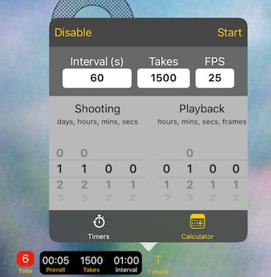
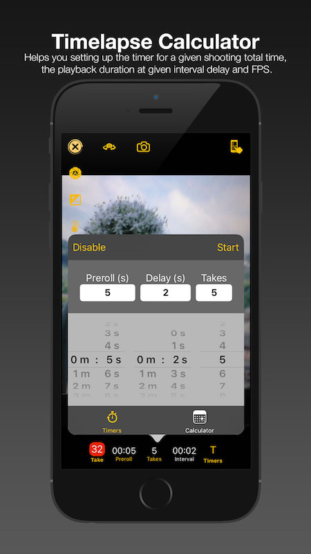
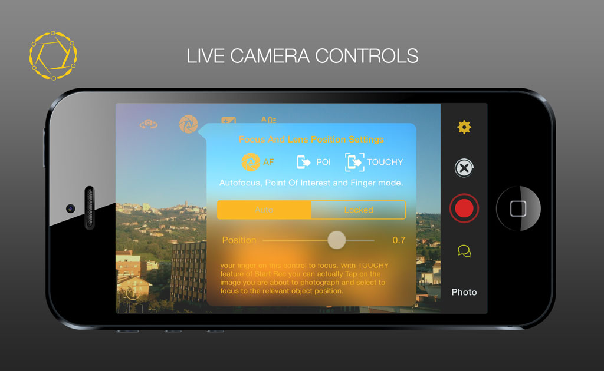

# Mobile Apps

For some years I worked with and published mobile apps. Albeit mostly on the iOS Apple platform, I ventured into porting onto Android (JAVA, Kotlin) as well.
This post lists the apps I worked on, worth of being published. Make sure you check those open-source ones, as their code is available for download.

> Modern software programs usually known as Apps...



Unless otherwise stated, I took care of
- designing all the graphical elements of the apps
- designing the UI/UX
- creating the promo videos
- writing/arranging the musics
- everything else



# ANTOINE: *that* little Prince 🤴

This text reader App implements a pretty new and interactive paradigm to enjoy a written story.

## Feature List

- it encompass the Little Prince's story by Antoine De Saint Exupery in four different languages (limited only by the number of translations available)
- each paragraph of the text can respond to a single touch
- the resulting behaviour can be customized between displaying a different translation in a circular order between all the available ones or
- the displayed language can be alternatively chosen between twos.
- the text color can be customized for each language
- the font size can be customized for each language
- the drawing and figures are presented along the text and by interacting with them, the user is offered a parallax rendition of them, with gyroscopic sensor active
- a shoot-em-all game can be run anytime, on a side-scrolling parallax screen with most of the drawings appearing both as moving background or as bonus/enemies.
- the music during the game changes dynamically style depending on the game conditions.



> The music on the promo video is composed and performed by Christian Cellini and it is used with his permission.

# CHATEA messaging app

{{< style "img { height: 1.25rem; }" >}}



Messaging app for nearby devices over Bluetooth or Wifi network.

## Feature List

- text messages with emoji support;
- photo attachments;
- hand-drawn sketches;
- PTT (push-to-talk) voice messages like a walkie talkie;

## iOS [Source Code](https://github.com/lucaji/chatea).

> the name "Chatea" joins the substantives "Chat" and "tea", but "cha" means "tea" in mandarin and the ideogram in the logo remarks this association.

# MYTUNA tunings librarian

{{< style "img { height: 1.25rem; }" >}}



A librarian app to store and collect various tunings for stringed instruments. It featured:

- a sine wave tone generator to generate the correct notes;
- a preview of the tuning played as plucked arpeggio or strumming arpeggiator;
- iCloud Drive support and exporting all tunings as CSV files for Excel;
- Pitch recognition;
- Reference tone generation;
- trasposition;



## iOS [Source Code](https://github.com/lucaji/mytuna).

# PIANOTONER aka ToneTuna

## iOS [Source Code](https://github.com/lucaji/pianotoner_ios) 

{{< style "img { height: 1.25rem; }" >}}



## Android [Source Code](https://github.com/lucaji/pianotoner_android) 

{{< style "img { height: 1.25rem; }" >}}



Another app from the *tuna series: a sine tone generator equipped with a interactive piano-like keyboard able to generate the correct note frequencies for the entire 88 keys of the piano. The catch is that is possible to adjust the concert "A" reference frequency in order to get a different character to the whole piano if you are, like me, into actually tuning acoustic pianos :)



# SHARI pdf reader with web server

{{< style "img { height: 1.25rem; }" >}}



PDF reader plus local webDAV server for upload/download of documents. This simple app combines two great open source projects into one:

It has a very nice reader for PDF files, and the addition of the WebDAV server gives the option to directly upload/download files onto the App's local directory on the device is running onto. For those who don't want to use cloud services, but good-old transfer and management of own files and documents.

## iOS [Source Code](https://github.com/lucaji/Shari)

# STARTREC multicam timelapse

A multi-camera audio/video/photo recording app with time-synchronization across all networked instances.

Sadly, the project is at the moment paused due to lack of time.

## Feature List

- audio, video and timelapse photography;
- media gallery;
- time-lapse calculator;
- time synchronization;
- media synchronization;
- GIF generator;
- supported **iCloud Drive**
- fully customizable touch interface for camera controls;

## Timelapse calculator

There are two ways you can use the timelapse calculator combined with:

- Entering the desired *interval* duration, expected *takes* and *fps* rate,
- Selecting the desired *shooting duration*, *interval* time, *fps* rate, and *playback time*.

Either ways, the calculator will inform you about:

- the required time to complete the timelapse recording with the displayed parameters.
- the resulting playing time at the given FPS rate.

## Timed recordings

Start Rec App runs two timers that can be run pressing the trigger button while in camera preview:

- A **preroll** timer which runs only once when the recording commences.
- An **interval** timer which waits between each take operation.

If the audio or video recording mode is selected when a timed recording is starting, for each expected take there will be a `start` trigger and a subsequent `stop` trigger.

## MANUAL CAMERA CONTROLS

Activate the Touchy feature and when using the Camera, you can change focus and exposure by sliding your finger across the display.

## Videos

StartRec App Promo Video



Touch live controls



Live session footage



## Music Credits
 The promo music is composed and performed by Christian Cellini used with permission.

