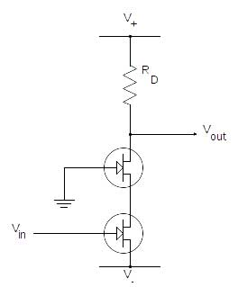

# Diretta Iniezione

# DI Box

a simple audio preamplifier for dynamic microphones with internal noiseless power supply (AC powered).

- Class A FET input stage with high linearity and large bandwidth.
- XLR input with gain control
- Line output (balanced/unbalanced)
- low noise and low distortion
- high bandwidth

Found in need to record sounds with a Shure SM58 into a computer, I decided to build my own little preamplifier so I could plug it to the Mac's line input jack and have a decent timbre and a low noise figure by choosing a voltage controlled amplifier using a single FET, well known for their tube-like sonority and their advantages over a current controller amp.

## Input stage

I personally like the sonority of the 12AX7 triode input stage of a classic Fender guitar amp even when using a microphone (dynamic) instead of a magnetic pick-up (in case of a dynamic microphone it is exactly the same thing).
The tone can be always adjusted and the end of the chain, even in analog domain via an EQ, or in digital domain after sampling it with your favourite DAW and applying a digital EQ filter boosting or shelving frequencies at your liking.
The dynamic response of this kind of pre-amp pleases my ear and the spectrogram when acquired.
These are the main reason for this project to be.
I avoided the USB port as power supply to avoid ground loops and noises from the computer (hisses), but being very practical, it might be a cool idea for a next revision.



Both the triode version and the FET version works in a very similar way, by using a negative voltage controlled feedback to adjust their transconductance. Using 18V as power supply guarantees a very high dynamic range.

A better and complete explanation is given by the [Fetzer Valve Article](http://runoffgroove.com/fetzervalve.html), from which I took the initial inspiration and I ended up learning a bit more than when I started.

Any JFET would do go, but I had a stash of 2SK30 and 2N5457 to choose from; I made some tests and ended up with the 2N5457 at the end.



There was still some DC offset, which was due a defective trimmer for the bias voltage.



The visible distortion in this last scope image is produced by a number of factors which won't affect the scope of the project at all:

- The output of the 1kHz sine wave as captured by the Shure M58 at maximum gain.
- I did not use any reference levels and the audio source was the Mac’s speaker itself.

But the voice recorded with it, sounded graceful and very crisp.

## Audio Sample

If you want to listen to a voice recording made with **Diretta Iniezione**, this [vimeo link](https://vimeo.com/97137760) might be helpful.

## Cascode configuration

I would consider working on a second prototype with a cascode configuration:



but that's all for now!



