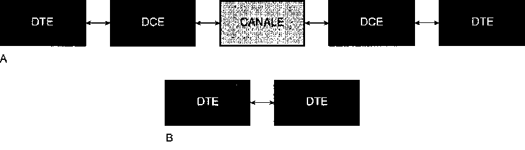

# Visual Communication and Video Acquisition


# Foreword

This is a transcription of my Diploma thesis simply titled "**Visual Communication**" written in June 2000.

At the time, visual communication was emerging as a compelling and novel field within computer science. Personal computers were just beginning to gain enough processing power to approach — albeit slowly — the capabilities of the mainframes of the era. Digital signal processing was still out of reach for home computers, but the direction was clear: we were heading into a visual era. A few decades later, the “unthinkable” can now be performed on a standard notebook.

As I was preparing for my diploma, I became fascinated by video signals, sampling techniques, and image compression algorithms.

I built a video digitizer card using a PIC microcontroller along with discrete ICs to extract composite video timings. The system drove an ADC into a memory buffer and then transferred a single captured frame over a serial port to a PC.

Resources were limited: I had only a small stack of printed datasheets and a few old reference books. USENET offered sparse information, and without a reliable Internet connection, I couldn't access much beyond the slowly fading world of Bulletin Board Systems. Compuserve and AOL were already being replaced by universities and early datacenters modernizing their infrastructure.

In the end, the project came together. The prototype was completed and worked as intended. Sadly, no photographs survive — they were taken on film and have since been lost. The hardware itself vanished into the school’s archive, likely discarded or buried in a landfill.


# Comunicazione Visiva

## <cite>Doxography[^1]</cite>
[^1]: Doxography is a term used especially for the works of classical historians, describing the points of view of past philosophers and scientists. Being this relation in conjunction with an multidisciplinar thesis, this arcaic term has been used as introduction for those old-scholars and old-teachers who were looking at such modern and untouched before topic with much suspect and refrain.


Most academic manuals begin by defining their subject, outlining the key areas of interest and scope of the discipline. In this case, however, I’ve chosen a different approach. Rather than starting with a technical definition of *visual communication*, I prefer to begin by explaining *why* I felt compelled to explore this topic — turning, first, to philosophy for insight.

Philosophy, after all, is the discipline uniquely suited to probing first principles and tracing origins. It offers the tools to examine not only *what* something is, but *why* it matters.

The human desire to understand — to know, to discover — is, according to both Plato and Aristotle, rooted in *wonder*: the awe we feel in the face of something unknown or unexpected. Centuries later, Freud echoed this view in his psychoanalysis of childhood, suggesting that this early curiosity matures into an adult's persistent, unconscious pursuit of meaning — a drive to uncover truth.

It is from this foundational impulse to *know* that the need to *communicate* arises. And with it, the importance of *information* — not simply as data, but as something deeply tied to human inquiry, expression, and connection.

In an age of conquest like ours, humanity has realized that simply possessing a vast amount of information can grant power. If one can control the dissemination of information—its modes, quantity, and presentation—then it becomes possible to enter people’s homes and manipulate their preferences and choices.

The medium that best fulfills these requirements today is Television—more than an appliance, less than Truth. Present in nearly every home and during nearly every moment of individual or family life, television constantly bombards us with images of lifestyles and ideals rarely reflective of daily reality. Instead, it offers pre-packaged myths and ideals designed by others. This power is amplified by the fact that television simultaneously engages two senses—sight and hearing—thus maximizing its capacity to capture attention.

This significant socio-cultural impact led me to choose visual communication as the subject of this thesis—not as an indictment of its abuses, but as a recognition of its weight on our lives.

Who knows—perhaps Shakespeare was thinking of television when, in *Romeo and Juliet*, Act 2, Scene 2, he wrote:



But soft! What light through yonder window breaks?
[...]
She speaks, yet she says nothing: what of that?

W. Shakespeare - Romeo and Juliet 



## History of Television

The invention of the vacuum tube by John Fleming in 1904 marked the beginning of a new branch of electrical engineering: electronics. Once the ability to produce, direct, and exploit an electron flow was discovered, countless applications were immediately envisioned. One of the most decisive breakthroughs was the discovery of the photoelectric effect, which made it possible to convert light into electricity.

At its core, the principle of television is incredibly simple. While transmitting a complex image through space might seem difficult, sending an electrical signal is quite straightforward. If an image is broken down into a series of small points, and each point is transmitted as an electrical impulse, all that remains is to design a receiver that can reassemble those impulses in the correct order — and the original image will appear.

Transforming these points into currents of varying intensity, transmitting them through space, and ensuring that the receiver reorders them in perfect sync with the transmitter: this was the challenge faced by the pioneers of television. In essence, the dream was to capture the human image and send it beyond the boundaries of space — to see moving images, people, and events in real time from miles away. Initially, such aspirations seemed more magical than scientific.

Even when the technical conditions began to align, some degree of madness and desperation was still required to embark on such a venture. These were qualities not lacking in a curious Scotsman named John Logie Baird — an inventor and ill-fated entrepreneur who chased after eccentric ideas and engaged in convoluted business ventures before turning, with little visible hope of success, to the challenge of television.

After experimenting briefly with the photoelectric effect — he once managed to ring a bell using only sunlight during the early years of World War I — Baird dabbled in various odd endeavors. He created and marketed paper insoles to keep feet warm, invented a shoe polish, patented a disastrously fragile glass razor, and designed a pneumatic sock for flat-footed individuals (which exploded unexpectedly and caused that business to collapse). These failures eventually led him back to his electronic experiments.

Using completely improvised equipment — a projection lamp made from a biscuit tin, cheap lenses, and a washbasin as a base — he succeeded in transmitting the image of a Maltese cross. He continued experimenting with the support of an electrical equipment manufacturer who, for advertising purposes, asked him to demonstrate in front of department store customers. But the transmitted images were blurry and little more than shadows, and the public met the invention with skepticism and ridicule.

Nonetheless, Baird persisted. By 1926, he was able to demonstrate a fairly convincing transmission of a human figure to a scientific commission.

In 1929, the BBC began a series of experimental television broadcasts. It was no longer just a magical aspiration or the fever dream of an eccentric — television had entered the implementation phase. Once the basic principles were established, television transmission became an industrial research challenge, a progressive solution to which continues to this day. Television has since become one of the defining phenomena of our era.

It’s important to note, however, that several years passed between these early experiments and the actual television boom — more than would have been expected based solely on the technical progress made. World War II significantly slowed development, as television was still seen as a luxury toy and its enormous potential to influence public opinion had yet to be recognized.

## Video Digitization Board

The project presented alongside this document is a circuit capable of digitizing a video signal coming from a camera, VCR, television, or any other analog composite video source. Once captured, the image can be viewed on the screen of a standard personal computer, taking advantage of all the benefits of digital format: saving frames to disk, reopening them later, sharing them over a network, printing them, and so on.

Building this board required a deep study of the structure of the European composite video signal, as well as the development of onboard control software using a PIC microcontroller. The microcontroller was tasked with managing the precise timing logic required for sampling the video signal and serializing the resulting image data. A corresponding software application was also written for the personal computer to handle the serial interface and display the captured frames.

The circuit features a PAL composite video input. However, while the signal is digitized at high speed, the inherent slowness of the RS-232 serial interface — chosen for its wide availability — prevents the transfer of full-motion video in real time to the computer's memory. As a result, the board is suited for video frame capturing applications, such as alarm systems and video surveillance, rather than continuous video streaming.


### Technical Specifications

- image resolution:  320x300 pixel;
- color depth:  256 grayscale levels (8 bit)
- serial interface speed:  38400 bps
- supported video input signal:  composite PAL
- power supply:  5VDC

## The Composite Video Signal

The television images we perceive as complete on the screen are, in reality, constructed from a single moving point. This point starts at the top-left corner of the screen, sweeps rapidly from left to right, and at the end of each line, moves down to begin a new one—second, third, and so on—until reaching the bottom of the screen.

The European video standard defines each frame as composed of 625 horizontal lines. If these lines were displayed sequentially, our eyes would perceive the image as flickering.

To eliminate this issue, each image is completed using **interlaced lines**: the first **field** (or half-frame) consists of all the odd-numbered lines, and the second field includes all the even-numbered lines. When interlaced, they form a complete image.


Thus, the first field consists of 312.5 odd lines (lines 1, 3, 5, etc.), and the second field consists of 312.5 even lines (2, 4, 6, 8, etc.). Since these fields alternate at a speed faster than the human eye's response time, we do not perceive the interruptions caused by the switching of line sequences.

Each line—whether odd or even—lasts 64 microseconds. It begins with a 5µs negative pulse known as a **sync pulse**, which marks the start of the line. Following this sync pulse is the **color burst**, which is present only in color images and omitted for black and white.

About 12µs after the sync pulse begins, the actual image signal starts and lasts for 51µs. This portion of the signal is **amplitude-modulated**: a signal level of 7.5% corresponds to black, 100% corresponds to white, and intermediate levels represent various shades of gray.

.")

This timing and encoding apply to all 625 lines in the frame. The final line of each field contains a **blanking interval**, which marks the transition between the two fields. Specifically, the last line of the second field is slightly shorter to make room for the **vertical blanking interval**, which consists of three parts: equalizing pulses, vertical sync pulses, and another series of equalizing pulses. This is followed by a blank interval (11 lines) containing only sync signals, where optional data like **teletext information** may also be embedded.

## Filters

The typical use of filters is to select a specific frequency range from a signal applied at the input. A filter is characterized by a few key parameters: first and foremost, its type (detailed below), then its order, cutoff frequency, passband, and finally, the circuit implementation, which can be realized using only passive components—resistors (R), inductors (L), and capacitors (C)—or by adding active elements such as transistors and operational amplifiers.

- **Low-Pass Filter (LPF)**: Allows frequencies below the cutoff to pass with minimal alteration, while attenuating higher frequencies.
- **High-Pass Filter (HPF)**: Allows frequencies above the cutoff to pass with minimal alteration, while attenuating lower frequencies.
- **Band-Pass Filter (BPF)**: Passes only frequencies within a specific range between two cutoff points, attenuating frequencies outside this band.
- **Band-Stop Filter (BSF)**: Attenuates frequencies within a specific range between two cutoff points, leaving other frequencies mostly unaffected.


Many areas of electronics—such as hi-fi audio, telephony, and measurement instrumentation—require systems capable of isolating specific spectral components of an input signal according to defined specifications. Passive filters accomplish this task but introduce loading issues for the stages they are connected to. Active filter designs overcome this problem by using operational amplifiers, allowing for transfer functions characterized by complex-conjugate poles without requiring inductors, which tend to deviate more from ideal behavior due to their inherent winding resistance when compared to capacitors.

Active filters are widely used in systems operating at frequencies up to a few hundred kilohertz, while passive filters are generally used in networks processing signals at frequencies in the hundreds of megahertz range.

These filters can be defined by the transmission specifications illustrated in Figure 3. These specifications define a region of the frequency response graph in which the behavior of |F(jω)| must reside in order to achieve the desired characteristics.

To make the representation general, the maximum value of the magnitude is normalized to 0 dB—in other words, any vertical shift in the entire graph caused by a multiplicative constant in the transfer function is ignored.

Each filter has a **passband** where the magnitude remains within a specified tolerance band F₁, and a **stopband** where the magnitude drops below F₂ or F₃. The interval separating these two bands defines the **transition band**. Table 1 indicates the frequencies (or angular frequencies) that mark the boundaries of each band.

It is important to note that the width of the transition band—defined by the difference (F₂ − F₁) or (F₃ − F₁)—determines the filter’s frequency discrimination capability. This in turn affects the order of the transfer function and thus the overall complexity of the circuit implementation.


## General Concepts on Electrical Signals and Their Conversion

In electronic systems, information can be represented by various time-evolving signals. These signals may take different forms while carrying the same informational content. Their nature depends on the source, the processing techniques, and the transmission channels involved.

Signals are characterized by multiple parameters such as amplitude, frequency, phase, duty cycle, and polarity. As a result, information is analytically described by a function *y = f(t)*, which expresses the relationship between a chosen signal parameter *y* and time.

It is also important to distinguish between analog and digital representations. Within a defined interval of the variable *y*, an analog signal can ideally assume an infinite number of meaningful values, whereas a digital signal can only assume a finite number. Specifically, both the domain and range are continuous in the former and discrete in the latter.

A significant case of digital signal is the binary signal, where only two values—known as logic levels—are meaningful.

In digital systems, information is associated with a code composed of two symbols, such as 0 and 1, used to represent a series of numbers according to a given convention. For instance, in natural binary code, 4 bits can generate 16 distinct combinations that may correspond to numbers, letters, or any other notation.

The elementary unit of a message is therefore a repetition of symbols called a *word*. Its length depends on the number of distinct combinations required. The group of symbols forming a word can be presented either simultaneously (*parallel form*) or sequentially (*serial form*).

To highlight the differences between analog and digital signals, some key points are presented below:

Since an analog signal evolves continuously, it can theoretically represent an infinite number of levels. However, noise—always present in electronic systems—makes it impossible to distinguish between values that differ by less than the noise amplitude. This introduces a degradation of information and, at worst, complete masking of weaker signals. The quality of an analog signal is therefore typically expressed by its *signal-to-noise ratio (SNR)*.

Noise superimposed on a digital signal does not affect the information content as long as it does not intrude upon the zone of uncertainty. Each logic level allows for a range of values within which the information is still unambiguously recognized as a logical 0 (low) or 1 (high).

This highlights one of the advantages of digital signal processing and transmission, which appears to be less prone to degradation.

However, serial processing of a digital word takes time proportional to the word's length. In contrast, processing in parallel is faster but requires more communication lines, resulting in a more complex hardware structure.

Analog signals, on the other hand, are always processed and transmitted in real time—i.e., with negligible delay—and require only a single communication line.

Digital systems are known for their versatility. With the advent of microprocessors, logic circuit functions are defined by software programs, which are easily modifiable. This flexibility is supported by the ability to store large amounts of data without any loss in accuracy.

Programmable architectures allow for information processing to be adapted in different ways without fundamentally altering the system's structure.

Analog systems, however, are better suited for interfacing with the physical world, as sensors and actuators typically handle signals that vary continuously over time. If numerical processing is required, both the input and output must undergo conversion to and from analog signals, thus requiring a dual conversion process.

## A/D Conversion Processes

The previous considerations highlighted that digital information processing offers many advantages, but generally requires both analog-to-digital (A/D) and digital-to-analog (D/A) conversion stages.

This document will focus primarily on the A/D conversion, as used in the developed circuit. The D/A conversion is effectively carried out by the computer monitor itself, which transforms the digitized image back into a visible form. Figure 4 shows the architecture of a typical system for processing analog signals digitally; each of the blocks in the diagram performs the functions described below.

The **sampling circuit** generates a sequence of pulses *vs(t)* with theoretically infinitesimal duration and amplitude equal to that of the input signal *vi(t)* at the sampling instants. This step marks the transition from a continuous domain to a discrete one.

The **sample-and-hold circuit** outputs a voltage *vsh(t)* equal to the sampled value and maintains it constant until the next sampling pulse. This block is necessary to present the A/D converter with a stable value during the time required for conversion.

If the input signal varies slowly within the sampling interval, the sampling and holding stages can be omitted.

The **A/D converter** encodes the amplitude of *vsh(t)* into a digital word composed of a predefined number *n* of bits.

The input quantity of this converter exists in a continuous range, meaning it can theoretically assume an infinite number of values. The output information, however, is discrete, represented by a finite set of values. Therefore, the A/D converter performs a **quantization** process, dividing the input voltage range into *l* discrete levels. In binary encoding, this corresponds to *l = 2^n*.

The **digital system**, represented in the block diagram, refers to any kind of digital processing operation—such as computation, storage, or signal transmission/reception.

The **D/A converter** decodes the digital word and produces a quantized output signal *vq(t)*, where both the domain and codomain are discrete. As a result, the waveform appears as a staircase-like pattern.

The **reconstruction filter** removes harmonic components in *vq(t)* that lie outside the original signal spectrum, producing an analog output signal *v₀(t)*, which once again has continuous domain and range.


## Data Acquisition

A common challenge in many industrial settings is the structured collection of information related to a production process. Based on the acquired data, it's possible to determine the type of intervention needed to guide the process in the desired direction.

Control may require manual action by an operator adjusting specific actuators, or it can occur automatically by linking those actuators directly to the data acquisition system.

Today, industrial systems are almost entirely managed by electronic machines due to their accuracy, speed, reliability, and low operating costs.

Moreover, the current state of programmable logic and personal computers allows for the creation of highly flexible process controllers. In other words, it's possible to change the production cycle simply by modifying the software program running on the computer.



Whenever we need to scientifically describe a system, whether in a static state or evolving over time, we must measure the physical quantities that characterize it. This enables the observer to subsequently intervene in the system to alter its behavior.

Measurements can be taken using electronic techniques which, compared to other methods, allow for high sensitivity, precision, and response speed. These methods also enable processing, storing, and transmitting the acquired data.

Figure 5 illustrates the general configuration of a measurement chain capable of displaying the value of a physical quantity—detected by a remote sensor—on one or more data presentation devices. Each block of the diagram is described below:

The **sensor**, placed at the input of the chain, converts the physical quantity to be measured into a corresponding electrical signal. This signal is typically analog, except in some cases where the sensor itself provides a digital output (e.g., an encoder).

The signal from the sensor generally requires initial conditioning by a **low-noise linear preamplifier**, which boosts the signal’s amplitude and increases immunity to noise as it travels through the subsequent stages.

If the transducer’s output is a current, this stage may also perform a **current-to-voltage conversion** using a **transimpedance amplifier**.

If the signal has a **common-mode component**, as occurs at the output of a measurement bridge, an **instrumentation amplifier** with high CMRR (Common-Mode Rejection Ratio) is recommended.

Note that common-mode voltage can also arise from **electromagnetic interference** induced on the cable connecting the sensor to the preamplifier. These disturbances, particularly problematic for low-level signals, can be minimized by using **shielded cables**.

Sometimes, the sensor is located remotely from the processing and display system—or the operator’s control room—necessitating a **transmitter and corresponding receiver** within the chain.

The transmission line may consist of an **electrical cable**, **optical fiber**, or, in special cases, **wireless communication**.

For short-distance wired connections, **V/F (voltage-to-frequency) and F/V (frequency-to-voltage) converters** are simple and reliable options, performing **Pulse Frequency Modulation (PFM)** encoding and decoding.

Alternatively, for connections of several hundred meters, **current loop transmission** is often used. Unlike voltage signals, current signals are not affected by line losses due to wire impedance. On the receiving end, the inverse conversion can be performed using a **precision resistor** connected to a **differential amplifier**.

Further **signal conditioning** may occur in the processing block to compensate for any **sensor non-linearity** or to **filter noise** accumulated during transmission.

Actual **data processing** is required when performing specific operations on the signal—for example, calculating the average or RMS value.

This block can be implemented using **analog**, **digital**, or **mixed techniques**. Digital circuits, in particular, simplify data storage and allow easy transfer to a computer.

The chain ends with one or more **data presentation devices**, which may include: **analog needle indicators**, **digital instruments**, **chart recorders**, **printers**, or **monitors**, depending on the application.

## Data Transmission

Modern electronic systems are often designed to interface with other units to enable data acquisition, storage, processing, or display.

A digital message can be sent over a transmission line in either a **parallel** or a **serial** format.

In the **parallel** format, all *n* bits of each word are transmitted simultaneously, requiring *n* wires plus ground. This leads to high transmission medium costs, limiting its use to short-distance connections—like linking a plotter to a personal computer. Moreover, inductive and capacitive coupling between the conductors (often grouped in a single cable) causes **crosstalk**, especially when multiple bits switch state simultaneously.

In the **serial** format, all *n* bits are sent sequentially, clocked over time. This requires only one signal wire plus ground, resulting in a significant cost reduction—especially over long distances—and improved system reliability.

However, serial transmission requires **PISO (Parallel-In Serial-Out)** registers at the transmitter and **SIPO (Serial-In Parallel-Out)** registers at the receiver. That’s because digital processors generally handle data in parallel form over a data bus.

The main drawback of serial communication is its slower speed since transmitting a single word requires at least *n* clock pulses. Nonetheless, the technique is widely used because it fits existing infrastructures, such as telephone lines.

In serial format, **transmission speed** is measured in bits per second (*bit/s*) or baud (for binary systems), while parallel transmission speed is measured in characters per second (*cps*).

To decode a serial message, synchronization between transmitter and receiver is necessary. Depending on the technique, serial communication is divided into two types:

### Asynchronous Transmission

Synchronization is achieved by adding a **start bit** at the beginning and a **stop bit** at the end of each word. In idle state, the line is high; the falling edge of the start bit triggers a local clock expected to match the transmitter's clock frequency.

Then, *n* bits of the word are transmitted, followed by the rising edge of the stop bit and then a return to idle high state—until the next start bit.

Clock precision must be sufficient to avoid phase drift beyond the width of a pulse, though this constraint only applies over the duration of a single word.

### Synchronous Transmission

Here, digital words are grouped into blocks that include synchronization characters, error-checking words, and length indicators—depending on the protocol. Synchronization is transmitted once per block or kept constant during idle.

This reduces transmission time, but demands more precise clock synchronization throughout the block.

Alternatively, a separate **clock line** can be added, but this increases wiring and system cost.

Asynchronous transmission, due to its simplicity, is dominant in communication between microprocessors, computers, and peripherals. Synchronous transmission is used where higher speed is necessary.

### Communication Types

Serial communication can take place over **dedicated lines** (for permanent links) or **switched lines** (for dynamic connections via switching centers). The most common example of a switched line is the telephone channel—widely used due to its affordability and infrastructure.

Communication between two units may be:

- **Simplex**: unidirectional only, with no interaction (e.g., a radio spy transmitter).
- **Half-Duplex**: bidirectional, but not simultaneous. Widely used due to its simplicity, although it causes delays during direction switching.
- **Full-Duplex**: simultaneous bidirectional communication. Eliminates delay and is used in telephony and teleprocessing.

### Serial Communication Hardware

Most serial communication functions are handled by a single IC chip labeled **USRT**, **UART**, or **USART**, depending on its capabilities.

In industrial environments, **electromagnetic interference** from motors and power switching can corrupt signals. To protect digital communication, systems use **HTL logic families** with high noise immunity, or **differential (balanced) lines**.

In **differential transmission**, twisted-pair wires carry equal and opposite signals. Any noise tends to affect both wires similarly, allowing a **differential amplifier** to filter it out.

**Line drivers** generate this signal via phase inversion, and **receivers** recover the original binary states while rejecting common-mode noise.

For long distances, **modulated (bandpass)** transmission is preferred over **baseband**, using modulation methods like **ASK**, **FSK**, or **PSK**. The corresponding hardware is called a **modem**, performing both modulation and demodulation of digital signals.

### Logic Level Compatibility and Interfaces

Communication between two units requires logic level compatibility. This is ensured by **interface circuits**, which comply with industrial standards governing electrical and mechanical behavior.

Using standardized interfaces allows for system expansion or component replacement—like connecting a measurement instrument or a new printer to a PC.

Interfaces can be **parallel** or **serial**. Among parallel interfaces, **IEEE 488** (from Hewlett-Packard) is notable for programmable test equipment, using 8 data and 8 control lines.

Before covering serial interfaces, here’s essential terminology:

- **DTE (Data Terminal Equipment)**: the end-user device (e.g., computer, printer).
- **DCE (Data Communication Equipment)**: the intermediary (e.g., modem).

 and two local DTEs (B).")

Communication usually follows the **Shannon model** (with bidirectional paths). In some cases—such as direct PC-to-PC connections—two DTEs connect directly.

The most important **serial interface** in recent decades has been **RS-232C**, approved by the **EIA**. It supports both synchronous and asynchronous modes, half- and full-duplex.

The RS-232C connector has 25 pins (some for data, others for control), though most applications use only a subset.

To improve noise immunity, RS-232C logic levels are higher than those of typical logic circuits:

| Logic Level | Voltage Range   | Description |
|-------------|-----------------|-------------|
| 0           | +3V to +25V     | space       |
| undefined   | -3V to +3V      | null        |
| 1           | -3V to -25V     | mark        |

“Space” and “mark” are legacy telegraph terms.

ICs like **National’s LM232** handle RS-232C levels (-9V to +9V output) while powered by a single +5V supply.


For noisy environments, **RS-422** (balanced differential) and **RS-423** (coaxial) are better suited, offering higher speeds than RS-232C.

The oldest still-used serial interface is the **current loop**, once used for teletypewriters and now for **MIDI** in digital musical instruments. It transmits asynchronous data at 20mA, using simple circuitry and supporting half- or full-duplex operation.

## Block Diagram

The block diagram of this board represents each functional unit of the circuit, showing simplified interconnections between stages. These include: the sync separator, the A/D converter, the microcontroller, the SRAM, the address generator, the clock, and the serial output stage.

The first issue to address is determining when the image to be sampled begins and ends. To avoid wasting memory, it's necessary to exclude the synchronization pulses and the color burst portion from digitization—storing only 320 pixels per line from a single video field, specifically the odd field.

To identify each field and therefore the start (the first pixel or line) of each frame, a **video sync separator** is required. In this design, the **LM1881** integrated circuit by National Semiconductor is used. With an external resistor and capacitor to select the video standard, this chip extracts synchronization signals. For locking to the vertical scan frequency of the European PAL standard (Phase Alternating Line), a 470 KΩ resistor and a 100 nF capacitor are sufficient (see RI and Cl).

This makes it possible to extract four signals embedded in the video waveform:
- Composite sync
- Vertical sync
- Odd/even field identification
- Color burst sync

A logic network built with appropriate logic gates performs a Boolean operation on the LM1881’s outputs, generating a high pulse **only** when valid image data (excluding sync and burst) is present. This pulse is fed to the microcontroller to manage the sampling.

The second issue is **managing the SRAM**. It must:
- Accept incoming bytes from the A/D converter during frame capture (with Write Enable active), and
- Later be read by the microcontroller (with Write Enable deactivated) to transfer the stored image to the PC.


These two operations must occur at **different speeds**:
- **Write speed**: synchronized with the sampling clock, at 6 million samples per second
- **Read speed**: synchronized with the PC upload rate, using a clock signal generated by the microcontroller

This is where the **Clock Line Select** and **Read Clock** lines come into play. Clock Line Select:
- Sets the memory to read or write mode,
- Enables the A/D converter outputs via the OE line,
- Selects the clock source for the counter—either the direct 6 MHz clock or the microcontroller-controlled Read Clock.

The need for a **6 MHz clock** can be calculated as follows:
- Each video line contains 320 pixels
- The visible portion of the video line lasts **51 µs**
- Therefore, each pixel appears every **51/320 = 0.159375 µs**, requiring a clock of **1 / 0.159375 µs = 6.2745 MHz**

This results in a **transfer rate** of about **6 MB/s** between the A/D converter and the static RAM acting as a buffer.

If a standard PC bus could handle this speed, real-time animation could be transferred instead of single frames. But to ensure **compatibility** with widespread PC hardware, the slower but common **serial port** was used.

Thus, this board captures a **single video frame** and transfers it **slowly** to a computer.

The digitization circuit uses a **fast flash A/D converter**, with 256 internal comparators, a built-in **sample & hold** circuit, and a sampling speed of up to **20 MHz**. This 8-bit parallel output component is managed—along with the 128 KB SRAM—by a **PIC16C84 microcontroller**, programmed to:
- Control memory write/read lines
- Generate sampling and read clocks
- Detect the start of the frame
- Upload the stored image to the PC via the **RS-232C serial interface** at **38400 bps**

The board uses an **ST232 level shifter** to convert TTL logic levels to the **EIA-standard voltage levels** required by RS-232 communication.

## Firmware


The program that runs on the PIC microcontroller handles:

- Waiting for the start and end of the frame using the **TimIn** pin
- Controlling the **Reset** line of the address generator
- Managing the **Clock Line Select**
- Managing the **Read Clock** line
- Managing the **serial data output** line

The program begins by preparing the board for image sampling, initially **activating only the reset line** of the address generator (i.e., the counter). This holds the memory address at zero, preventing advancement through memory locations.

As soon as the **odd field** of the frame starts—detected by a **falling edge on the odd/even line**—the controller **releases the counter’s reset**, allowing the address to advance. At that moment, memory begins storing each pixel at **6 MHz**, writing every point of the image into sequential memory locations.

The microcontroller then **waits for the end of the field**, which is detected as a **rising edge** on the odd/even line, signifying the start of the even field. This marks the end of digitization. At that point, it:

- **Stops sampling** by toggling the signal that controls the clock switch
- **Resets the address counter**

From this point, the firmware proceeds to:

1. **Read each byte** from **PORTB**
2. **Send it serially** via the UART routine
3. **Increment the memory address** by one location through a clock pulse sent to the counter (via the clock switch, which now routes the microcontroller's clock signal to the counter)

By repeating this cycle for every stored pixel, the companion **PC software** receives and reconstructs the entire image for display on the screen.


```nasm
  LIST P=16C84 INCLUDE "p16c84.inc"

        RA0        EQU 0               ;  serial  out
        Timln      EQU 1               ;  timing  input
        CKSel      EQU 2               ;  clock line out
        CKOut      EQU 3               ;  clock out
        CntRset    EQU 4               ;  counter reset
                                       ; serial tx routine declarations N_BIT  EQU  8
        BAUD       EQU 9600
        FCLOCK     EQU 4E6
        N_DELAY    EQU (FCLOCK - 64 * BAUD) /  (12 * BAUD)
        BUFFER     EQU 0x2D
        TIMER      EQU 0x2E
        COUNT      EQU 0x2F

        C0         EQU OxOC
        C1         EQU OxOD
        C2         EQU OxOE

        org        0x00
        clrf       PORTA               ;  init port  a
        movlw      0x02                ;  RA1 input  all others are outs
        bsf        STATUS, RP0
        movwf      TRISA
        bcf        STATUS, RP0

        clrf       PORTB               ;  init port  b (8 bit input)

        bsf        PORTA, CntRset      ;  pull-up counter reset line
        bcf        PORTA, CKOut        ;  keep  down  uP clock line
        bcf        PORTA, CKSel        ;  keep  down  clock line select
        bsf        PORTA, RAO          ;  keep  idle  state on serial  line

WAIT0   btfsc      PORTA, TimIn
        goto       WAITO
WAIT1   btfss      PORTA, TimIn
        goto       WAIT1

                                       ; start sampling

        bcf        PORTA, CntRset      ; clear reset line - let the clock pass
OVER    btfsc      PORTA, TimIn
        goto       OVER

                                       ; stop sampling

        bsf        PORTA, CKSel        ;  swap clock line
        bsf        PORTA, CntRset      ;  reset  counter
        nop
        nop
        bcf        PORTA, CntRset

                                       ; upload to host 128KB data block
        clrf       C0
        clrf       C1
        movlw      0x02
        movwf      C2
NEXTBYTE
        movf       PORTB, W
        movwf      BUFFER
        call       SEND
        bsf        PORTA, CKOut        ; clock pulse high
        nop
        nop
        bcf        PORTA, CKOut        ; clock pulse low
        incfsz     CO
        goto       NEXTBYTE
        incfsz     C1
        goto       NEXTBYTE
        decfsz     C2
        goto       NEXTBYTE
        sleep

SEND    bcf        PORTA, RA0          ;  bit start (basso)
        call       DELAY               ;  10 cycles
        nop
        nop
        nop
        nop
        movlw      N_BIT               ;  load data bit count
        movwf      COUNT               ;  into COUNT
LOOP    btfsc      BUFFER, 0           ;  check LSB byte to send
        goto       ONE
        nop
ZERO    bcf        PORTA, RAO          ; send 0
        goto       AWAY
ONE     bsf        PORTA, RAO          ; send 1
        nop
        nop
AWAY    call       DELAY
        rrf        BUFFER, F           ;  shift data on LSB
        decfsz     COUNT               ;  decrementa n bit trasmessi
        goto       LOOP
        nop
        nop
        nop
        nop
        bsf        PORTA, RAO          ; stop bit (high)
        call       DELAY               ;  frame delay
        nop
        nop
        nop
        nop
        nop
        return
DELAY   movlw      N_DELAY
        movwf      TIMER
AGAIN   decfsz     TIMER
        goto       AGAIN
        nop
        return
END
```

### Serial Transfer Routine

The serial transfer routine must execute with **very precise timing** to avoid framing errors during reception on the computer side. Specifically, this routine performs **exactly 26 clock cycles per transmitted bit**, regardless of whether the bit is a **start**, **stop**, or **data** bit.

This timing yields a data rate of **9600 bps using a 1 MHz clock**, and up to **38400 bps with a 4 MHz clock**, assuming an instruction execution time of **1 µs**.

The **second program** is responsible for **receiving bytes** from the serial port and storing them into a **preallocated memory structure** referenced by a pointer. During the download phase, it displays the received frame by simply creating **rows of 320 pixels**, where each pixel corresponds to a grayscale tone derived from the value of the received byte.

This method maintains a solid **correspondence between the sampled brightness** of each point and its **representation on the computer screen**, except for pure black, due to the original grayscale scale starting from a near-black value (7.5%). However, for the intended applications, this does **not pose a calibration problem**.

Each point is visualized using the **RGB color model**, allowing full use of the **host computer’s video card color palette**, unconstrained by the limitations of standard color sets.

The software uses the following structure to store each grayscale value as RGB:

```delphi
type RGBColor = record
  red: Integer;    { red component }
  green: Integer;  { green component }
  blue: Integer;   { blue component }
end;

```

This structure, borrowed from the MacOS™ operating system, allows access to **48-bit color palettes** (including support for alpha-video). However, to standardize the program and avoid using **indexed CLUTs (Color Look-Up Tables)** limited to 256 colors—which would restrict the number of usable grayscale values (not colors)—the structure was simplified by using only the **eight most significant bits** of the `Integer` data type.

By assigning the **same value** (i.e., the one received from the hardware board) to each **RGB color component**, it becomes easy to render a **gray tone**, or more precisely, a specific **brightness level** on the monitor.

The program also provides **basic file saving and opening functions**.

## Multimedia Compression Algorithms

Capturing an image in digital form can consume a significant amount of memory. For this reason, compression techniques were developed to reduce image size and save space. Smaller image files are advantageous not only for storage but also for transmitting data over networks like the Internet. Compressing a full-color 2 MB image down to 100 KB, for example, drastically reduces both disk space usage and transmission time.

Numerous image compression standards have emerged over the years, with the most prominent being **JPEG** (pronounced "jay-peg"). JPEG stands for *Joint Photographic Experts Group*, the name of the original committee that created the standard. JPEG compression can easily achieve a 20:1 compression ratio, though decoding and displaying the image takes more time — a clear example of the trade-off between speed and space.

While the term **lossy compression** might seem alarming, it's important to understand that no digital image format can perfectly retain all the visual information perceived by the human eye. The main downside of lossy compression is that repeated cycles of compressing and decompressing will degrade image quality incrementally — an issue for some use cases, but negligible for many others.

Ideally, one would like to decompress a JPEG image, modify it (e.g., crop it), and recompress it without any additional quality loss. Unfortunately, this is not generally possible: recompressing an altered JPEG image typically results in further degradation. Therefore, it's best to minimize the number of JPEG compression stages between the original and final image.

However, a few specialized operations can be performed on a JPEG file without generational loss. These include **90-degree rotations and flips**, but only under certain constraints related to the file format and image dimensions.

---

### About the JPEG Algorithm

JPEG is optimized for compressing either full-color or grayscale images of natural, real-world scenes. It performs well with photographs but poorly with line drawings, charts, or computer-generated graphics.

As a **lossy** algorithm, JPEG does not preserve the exact original image. Instead, it leverages characteristics of human vision — particularly that slight variations in color are less perceptible than variations in brightness. This makes it ideal for images viewed by humans, though it may introduce subtle inaccuracies that could affect machine-based image analysis.

A useful feature of JPEG is that its **compression level is adjustable**. This gives the user the flexibility to balance file size and image quality. You can create extremely compact files if you tolerate lower quality, or preserve high fidelity at the cost of a larger file.

JPEG images are usually stored in a format called **JFIF (JPEG File Interchange Format)**, which comes in two versions:

- **Baseline JPEG**: Encodes the image in a single, top-to-bottom scan.
- **Progressive JPEG**: Encodes the image in a series of scans, gradually increasing quality.

The progressive format is especially beneficial for web use. While downloading, a baseline JPEG will show only the top portion of the image until the rest arrives, leaving the bottom blank. In contrast, a progressive JPEG displays the entire image immediately at low resolution and enhances it as more data is received — offering a preview that helps users decide whether to continue downloading.

JPEG is designed solely for **still images**, but its principles extend to motion video compression. Formats like **Motion JPEG** or **MPEG** apply similar techniques to sequences of frames. MPEG, for instance, compresses not only individual frames but also the changes between them, a process that is computationally intensive and complicates frame-by-frame editing.

With suitable adaptations, the MPEG standard has also been applied to **audio**, resulting in **MPEG Layer 3** — more widely known as **MP3**. This has become a cornerstone of modern digital audio compression, particularly for online distribution.

---

### Legal Aspects of JPEG Compression

The JPEG specification supports two different backend encoding methods: **Huffman coding** and **arithmetic coding**. While both yield the same image quality, arithmetic coding typically compresses data more efficiently — reducing file size by 5–10% compared to Huffman coding.

However, JPEG's implementation of arithmetic coding is covered by patents held by **IBM**, **AT&T**, and **Mitsubishi**. This means that using it legally requires obtaining licenses from those companies. Although scientific research may qualify for exemption under "experimental use," any personal or commercial application would constitute patent infringement.

For this reason, it's strongly recommended to **avoid arithmetic coding** in JPEG files. The modest reduction in file size is not worth the potential legal complications. In particular, arithmetic coding should never be used for images intended for exchange over the Internet.


