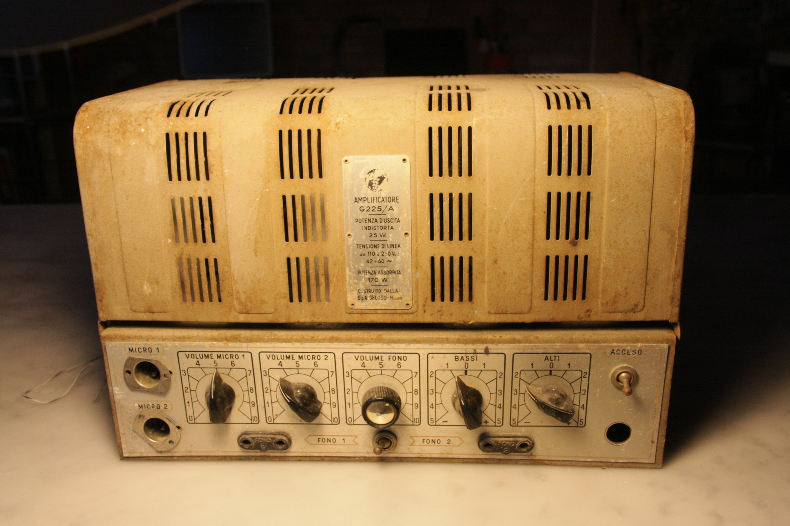
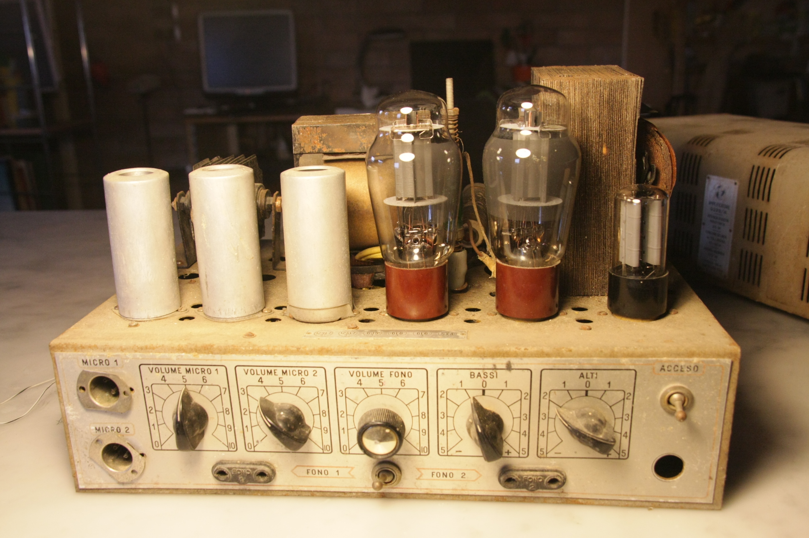
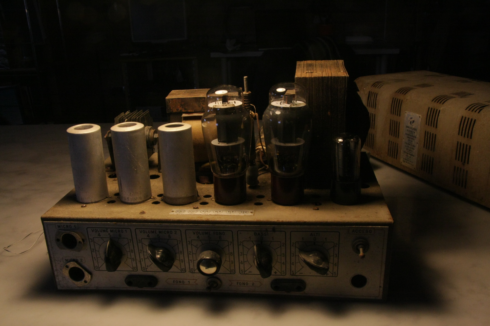
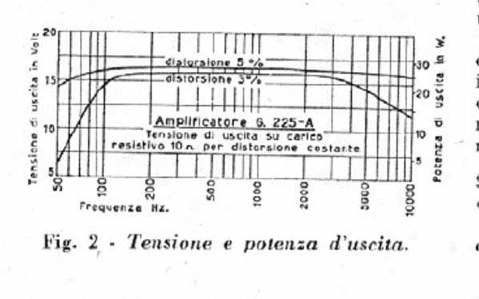
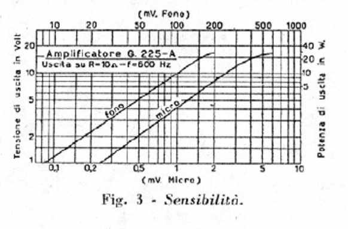
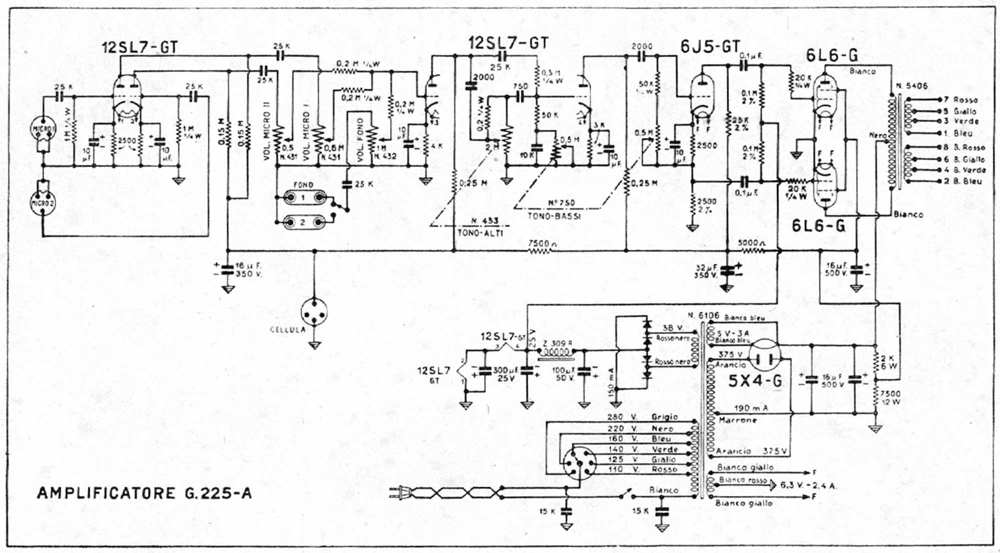
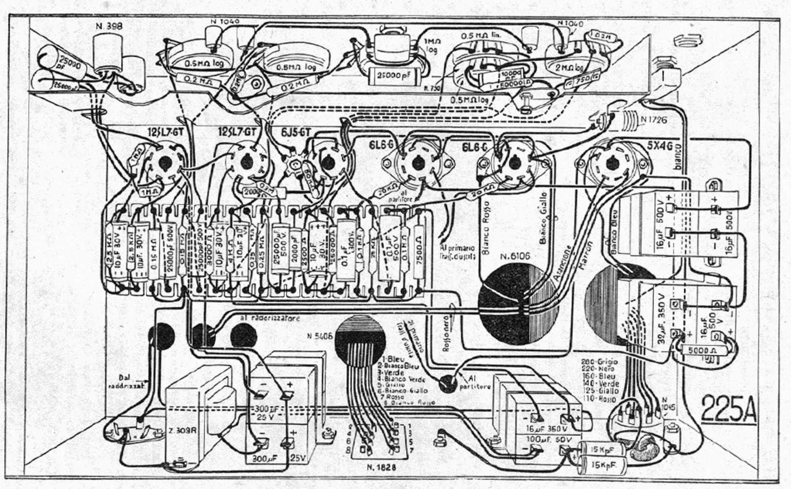

# Restoration of an old open-air cinema PA


# GELOSO

Geloso, founded in 1931 by Giovanni Geloso, was an Italian manufacturer of radios, televisions, amplifiers, amateur radio receivers, audio equipment and electronic components. Its headquarters were situated in Milan, Viale Brenta 29.

In 1931 the company started the production not only of radio sets but also most of the electronic components with which they were built and, over time, also developed and patented many others.

After the Second World War, Geloso expanded and expanded his production, becoming from 1950 onwards, a point of reference for enthusiasts of consumer electronics and hobbyists.

The many products under the brand name Geloso were known throughout Italy and much appreciated abroad. The output consisted of innovative products known for their high quality, solid construction and reasonable price. The main production consisted of radios, amplifiers, tape recorders, televisions, kits, and professional laboratory instruments. These were complemented by components such as capacitors, resistors, potentiometers, switches, connectors, transformers and microphones.

It is fashinating to know that this very amplifier was sold as a self-assembly kit and its build-date goes back to the mid '70s. An exact date cannot be determined, but my friend gave this rough estimation.


## From assembly kit to summer-night cinema

Time ago a friend of mine gave me this pretty nice old cinema PA. It was not in good-shape as it has been left down in a storage room, with no much protection against humidity, dust and alike, all eroding agents for any electronic devices.

Remarkably this is an assembled kit, made by this friends' uncle back before the 70s.

Back in its hey-days this very tube amplifier from [**GELOSO**](https://en.wikipedia.org/wiki/Geloso) was used to amplify a cosy open-air cinema in warm summer nights in Italy between 1970 and late 1980. Believe it or not, audio quality was not an issue (it is not an Hi-Fi grade amp) but for spoken voice and those early sound effects present in films in the early '80s, it was more than enough even for an open space. People were not even fussier about wanting a subwoofer or enjoy explosions like modern days: people just wanted to gather together and follow a nice story. So long for todays' tastes...
Anyway, here it is: it all its old and present glory, the GELOSO G-225/A.




# Amplificatore G-225/A

Potenza modulata 25W - 6L6 push-pull class AB1 - 5 valvole - 2 prese mic e 2 prese pick-up con mixer - Guadagno 100.000 volte il segnale d'entrata

Le due prese per microfono e le due per pick-up, i tre potenziometri di volume e due regolazioni di tono, il cambio delle tensioni e gli attacchi razionali di entrata e di uscita aggiunti alla possibilità di misclare i segnali dei diversi canali rendevano questo apparecchio adattabile alle più svariate installazioni: dagli ambienti chiusi di piccola capacità alle chiese ed ai cinematografi di capienza anche superiore alla media del periodo.
I 25W di potenza utile effettivamente disponibili al secondario del trasformatori erano sufficienti per alimentare un numero considerevole di altoparlanti e permettere una razionale diffusione del suono.
Tale caratteristica lo rendevano particolarmente adatto ad installazioni di capacità superiore alla media e nelle quali era richiesta una elevata (per l'epoca) fedeltà di riproduzione.
In questo apparecchio l'amplificazione è di ben 100000 volte il segnale di entrata, mentre il noise floor era ridotto a circa 1/2500mo del segnale di uscita. A tali risultati si giunge usando opportuni accorgimenti nella progettazione dei circuiti di filtro e accendendo i filamenti delle due valvole 12SL7-GT con corrente continua ottenuta da un raddrizzatore a secco.



## Dati tecnici

 - Potenza nominale: 25W (+36,2dB) 5% THD
 - Potenza di picco: 35W (+37,7dB)
 - Sensibilità micro: 4mV (-85,8dB) Z = 1MΩ
 - Guadagno micro: +122 dB
 - Sensibilità fono: 170mV (-52,,1) Z = 1MΩ
 - Guadagno fono: +89,3dB
 - Noise Floor: -68dB a massimo guadagno
 - Frequency Response: ±3dB 50Hz a 10kHz
 - Impedenze di Uscita in Ohm: 1,25 - 2,5 - 5(balanced) - 7,5 - 10(bal) - 14 -  - 18 - 30(bal) - 75 - 100 - 125 - 300(bal) - 350 - 400 (bal) - 450 - 500(bal)
 - Controlli di tono acuti: -15/+6dB (5kHz) -21dB/+7dB (10kHz)
 - Controlli di tono bassi: -10/+6dB (100Hz) -18dB/+6dB (50Hz)
 - Valvole: 2x 12SL7-GT; 1x 6J5-GT; 2x 6L6-G; 1x5X4-G
 - Tensioni di linea: 110 - 125 - 140 - 160 - 220 - 280VAC
 - Potenza assorbita AC: 170 VA
 - Dimensioni: 390x220x232 mm
 - Peso: 13,5 Kg

### Potenza




L'amplificatore G275/A ha una potenza di uscita di 25W. La distorsione contenuta nettamente entro un limite del 5%. Diminuendo la potenza d'uscita diminuisce rapidamente anche la percentuale di distorsione come visibile nella curva esplicativa:


La potenza di picco è di 35" (+37,7dB). Con la sostituzione del normale trasformatore n.5407, il G225/A può essere usato come modulatore di uno stadio finale RF con 50W di alimentazione ed una modulazione del 100%, oppure fino a 70W con una modulazione dell'80%.

### Ronzio e rumore di fondo

Il ronzio ed i rumori di fondo sono stati ridotti a -68dB a massimo guadagno di uscita e cioè a circa 1/2500 del segnale di uscita.

### Sensibilità

La sensibilità dei canali micro è di 4mV, pari a -85,8dB. Con un segnale di soli 4mV, l'apparecchio da la piena potenza, per cui risulta superfluo l'uso di preamplificatori anche nel caso di microfoni meno sensibili.
Per i canali phono, la sensibilità è di 180mV, pari a -53,1dB e sufficiente anche per l'uso di pick-up magnetici meno sensibili.


Il criterio che ha ispirato, in sede di progettao, la separazione dei due canali micro da quello pick-up è stato di evitare, nel caso di pick-ups di forte uscita, il fenomeno di saturazione e di distorsione nella prima valvola e per dare la possibiltà di mescolare a piacere, a mezzo dei rispettivi controlli di volume, i segnali dei due canali.


### Circuiti di entrata

Nell'amplificatore G.225/A vi sono due prese per microfoni e due per fono, tutte ad alta impedenza (1MOhm).
Esistono tre controlli di volume: uno per ciascun microfono ed uno per i pick-ups. Detti controlli sono separati e danno la possibilità di miscelare a piacere i segnali dei vari circuiti.
Per mezzo delle due prese fono è data pure la possibilità di ridurre al minimo le pause nella riproduzione dei dischi.
Nel caso di microfoni a bassa impedenza (nastro e dinamici) occorre, per avere la massima resa, accoppiare questi microfoni attraverso un trasformatore elevatore, convenientemente schermato.

## Schematic



Alle griglie dei due triodi della prima 12SL7, sono applicate le boccole di entrata dei due microfoni. Alla griglia del primo triodo della seconda 12SL7 è applicato, attraverso un commutatore, l'ingresso pick-up.
L'accoppiamento tra i due triodi della prima 12SL7 e la seconda è a resistenza-capacità con particolari accorgimenti per permettere la miscelazione dei due microfoni e di un pick-up e di regolare separatamente, a mezzo di tre potenziometri, il volume dei singoli canali.
L'intermodulazione tra i due canali micro, con entrambi i microfoni inseriti, è trascurabile.
Tra il primo ed il secondo triodo della seconda 12SL7 e tra questo e la 6J5 invertitrice di fase sono realizzati i circuiti del controllo di toni. I toni alti utilizzano un potenziometro logaritmico da 2MΩ, mentre al controllo dei bassi un doppio potenziometro: quello da 500kΩ logaritmico serve per eliminare il rialzo alle note basse dato dal condensatore da 10000pF in parallelo ad esso; l'altro da 500kΩ lineare ha il compito, variando la resistenza di griglia della 6J6, di diminuire la sensibilità dell'amplificatore alle note basse.

Lo stadio finale è costituito da due 6L6 in configurazione push-pull.

Il circuito di alimentazione è costituito da un trasformatore di alimentazione, da una 5X4 raddrizzatrice doppia onda e dai circuiti di filtro.
Il condensatore di ingresso è da 32uF 500V e da esso vengono alimentate le placche dello stadio finale. Segue un partitore formato da due candele, una da 2000Ω 6W, ed una da 7500Ω 123W; in parallelo alla resistenza da 7500Ω 12W vi è un condensatore da 16uF 500V.
Da questo punto del circuito vengono alimentati gli schermi dello stadio finale; segue una resistenza da 5000Ω ed un condensatore da 32uF 500V. Qui è collegata la resistenza di placca della 6J5 e della placca del secondo triodo della seconda 12SL7. Segue una resistenza da 7500Ω ed un condensatore da 16uF 350V.
Da questo punto parte l'alimentazione delle placche del primo triodo della seconda 12SL7 e le placche della prima 12SL7.
Un circuito raddrizzatore, con un raddrizzatore al selenio collegato a ponte, serve per l'accensione dei filamenti delle prime due valvole e per la polarizzazione negativa dello stadio finale.
La capacità di ingresso del circuito di accensione è di 100uF 50V; dopo un impedenza di filtro Z309R c'è un altro condensatore da 300uF 25V.
In questo punto è prelevata la tensione di polarizzazione per le griglie dello stadio finale.
I filamenti delle due 12SL7 collegati in serie vengono pure collegati dopo l'impedenza. Il filamento della prima 12L7 è verso massa ed in parallelo a questo filamento vi è un altro condensatore da 300uF 25V.
Le tensioni di lavoro dei condensatori elettrolitici e di quelli a carta, la potenza dissipata nelle resistenze chimiche ed in quelle a filo sono inferiori a quelle limite di funzionamento, in modo da offrire la massima garanzia di durata dell'impianto.

## Montaggio



Il montaggio dell'amplificatore G225/A non richiede speciali accorgimenti: basta attenersi con scrupolo ed intelligenza alle indicazioni dello schema elettrico e di quello di montaggio.
Fissare innanzi tutto al telaio le parti meccaniche: zoccoli per le valvole, attacchi micro e fono, potenziometri, impedenze, trasformatori, condensatori elettrolitici.
È necessario osservare l'orientamento indicato nello schema costruttivo che fornisce indicazioni per la realizzazione della filatura.
Collegare innanzitutto le parti vicine al telaio.
Fare attenzione nell'eseguire i collegamenti del raddrizzatore ad ossido e degli elettrolici, perchè un errore  potrebbe provocare gravi danni all'apparecchio.
Il collegamento delle prese mico deve risultare secondo la disposizione prestabilita, unificata per tutti gli apparecchi.
Ad evitare la formazione di fruscii e di rumori curare attentamente le saldature.
Per ultimo dovrà essere montato lo schermo di protezione delle prese d'ingresso.
La basetta porta-resistenze si prepara separatamente.
A montaggio terminato verificare con l'ohmetro gli isolamenti in particolare dei lati caldi da massa.
Inserire la valvola raddrizzatrice e verificare la tensione, inserire le prime due valvole e verificare il negativo; inserire le restanti valvole.
Tutte le tensioni devono corrispondere a quelle della tabella qui riportata.

### Verifica delle tensioni

Riscontrata l'esattezza dei collegamenti e la loro continuità, si proceda alla verifica delle tensioni.
La misurazione di queste deve essere effettuata sia al primario del trasformatore di alimentazione, per verificare la tensione di rete, sia ai circuiti secondari e interni all'apparecchio.
Per il controllo delle tensioni alternate potrà essere usato un qualsiasi voltmetro a ferro mobile o a raddrizzatore, purchè sufficientemente preciso.
Per la misurazione delle correnti continue è invece necessario usare un voltmetro a bobina mobile a 20.000Ω per volt, poichè i valori della tabella che segue sono stati rilevati con uno strumento di tali caratteristiche.
Qualora il tecnico disponesse di uno strumento di diverse caratteristiche, cioè di differente resistenza interna, si dovrà tener conto dell'eventuale caduta di tensione nelle resistenze del circuito al qualie si applica lo strumento, dovuta al maggior consumo di questo.
Le tensioni riscontrate dovranno essere comprese entro il 5% in più o in meno dei seguenti valori, ferma restando la tensione di rete al valor indicato sul cambio di tensioni, e dovranno essere misurate tra i piedini delle valvole e la massa.
Per l'uso si può ammettere che la tensione di rete varii al massimo entro una tolleranza del 10% in più o in meno.

```

TABELLA DELLE TENSIONI

Alta tensione
1° Elettrolitico . . . . . . . . . . . 400V
2° Elettrolitico . . . . . . . . . . . 300V
3° Elettrolitico . . . . . . . . . . . 280V
4° Elettrolitico . . . . . . . . . . . 270V
        / griglia . . . . . . . . . .  -25V
6L6-G   | schermo . . . . . . . . . .  300V
        \ placca  . . . . . . . . . .  400V

        / placca . . . . . . . . . .   215V
6L5-GT  |
        \ catodo  . . . . . . . . . . . 57V

           / placca . . . . . . . .    90V
12SL7-GT   | catodo . . . . . . . ..  1,2V
           | placca  . . . . . . .  . .130V
           \ catodo  . . . . . . .  . .1,6V

           / placca . . . . . . . .    160V
12SL7-GT   | catodo . . . . . . . ..  1,7V
           | placca  . . . . . . .  . .160V
           \ catodo  . . . . . . .  . .1,7V

Tensione negativa
1° Elettrolitico . . . . . . . . . . . -36V
2° Elettrolitico . . . . . . . . . . . -25V
3° Elettrolitico . . . . . . . . . . . -12,5V

```


# Useful links

[Geloso story](https://www.qsl.net/i0jx/geloso.html)
[Geloso on RadioMuseum](https://www.radiomuseum.org/m/geloso_i_en_1.html)
