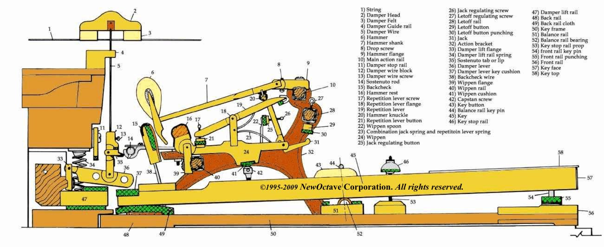
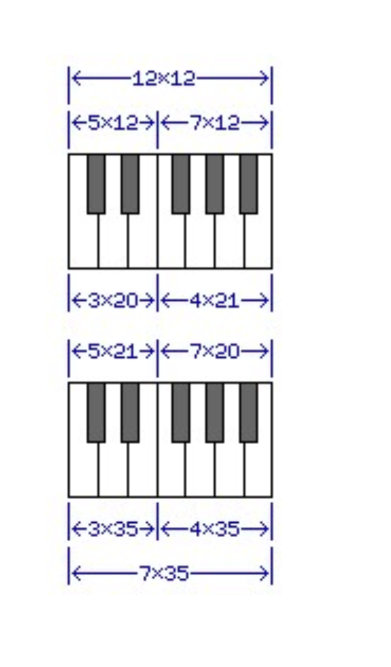
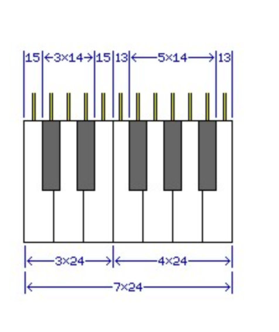
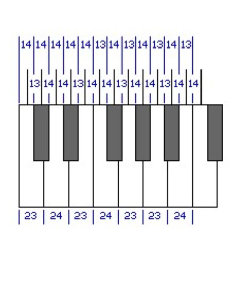

# KAYABOARD - mag-lev organ keyboard (POC)

# KAYABOARD

This is a Proof-Of-Concept of an **organ keyboard** using **magnets** instead of springs to obtain a nice upward release action and a decent downward counter-pressure when playing.

Designing a musical-instrument keyboard confronted me with some ergonomics considerations and material choices.
I did some research on magnets as well, to have a better understanding of their force irradiation and how to select them to save space, weight and achieve the best feeling when playing.



## The model

I always admired the acoustic piano keyboard mechanics: it is a concoction-masterpiece!

It is by any means totally different from an organ manual, was the original inspiration as I wanted to understand the way it actually works. There are so many different mechanics and techniques (such as Renner) and they all implements some kind of escapement mechanism and *trickery* to give the player the best comfort.

## The Size of the Piano Keyboard

The black keys on a piano keyboard, instead of always being centered on the dividing line between the two white keys they lie between, are spaced so that the twelve keys which make up an octave are spaced equally as they enter the internal mechanism of the instrument.
However, the white keys as they face the performer are still equal in width.
As the space from C to E contains three white keys and five keys in total, while the space from F to B contains four white keys and seven keys in total, it is not quite possible to achieve this goal perfectly.

If the internal spacing for the internals of a piano or organ is perfect, giving each of the twelve notes of the octave units of width on the keyboard, then the three white keys for C, D, and E would be 20 units wide, while the white keys for F, G, A, and B would be 21 units wide.

If, on the other hand, the white keys present themselves with an absolutely equal width of 35 units each to the performer, then the five notes from C through E would be 21 units wide as they entered the instrument, and the seven notes from F through C would be 20 units wide as they entered the instrument.
Since the internal mechanisms of a piano and organ could still have an exact equal spacing where they contacted the keys of the keyboard even if the latter alternative was chosen, that alternative, providing a better human interface, is likely to be the one used.

In any case, what then are the nominal dimensions of a piano keyboard, ignoring the space between keys which will be required for them to move freely?
While the keys on a typewriter keyboard are spaced on 3/4 inch intervals (19.05 millimetres), piano keys are somewhat larger, at least on a full-sized keyboard. One source, the book Electronic Musical Instruments by Richard H. Dorf, notes the dimension as being in the vicinity of 6.46 inches, with slight variations between manufacturers for a range from about 164 mm to 164.2 mm.

164 millimeters is about 6.4567 inches.
6 15/32" is 6.46875 inches - and 207/32". 6 29/64" is 6.453125 inches - and 413/64".
Neither 164 nor 207 are numbers which are divisible by either 7 or 12, though, so there seems to be no obvious choice for the dimensions of a keyboard in the most commonly used units.

However, the possibilities above overlook an important fact. It is desirable that the seven white keys be evenly spaced, and that their nominal dimensions be something that can be measured out in practice. It is also desirable that the twelve mechanisms inside the instrument be equally spaced, and that their positioning be measurable. But the equality of the width of the upper parts of the white keys can be allowed to vary a little, while keeping all the black keys as identical parts, with identical centering on their links to the internal mechanism would be highly desirable.
Thus, the diagram showing a single keyboard design illustrates a more likely shape for the piano keyboard. It still, however, meets with the objection that the normal value for the width of an octave is not easy to divide into either 7 or 12 exactly using convenient units.

However, given that high tolerances are used in manufacturing, precise units can be used.
Thus, if we go with a fundamenal unit of 0.03845 inch, then the white keys are spaced on 0.9228 inch intervals, the internal mechanisms of the instrument are spaced on 0.5383 inch centers, and the width of an octave is 6.4596 inches.
Or, if we go with a fundamental unit of 0.9762 millimetres, then the white keys can be spaced on 2.34288 cm intervals, the internal mechanisms of the instrument can be spaced on 1.36668 cm centers, and the width of an octave is 16.40016 centimeters.
Thus, it is possible to design a piano keyboard without going insane. But perhaps only just.
One would, of course, have expected that the standard width of a piano key would have been originally convenient in the system of measurement in general use. Thus, 3/4" can be divided into 12 parts, each 1/16", and if something wider is desired, 15/16", which is 0.9375 inches, can be divided into 12 parts of 5/64". And the inch is sometimes divided into 10 or 12 parts for some purposes, instead of into sixteenths.
Before the adoption of the metric system, different locations in Europe used feet and inches, but with different standard lengths for the foot.
In Weimar, the foot that was used at one time was 281.98 millimetres in length. Divide this foot into twelve inches, and each inch would be just under 23.5 millimetres. If this is too wide, in Aachen, the foot was 280.7 millimeters in length, yielding an inch of just over 23.39 millimetres, which would make for an octave width of 163.73 millimetres.
On the other hand, if a metric foot of 30cm is used, with one inch being exactly 2.5cm, then 15/16" would be just under 23.44 millimetres. Such a foot was used for a time in Baden, in Switzerland. The foot of Cracow in Poland was 298 millimetres, and the foot of Bloois, a Dutch city, was 301 millimetres.
And what about a foot that is larger than the foot used in the English-speaking world? Might there be one in which a piano key could be 3/4" wide? A foot of about 375mm would do, but while some of the other standards for the foot were somewhat larger than the British foot of 304.8mm, apparently there was not one in use that was quite that large.

Since this investigation has turned up no obvious culprit, and since the width of keys on the earliest keyboard instruments was quite variable, given that while Germany was for a long time divided into small principalities, each with their own unit of measure, France used the Pied du Roi from one end to another, and France was, and still is, a very influential country, it might at least be worth asking what the width of a piano key is when measured in that system. In that system, it works out to about 0.8659 French inches, which does not seem to suggest a relationship.
However, if a basic unit of 0.036 French inch is used, leading to the white keys being spaced on intervals of 0.864 French inches, the mechanisms of the notes being spaced at intervals of 0.504 French inches, and the width of an octave being 6.048 French inches, this span would be 6.446 inches or 163.7 mm. As this is a closer match than could be obtained through a similarly rounded unit in either the English or metric systems (for example, just changing from 0.03845 inches for the unit, which yielded 6.4596 inches, or about 164.07 mm for the octave, to 0.0385 inches for the unit would lead to an octave of 6.468 inches, or 164.28 mm, so 0.038 would be much too small, and 0.039 much too large), there is at least a possibility that the old French units of measure had some influence on the standardization of the width of the piano keyboard.
However, what has gone before has overstated the real-world complexity of designing a piano keyboard. It is true that distances which are an exact multiple of 168 (12 times 7 times 2) are hard to find in the vicinity of the standard extent of an octave span (164.1 millimeters) in both English and metric units. But rather than using measurements defined in terms of the one-hundred thousandth of an inch, or the ten-thousandth of a millimeter, all that has to mean is that the keyboard can be allowed to deviate slightly from the ideal shape shown above.
Let us suppose that we are limited to tenths of a millimetre in our measurements. Then, 163.8 mm is seven times 23.4 mm. As well, when divided into twelve parts, we get six distances of 13.6 mm, and six distances of 13.5 mm.
Rather than going to a unit of 0.05 mm or even 0.025 mm to achieve the ideal shape, it would be entirely satisfactory to space the internal mechanisms of the instrument for the seven notes from F through B apart by distances of 13.6 mm, locating the black keys so that they would be centered with those mechanisms, and then when going from B back to F, use 13.5 mm as the spacing.
Or, to make the spacing of the black keys more uniform, one could, for example, space the mechanisms from C sharp to D, and from D to D sharp, by 13.6 mm, then alternate 13.5 mm with 13.6 mm, until one reaches G - the spacing from G to G sharp and from G sharp to A would both be 13.5 mm, and then the spacings would return to alternation.
Or, if one does not wish to go beyond the thousandth part of an inch, a multiple of seven can easily be found in the required range: 6.461 inches is seven times 0.923 inches.
Dividing that into twelve parts, we have seven distances of 0.538 inches, and five distances of 0.539 inches, that we can work with.
Given that we would, at least, like to achieve the goal that the white key for D is perfectly symmetrical, and the black key between G and A is perfectly centered, an even remainder is preferred to an odd one. A simple solution to that is to be willing to measure down to a two-thousandth part of an inch, if the size tolerance is such that moving on to the next multiple of 0.007 inch for the span of an octave is not an option.
Supposing, though, that we do have this option, then: Each white key occupies a space that is 0.924 inches wide.

Each mechanism in the instrument is spaced 0.539 inches apart.
So enlarging the keyboard slightly beyond the range noted does allow spacings in thousandths of an inch, since we have a multiple of 84 after all. The basic unit, though, is 0.0385 inch, so we still have to go to a two- thousandth of an inch to position the keys of the instrument symmetrically on the mechanisms.
But we could go to even coarser units. What if we just use an octave span of exactly 6.46 inches, with no units below one hundredth of an inch?
Here, it's an even multiple of one-hundredth of an inch, so the remainder after dividing by twelve is even. So we have ten distances of 0.54 inches to work with, and two distances of 0.53 inches to work with. So, the distances between the mechanisms for B and C, and those for E and F, can be 0.53 inches, and the rest 0.54 inches, and we have the desired symmetry.
Dividing by seven, two of the white keys would be 0.93 inches at the front, and the other five would be 0.92 inches wide at the front. To achieve a symmetrical and evenly-spaced layout, make the wide white keys the ones for F and B.

Another clear example would be to have the octave exactly 164 millimetres wide, and to have all distances be a multiple of a whole millimetre.
Three of the white keys would be 24 mm wide at the front, four would be 23 mm wide at the front. The desired symmetry could be achieved by making the 24 mm wide keys those for D, F, and B.
The spacings between successive mechanisms would be 14 mm in eight cases, and 13 mm in four cases. The condition for symmetry is that the C sharp to D and D to D sharp spacings both be the same, as those for G to G sharp, and G sharp to A, as well as the rest of the spacings lining up.
The diagram on the left, drawn to scale, shows how that can be achieved with the maximally-even spacing of 14 mm, 14 mm, and 13 mm distances repeating in a cycle of three.
So there you have it, a piano keyboard of standard size that may be drawn with an ordinary ruler.
