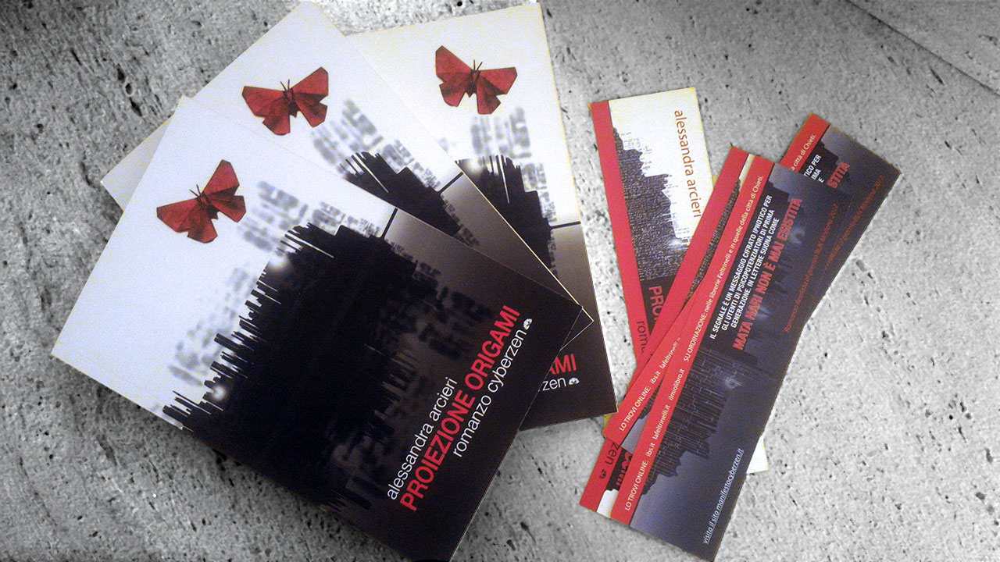

# Proiezione Origami - Book Cover Design

I designed the cover for this enthralling **cyberzen** story, rich in obfuscated structures that only electricity can uncover.

<!--more-->

# Prologue

The Author of this story had clear ideas about how the cover should look like. That made it easy to a good start.

- She said the story and the cover were to be cast within a city skyline.
- Math formulas and expressions should have popped around, in a similar way to The Matrix.
- The catch phrase "Mata-Hari non è mai esistita" needed to be highlighted.
- Duality and Binary (plus and minus, opposites, extremes, etc.) are part of the story she'd like to see in the cover image as well.

## Assembling the Cover

Initially the skyline was very easy to draw using Illustrator. A simple square-like trace would have rendered as buildings.
Math formulas were placed vertically all over the buildings silhouettes, like smoke coming out.

This first rendition was not exciting until an idea came blazingly fast while thinking about the catch-phrase:
a soundwave! The actual shape we see on the full cover, it is the waveform of the spoken catch-phrase including a certain amount of emphasis and pathos.
This allowed for the duality to be depicted both horizontally and vertically when you look at the stretched out cover picture on both sides.
The sky and the lake were now joined by the waveform/skyline.
The math formulas ended up only on the rear half, like antennas, keeping the front page nice and clean.

## Final Origami

An origami-butterfly would complete any missing-link to the book's title.

This is how I made it:



## Proiezione Origami by Alessandra Arcieri

I did write myself a mystifying foreword to the story, in pure electronic style:

> The story interlaces seamlessly between the ever existing layers of knownledge and notion, human and nature, duality (*0, 1*) pivoting over the *fulcrum* of the **third state** of electrical and logical levels: **nil**, **Z**, or the **high impedance mode**.
> Just like ideal operational amplifiers, travelling Agents with infinite input impedance and zero output impedance, at any rate will induce stray currents in your *body electric* across a live circuit board shaped just like a table-game.
> LC.

The book is written in Italian, and can be found here:

- [Proiezione Origami di Alessandra Arcieri on ibs.it](https://www.ibs.it/proiezione-origami-romanzo-cyberzen-libro-alessandra-arcieri/e/9788892305410)
- [Proiezione Origami di Alessandra Arcieri on ilmiolibro.it](https://ilmiolibro.kataweb.it/libro/fantascienza/189054/proiezione-origami/)

> Rome, New York, Bombay. What will be the next target? In a scenario á-la Blade Runner, in a time marked by attacks and dominated by the logics of psycho-empowering games, every experience is transformed into Agone and every gamer in Ludopath. The jingle of the new role-playing game is a song by the TV musical "Fame", inspired by the verses of Walt Whitman. Among these verses lies the secret of Agent Alpha's mission. The rebel player, determined to neutralize the mother-company and to discover the identity of the powerful demiurge, will have to deal with a fearsome opponent sent to flush her out, some mercenaries and a series of events created on-spot by the game. Among excellent university campuses, historic cities and metropolis with gray tones, all is played without the exclusion of blows. Alpha has a precious ally, a valid Master and a secret and very powerful energy resource, which she does not yet know. She will first have to sing the electric body. Finalist book at BUK Modena 2017.
