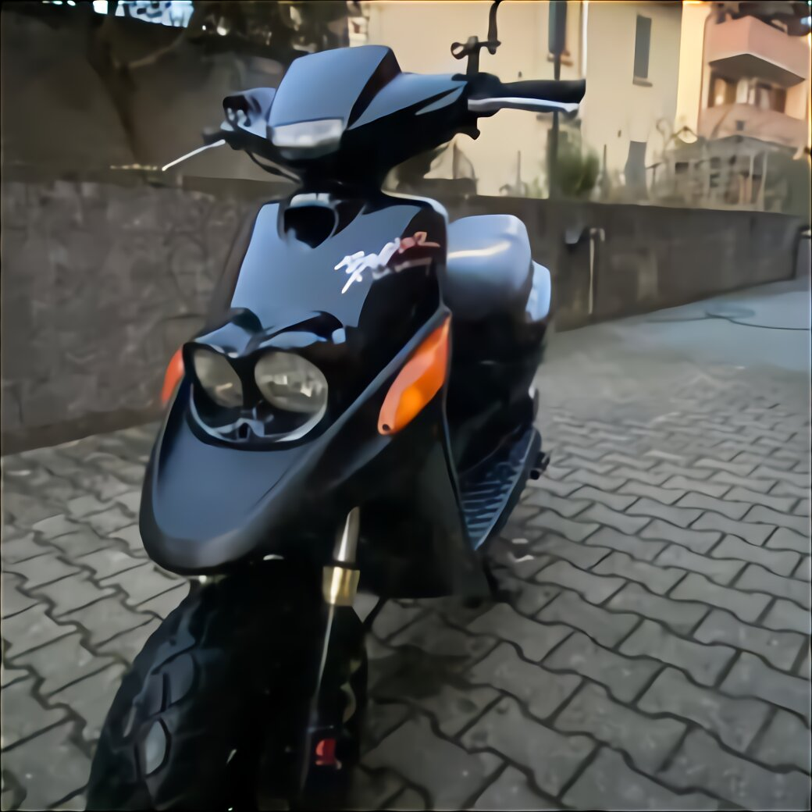
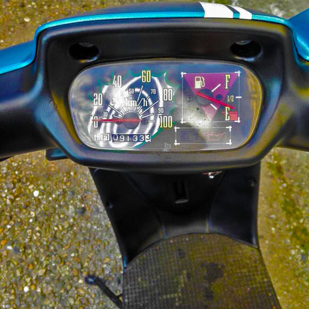
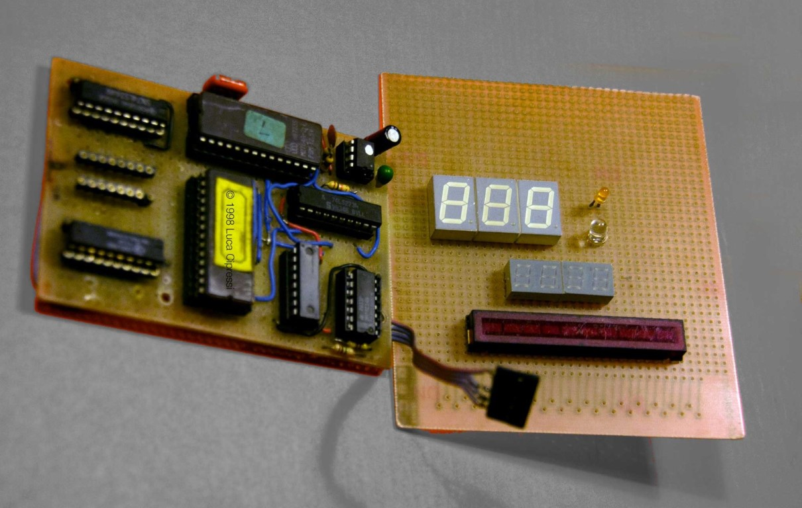
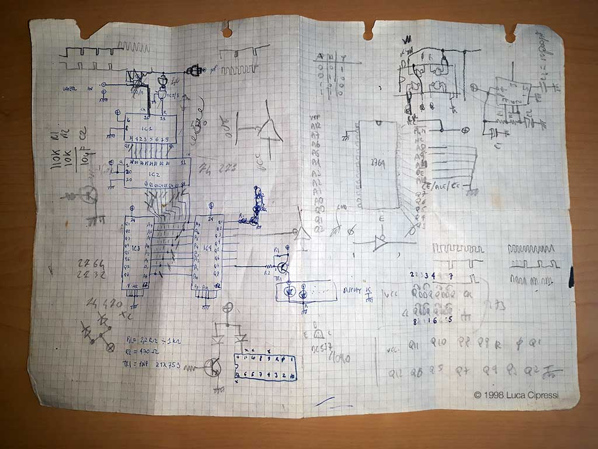

# Digital Tacho for a Scooter

# A relic project from late '90s



This project dates back to my high-school days and albeit it should still be working, the original display board is missing. An effort to restore it to working conditions might be made in the future.



## The Scooter

> "Car's got a lot of pickup."

As every teenager could enjoy riding a 50 cubic centimeters (1.7 cubic feet) scooter, I was no exception back in the schooldays. Like others, mine too was almost completely modified and not officially road-worthy anymore.

> It's got a cop motor, a 440 cubic inch plant, it's got cop tires, cop suspensions, cop shocks. It's a model made before catalytic converters so it'll run good on regular gas. What do you say, is it the new Bluesmobile or what?

The original tachometer:

Other than having a bigger motor (70cc), a more performant exhaust, air filter, modified continuous variator, modified clutch, sporting crankshaft, 17cm carburettor but it had a home-made digital speedometer.

# Main Board

The display board in this picture is a mock-up of what it was originally made and installed inside the scooter's cockpit instead of the original one. The original idea had to have the gas-gauge, trip and total mileage indication, direction and high-beams indicators included.

 and had to recur to scraped wires to make all the connections. Not to mention that the soldering iron tip was quite big and not thermo-regulated. In fact it was a soldering iron directly connected to 230VAC and had to manually unplug it to avoid overheating.")

## Schematic (main board)

This is the last of the original papers I used to bring to school and spend the morning hours filling my notebooks with concepts, sketches and notes of this project. As you can see there are still some over there.

## Calculations

The working theory was based on the fact that I decided to get the rotational impulses from the front disc-brake. It had six holes in a row:

Calculating the speed, knowing the wheel circumference, could have been done by floating point arithmetic by a decent PIC or ATMEL uC, instead I opted for a simpler shortcut as I had plenty of old EPROM memories at disposal, I found out how I could implement a pair of them to get the calculations done. Done yes, as the results were pre-calculated and stored for the different speed detected by the counter.

The six pulses coming from the disc-brake, would have been counted by a CD4040 within a 1 second enable-window controlled by a NE555 monostable. This would have resulted in a 12bit address to fetch the data at that memory locations of two 2764 EPROMS, one for the tenths and one for the units, of the pre-calculated speed. The data present inside the memories was already 7-segment encoded, and ready to be fed though a current buffer to the actual seven-segment displays.
Reaching more than 100 km/h was not really possible, but the scooter, with all the modifications and with the right rear-wind down a slope could actually get past that velocity. Using the MSB from each memory location I could use them signals to drive the segments "b, c" on the hundreds digit figure thus saving a lot of components.

The solder side of the main board, was a painstakingly task to accomplish, with a brutal soldering iron (surely not a Weller with a fine-tip) looking much more that of an idraulic. I only had spare wires and not consistent in their gauges.

# Parts list (Main Board)

| Part Number | Description |
|:-----------:|:----------- |
| NE555       | monostable configuration 1 second pulse |
| 74HC14      | inverter |
| CD4040      | 12-bit binary counter |
| 74LS273     | 3-state buffer for memory addressing |
| M2764A      | 64kbit EPROM (2x) |
| 74LS244     | 3-state buffer for display segment driver |

