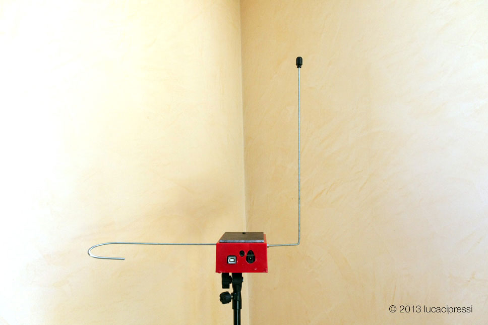
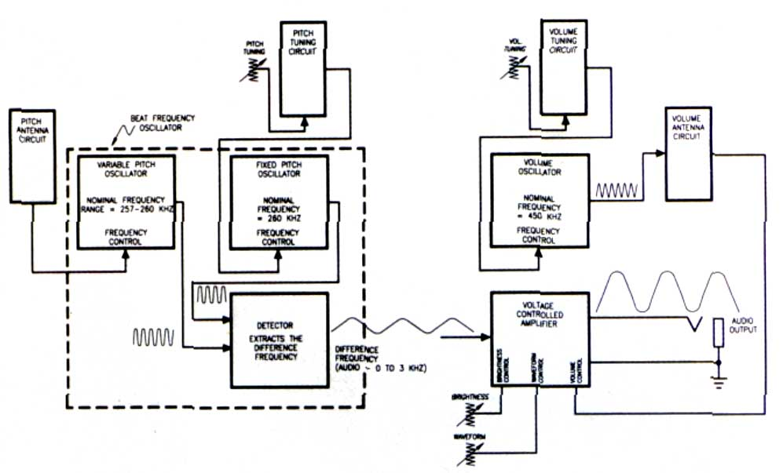
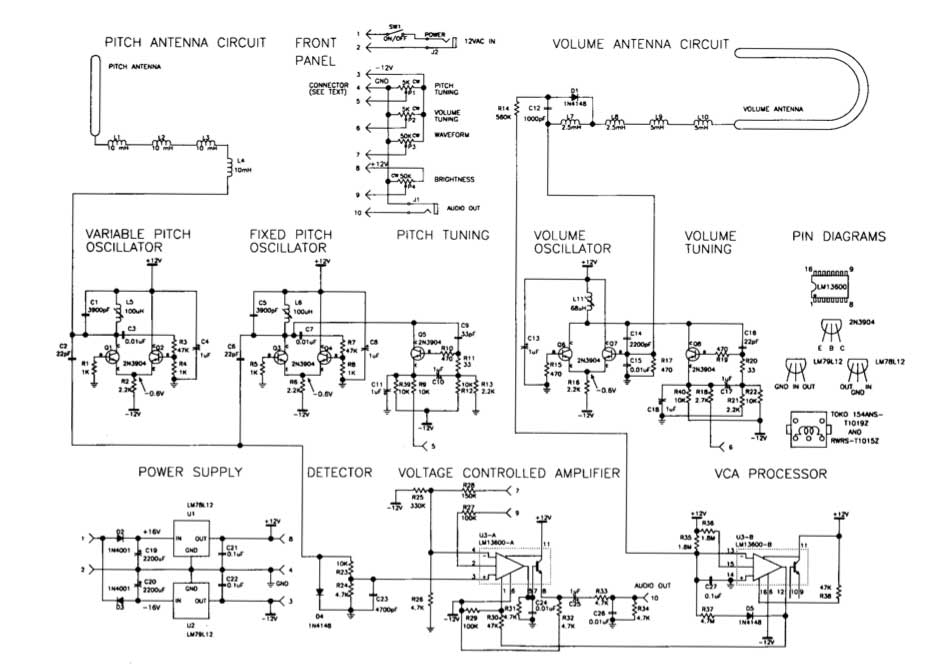

# Theremin

A mighty Theremin build from an open source project powered by an Arduino UNO.
<!--more-->

# Leon Theremin

The theremin is an electronic musical instrument controlled without physical contact by the performer. It is named after its inventor, [Leon Theremin](https://en.wikipedia.org/wiki/Leon_Theremin), who patented the device in 1928.

It was the first electric musical instrument ever made. Like all the greatest invention, it was born while proximity sensors research gone wild :)

One morning I stumbled across the [OpenTheremin](https://www.gaudi.ch/OpenTheremin/) project and I ordered immediately one.

They design and produce Arduino compatible theremin shields with two oscillators as you can control both tone and volume.
I entered the theremin’s world and found it fashinating. And made my first attempt at it:

## The Sound of Theremin

> Schonberg described the sound of the theremin as
> "a cello lost in a dense fog, crying because it does not know how to get home."

The sound of the Theremin is indeed **eerie** and ethereal. It has been used in movies such as:
- Miklós Rózsa's Spellbound and The Lost Weekend
- Bernard Herrmann's The Day the Earth Stood Still
- Justin Hurwitz's First Man

as well as in theme songs for television shows such as the ITV drama Midsomer Murders and the Disney+ series Loki, the latter composed by Natalie Holt.
The theremin is also used in concert music (especially avant-garde and 20th- and 21st-century new music) and in popular music genres such as rock.

- [Beach Boys - Good Vibrations](https://www.youtube.com/watch?v=apBWI6xrbLY)
- [The Big Bang Theory - Sheldon Playing the Theremin](https://www.youtube.com/watch?v=ZnTLZtZzrWU)
- [Theremin - An Electronic Odissey](https://www.youtube.com/watch?v=HNJKKVpj7Fc) Documentary

## Analog vs Digital

The original Theremin was a completely analog apparatus. Being built in the late 1920s, it was very heavy, bulky and used vacuum tubes and very archaic components to generate its two carriers for pitch and volume that were transferred to metal antennas. Probably the latter are the only same component stayed since the original prototypes: the antennas.

It generates two carrier frequencies around 300kHz, slightly displaced each other to avoid cross-modulation and interference. By waving the hands in thin air just near the antennas, the oscillator frequencies are being altered, due to capacitive effects of the body. The internal circuitry then, derives a voltage proportional to the distance from each antennas which, in turn, drives a VCO and a VCA.
These two acronyms, still existing today in modern synths stand for:
- Voltage Controlled Oscillator - able to change its generated frequency via a control voltage.
- Voltage Controlled Amplifier - able to change its gain via a control voltage.

This consistent duality permits the executor to change pitch and amplitude indipendently, giving maximum expressiveness to the execution.
The timbre, given by the VCO waveform directly by its shape, can be customized. But usually a sine-wave-like has always been used due to its "ethereal" appeal.

The most famous 

I went through this paper from Robert Moog:

# Build the EM Theremin
## *This classic electronic instrument gives good vibrations and excitations.*
### By Robert Moog

Most electronic musical instruments are sonic chameleons that try to sound like a wide variety of other things. However, there is one electronic instrument that makes no apologies for its single, immediately recognizable sound: the theremin. This monophonic instrument has added its distinctive, melodic character to the scores of many horror and suspense movies and made its pop debut on the Beach Boys' "Good Vibrations." It has also appeared on many concert stages, including Carnegie Hall.
The theremin was named after its inventor, Russian physicist and musician *Leon Theremin*, who developed the instrument in the 1920s. Unlike most musical instruments, the theremin is played with absolutely no physical contact. Players wave their hands in the air near two antennas. As one hand gets closer to the straight vertical tube (called the *pitch antenna*), the pitch rises; as the other hand gets closer to the horizontal tubular loop (called the volume antenna), the volume decreases. Because the theremin's pitch and volume are intimately tied to the player's hand motions, the tone has a vibrant, wavering quality, not unlike a human voice or a violin.
Among the requests for DIY projects that EM receives, by far the most common is a do-it-yourself theremin. The instrument presented here is an authentic theremin, with antenna response characteristics, pitch range, and tone color that closely emulate Leon Theremin's original designs. However, it is reasonably easy to build. It uses currently available components and materials that you can buy at your local hardware store or from mail-order electronic-parts distributors. If you know how to read a schematic diagram, solder, and use a voltmeter, and if you're comfortable with basic home tools, you should be able to build and adjust this theremin.

### OVERVIEW
When you bring your hand near a theremin antenna, you are actually forming a variable capacitor: the antenna is one "plate" and your hand is the other. With the high frequencies and very low currents used by the instrument, your hand is effectively grounded by being attached to your body, so the antenna and your hand form a variable capacitor to ground. This variable capacitance is called *hand capacitance*. You increase the hand capacitance by bringing your hand nearer to the antenna. During normal operation, the hand capacitance is less than one picofarad, which is a very small capacitance indeed!
Each antenna forms a resonant circuit with a group of inductors collectively called an antenna coil. In this design, the resonant frequencies are about 260 kHz for the pitch antenna and about 450 kHz for the volume antenna. At or near the resonant frequency, a tiny change in hand capacitance results in a larger change in the impedance of the antenna circuit as a whole.
Refer to Figure 1, the functional block diagram

and Figure 2, the schematic diagram of the entire circuit:

The *variable-pitch oscillator* (VPO), *fixed-pitch oscillator* (FPO), and *detector* sections form a *beat-frequency oscillator*. Q1, Q2, and their associated components constitute the VPO, the frequency of which is set slightly higher than the resonant frequency of the pitch-antenna circuit (established by adjusting L5). As a player brings a hand near the pitch antenna, the changing impedance of the pitch antenna circuit lowers the VPO frequency by about 3 kHz.
Q3, Q4, and their associated components form the FPO, the frequency of which is set equal to the VPO frequency (by adjusting L6) when the player's hand is away from the pitch antenna. The difference, or beat, frequency is extracted by the detector and appears as an audio waveform at the junction of R23 and R24. As the player brings a hand near the pitch antenna, the frequency of the audio waveform goes from 0 to about 3 kHz (31⁄2 octaves above middle C).
Q5 and its associated components constitute the *pitch-tuning circuit*. This circuit presents a variable active impedance that is used to make fine adjustments to the FPO frequency while the instrument is being played. Front panel potentiometer P1 adjusts the current through Q5, thereby changing its active impedance.
Q6, Q7, and their associated components form the volume oscillator. Its frequency is set slightly higher than the resonant frequency of the *volume-antenna circuit* by adjusting L11. As the player brings a hand near the volume antenna, the resonant frequency of the volume-antenna circuit is lowered, and the DC voltage appearing at the junction of D1 and C12 is reduced. The resulting current flowing through R14 is amplified and level-shifted by the VCA processor section (U3-B and associated components) and then fed through R30 to control the gain of the voltage-controlled amplifier (U3-A and associated components). The amplitude-controlled audio output is then fed to front-panel jack J1. The maximum level is about 0 dBm (0.8V RMS).
Q8 and its associated components constitute the volume-tuning circuit, which is nearly identical to the pitchtuning circuit. Potentiometer P2 is used to make fine adjustments to the volume-oscillator frequency during performance.
The audio waveform is applied to pin 3 of U3-A at a level high enough to clip it. This has the effect of reshaping the waveform from a skewed sine to a quasi-rectangular wave, which is very similar to
the waveform of Professor Theremin's original instruments. P3 varies the input resistance of U3-A, which influences the amount by which the audio waveform is clipped. P4 shifts the bias at the input of U3-A, which changes the waveform width and therefore the output's harmonic spectrum. C24 and C26 roll off the high-frequency harmonics to produce a pleasant, cello-like tonal balance.

### ANTENNAS
Making the antennas can be tricky. They should be metallic, rugged, attractively finished, capable of being rigidly mounted, and easy to fabricate by a home hobbyist. I have found that 3/8-inch soft copper tubing of the sort that plumbers use with bathroom sinks works well. You can buy preplated, straight, short pieces at your local builders' supply or hardware store. You can also purchase a simple tubing bender that will allow you to bend the volume antenna by hand without collapsing the tubing. You'll also need a tubing cutter or hacksaw to cut the tubing to length.
The finished pitch antenna is a straight, vertical tube eighteen inches long and 3/8 inch in diameter, and the finished volume antenna is a horizontal, hairpin loop with a total length of nine inches. The ends of the volume antenna should be separated by 31⁄4
inches, center to center.
I suggest you make the antennas longer than necessary and then cut them to length after they're formed and stiffened (discussed shortly). Start with a straight, 24- or 36-inch length of tubing for each antenna. To form the volume antenna, slip the tubing bender over the tube. Then, starting ,at the midpoint of the tube, bend it into a semicircular curve. Hold the tube in both hands and push into the curve with your thumbs while pulling down with your other fingers. Doublecheck to make sure that the two ends of the volume antenna are parallel and are the correct distance apart.
Copper tubing has one drawback: because copper is soft enough to bend by hand, it is easy to put unwanted kinks in the tubing after it has been formed. You can stiffen the antennas by filling them with polyester resin (the liquid plus-hardener type used to repair car bodies) after you've formed them. This is not particularly difficult, but the potential for making a mess is significant, so be sure you have plenty of time and you're at peace with the world.
The pitch antenna is straight because this configuration is more sensitive to changing hand position when the hand is farther away and less sensitive when the hand is close. The change in hand capacitance is extremely small when the hand is far away, and the change in pitch as a function of distance must be as uniform as possible.
The volume antenna is looped because this configuration is less sensitive when the hand is far away and more sensitive when the hand is close. This gives you greater control over the low end of the dynamic range and lets you articulate notes by quickly dipping your left hand into the loop (more in a moment)
The two antennas are perpendicular to each other to minimize the interaction between them. For example, as you move your left hand tip and down above the volume antenna, its motion is parallel to the pitch antenna, which causes little or no change in pitch.

## CABINET
The entire cabinet is made of wood. Except for the front panel, large metal cabinet parts should not be used, as they may add unnecessary capacitance to the antennas. My materials of choice are hardwood plywood for the top and solid hardwood for the rest of the cabinet because they are rugged, easy to shape accurately, and can be attractively finished.
The enclosure consists of a base and cover (see Fig. 3). The cover should fit snugly over the base. You may fasten the pieces together with any combination of nails, wood screws, and wood glue, depending on how you like to put cabinets together. After the cabinet parts have been assembled, sand them down well and finish them with the wood finish of your choice, except metallic paint.
The antenna sockets are regular tube-to-pipe connectors that you can get when you buy the copper tubing for the antennas. The volume-antenna sockets are straight 3/8-inch-tube-to-3/8- inch-male-pipe connectors, whereas the pitch-antenna socket is a right-angle, 3/8-inch-tube-to-3/8-inch-male-pipe elbow. Drill 3/8-inch holes for these fittings; then screw them in by hand. If you can't screw the 3/8-inch pipe threads into the wood by hand, don't force it by using a pipe wrench: you may split the wood. Instead, enlarge the hole slightly with a large round file or a 3/8-inch pipe tap.
Once you're sure you can screw in the pipe fittings by hand, unscrew them, put a small amount of epoxy on the threads, and reinsert them by hand. Before the epoxy hardens, verify that the pitch-antenna socket is vertical by inserting the pitch antenna into the socket and adjusting the position of the socket as necessary.
Two 4/4-inch X 3/4-inch blocks and one microphone-stand mounting flange are attached to the bottom of the enclosure. This lets you set the finished unit on a microphone stand (preferred) or on a wood (not metal) table when you play it.

## FRONT PANEL
The front panel should be made of 1/16-inch sheet aluminum. It should be about nine inches long and should have bends at the top and bottom for mounting and stiffening. You can either cut and bend the panel yourself or have your local sheet-metal shop do it for you. Alternatively, you can buy a blank, single-space (1U) rack panel, which is 13⁄4 inches high by nineteen inches wide, cut it to length with a hacksaw, and attach the panel to the base from the front instead of from the bottom. However, that will leave a 1/4-inch gap between the top of the panel and the enclosure cover.
Four rotary potentiometers, one 1/4-inch phone jack, one 1/8-inch mini-jack, and one toggle switch are mounted on the front panel. The two tuning pots should be located in the left part of the panel so your hand is as far from the pitch antenna as possible when You tune the antennas. Use high-quality, full-size rotary pots and large-diameter knobs for PI and P2, P3 and P4 are less critical; these pots can be miniature, and the knobs can be small. I suggest you use an insulated, 1/4-inch jack for J1 to avoid a ground loop between the audio and power grounds.
Eight single-conductor wires and one shielded wire connect the front-panel components to the main circuit board, I suggest you use a connector for these wires so Von can unplug the panel if you need to work on the main circuit board. Prototyping boards often have provisions for mounting a DB15 or DB25 connector.

## MAIN CIRCUIT BOARD
All circuitry (except the antenna circuits and front-panel components) is mounted on one circuit board (see Fig. 4). A plug-in prototyping board of the sort used to assemble computer I/O circuits provides the space, connection provisions, and solidity you need. Radio Shack's prototyping board (catalog #276-1598) provides ample space for all the circuitry with extra room to try your own modifications.
The theremin's power is supplied by a ±12 VAC wall wart, which is widely available (see sidebar "Where to Get Parts and Materials"). The AC voltage is converted into DC by two voltage regulators (UT, U2, and associated components). Keep the power-supply circuit components as close together as possible, and keep connections as short as you can. Be really sure that that C20 and C22 are very close to U2. The negative side of C19 and the positive side of C20 should be connected together with a very short lead, and the grounded side of J2 should also be connected to this lead. The voltage regulators are less likely to oscillate if the connections are kept as short as possible.
Be sure to separate the VPO from the FPO by a couple of inches. These oscillators are already lightly coupled through C2 and C6, so they tend to synchronize at low beat frequencies (which is desirable). Placing the oscillator circuits close together increases the coupling, which may result in an excessive tendency to synchronize. In addition, place C4, C8, and C13 very close to the oscillator circuits with which they are associated to maximize the decoupling.
After the main board is assembled and checked, brush the solder side with a small wire brush and inspect for unwanted solder bridges, wiring mistakes, and weak solder joints. Then set the board in the middle of the cabinet base in preparation for final test and tuning.

## ANTENNACIRCUITBOARDS
The inductors and other antenna-circuit components are mounted on two separate, small circuit boards with little or no copper circuit pattern. LI through L4 are mounted on the pitch-antenna circuit board (see Fig. 4). Position the inductors so they are parallel to one another and about one inch apart, center to center. The inductors are not polarized per se, but each terminal is distinct: one emerges from the center of the coil and the other emerges from the outer layer of the coil. Arbitrarily select one terminal as the beginning and the other as the end, and connect the inductors in series so the end of one inductor is connected to the beginning of the next.
Position the board on the base next to the pitch antenna. The free end of L4 should be close to the main circuit board, and the free end of Ll should be close to the pitch-antenna socket.
Connect a short wire from the free end
of LI to the pitch-antenna socket using a heavy soldering iron or by drilling and tapping a hole for a 4-40 thread and then mounting a solder lug.
L7 through L10, DI, C12, and R14 are mounted on the volume-antenna circuit board (see Fig. 4). As with the pitch-antenna circuit, position the inductors so they are parallel to one another, about an inch apart, and connected so the windings are end to beginning. Position the board near the volume antenna, and install wires to connect the free end of L10 to the volume-antenna socket. In addition, connect the junction of L7 and C12 to the junction of C14 and C15, and connect the free end of R14 to pin 13 of U3.

## CHECKING IT OUT
After you've assembled and cleaned the main board, take a deep breath and check all your connections again. Look for shorts, mistakes, missing connec-
tions, etc. Then connect the front panel to the main board, plug in the power supply, and turn the power switch on.
Use a voltmeter to check the voltages at the inputs and outputs of U1 and U2 (see Fig. 2). Then check the DC voltages at the collectors of Q1 through Q8 (they should all be about +12V); the emitters of Q1 through Q4, Q6, and Q7 (about 0.6V); and the emitters of Q5 and Q8 (about -2.6V). If you don't observe all these readings, check everything until you find the problem.
Next, verify that all three oscillators are working. Read the AC voltages across L5, L6, and L1 I. If you read about 10 VAC, then the corresponding oscillator is producing a waveform. If you don't read any voltage at all, the oscillator is not working. To check the detector, measure the DC voltage across R24. If it's -0.5V or so, the detector is working.
Temporarily connect a pair of headphones or a small powered speaker across R24. Turn the tuning slugs in L5 and L6 counterclockwise until the tops of the slugs hit the shield cans. Be careful. Do not force the slugs farther than they want to go! Turn L5 exactly two turns clockwise. Then turn L6 clockwise slowly until you hear a high-pitched whistle. Keep turning until the tone is in the mid range (about I kHz). Now, turn P1 in either direction. You should hear the pitch change markedly. If you observe all these things, then the entire beat-frequency oscillator circuit is in good shape.
To check the VCA, temporarily connect pin 12 of U3 to ground. (This should turn on the VCA.) Connect your headphones or monitor amp across R34. You should hear a somewhat louder tone. Now, disconnect the temporary ground connection to pin 12 of U3, and connect that pin to -12V. The audio across R34 should disappear. If it does, the VCA is working properly.
While pin 12 of U3 is connected to ground, you can also check the Brightness and Waveform controls (P3 and P4). Use the Pitch Tuning control (PI) to set the tone's pitch to approximately middle C. Then turn the Brightness and Waveform controls. The Brightness control should change the sound from muted to bright, and the Waveform control should change the sound from “reedy” (narrow waveform) to
“full” (wider waveform). After you have checked all of these controls, remove the temporary connection to pin 12 of U3.

## TUNING
Before tuning, clean off your workbench and move aside any large, conductive objects such as desk lamps and test gear. Leave a clear space of two or three feet around your work area. Place the cabinet base in the middle of the cleared space, put the pitch antenna in place, and connect the pitch-antenna circuit board between the antenna and the main board. On the main board, temporarily connect pin 12 of U3 to ground and connect the instrument's audio output to headphones or a monitor amplifier. Now follow these steps to adjust L5 and L6:
1. Set PI (the Pitch Tuning control) to its middle position.
2. Grasp and hold the pitch antenna with one hand. With the other hand, adjust L6 until the beat frequency is zero, Then carefully turn L6 counter-clockwise until you hear a pitch of about 3 kHz (3 1⁄2 octaves above middle C). 3. Let go of the pitch antenna. Slowly
retract your hand from the vicinity of the antenna. You should hear the pitch go down.
4. If the pitch does not go down to zero when you've retracted your hand completely and stepped back, the inductance of L5 is set too high. Advance the slug in L5 clockwise by a small amount, perhaps 1/10 turn or so, and repeat steps 2 and 3.
5. If the pitch goes to zero and then begins to ascend as you retract your hand, the inductance of L5 is set too low. Turn the slug in L5 counterclock-wise by a small amount, and repeat steps 2 and 3.
6. If the pitch jumps abruptly as you retract your hand, the inductance of L5 is set far too low. Turn the slug in L5 counterclockwise approximately a quarter-turn and repeat steps 2 and 3.
Eventually, you will converge on the proper settings for L5 and L6. The idea is to find the settings at which the frequency (a) is zero when you've stepped away from the theremin, (b) begins to ascend when your body is about two feet from the pitch antenna, and (c) reaches about 3 kHz when your hand touches the pitch antenna. Tap lightly on L5 and L6 as you converge on the proper settings, which will stabilize the tuning-slug positions.
This completes the tuning of the pitch oscillators. In performance, the exact tuning is established by adjusting the pitch-tuning control (P1).
Now, remove the temporary ground connection to pin 12 of U3. Connect a voltmeter from pin 12 of U3 to ground, install the volume antenna, and connect the volume-antenna circuit card between the antenna and the main board. Follow these steps to adjust L11:
1. Set P2 to its mid position.
2. Carefully turn the slug in L11 counterclockwise until it is out as far as it will go. The meter should read about -12V.
3. Slowly turn the slug clockwise. At some point, you will see the voltage begin to rise from -12V. Stop when the voltage passes through 0 and becomes positive, At this point, bringing your hand near the volume antenna lowers the voltage; the meter should read about -12V when your hand is two or three inches from the volume antenna.
This completes the tuning of the volume oscillator. In performance, the exact volume is established by adjusting the volume-tuning control (P2).

## PLAYING THE THEREMIN
You are now ready to try your theremin. Place the instrument (with antennas installed) on a microphone stand that is set about 40 inches high. Connect a small monitor amplifier and speaker to J I and the 12 VAC wall-wart power adapter to J2. Turn on SW1 and touch the pitch antenna. Set P2 so the tone is loud when your left hand is well away from the volume antenna and the volume begins to decrease noticeably when your left hand is brought within ten to twelve inches of the volume antenna. Then set PI so the frequency is zero when your right hand is well away from the pitch antenna and the tone becomes apparent when you bring your right hand within 18 to 24 inches of the pitch antenna. Your instrument is now ready to play.
As with any expressive musical instrument, playing the theremin takes some practice. You can start by follow-ing these simple exercises:
1. Stand slightly left of the center of
the instrument with your right shoulder about 24 inches from the pitch antenna. Relax your wrists. Think of a note and hum it to yourself. Then move your right hand toward the pitch antenna until the theremin pitch coincides with the pitch you're humming. Now hold the note. This is not as easy as it sounds, but it's an important technique to learn. At first, you will find it difficult to stand still, but a few hours of practice will work wonders.
2. Hum two different notes, one after the other. Find the first note on the theremin, hold it, and then slowly glide to the second note.
3. Repeat the above exercise, but bring your left hand near the volume antenna while your right hand glides from one note to the next. Move the left hand slowly at first and then more rapidly as you learn to move your left hand independently of your right hand. This exercise teaches you to "feel" where the notes are and to impart expressive dynamics.
4. While playing a note, introduce vibrato by moving your right hand back and forth from your wrist several times a second. Concentrate on making the vibrato even and steady.
These exercises address the basic skills of theremin playing: finding notes, playing intervals, articulating notes, and introducing vibrato. With these basic skills, you can play slow melodies. Practicing regular scales and arpeggios will increase your proficiency. Focus on accuracy of pitch and precise control of dynamics.
Once you've mastered the basic moves, it's time to develop your own style. Pay particular attention to shaping envelopes and dynamics with your left hand. The left hand can also be used to articulate discrete notes by momentarily dipping into the volume antenna as the right hand quickly moves from one pitch to another. Try combining audible glides and discrete pitch changes within a musical phrase. In addition, avoid constant vibrato in the right hand. Instead, impart expressive nuance by shaping the amount and rate of vibrato. These considerations are important components of theremin musicianship.
The theremin presented here is designed to meet the needs of musicians who wish to explore the artistic resources of this unique instrument. Build your instrument carefully, and it will provide many years of reliable service. Practice with diligence, and you will provide enjoyable music for yourself and your audiences. Finally, be sure to give an occasional thought to the spirit of Leon Theremin, to whom we owe so much.

Robert Moog was a pioneer in the early development of commercial synthesizers and currently serves as Grand Poobah of Big Briar, Inc.
