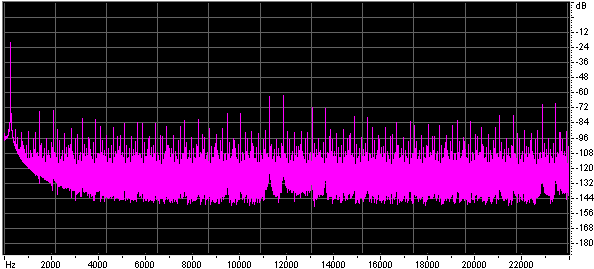

# Theremin


A mighty Theremin build from an open source project powered by an Arduino UNO.
<!--more-->

# Leon Theremin

The theremin is an electronic musical instrument controlled without physical contact by the performer. It is named after its inventor, [Leon Theremin](https://en.wikipedia.org/wiki/Leon_Theremin), who patented the device in 1928.

It was the first electric musical instrument ever made. Like all the greatest invention, it was born while proximity sensors research gone wild :)

One morning I stumbled across the [OpenTheremin](https://www.gaudi.ch/OpenTheremin/) project and I ordered immediately one.

They design and produce Arduino compatible theremin shields with two oscillators as you can control both tone and volume.
I entered the theremin’s world and found it fashinating. And made my first attempt at it:




## The Sound of Theremin

> Schonberg described the sound of the theremin as
> "a cello lost in a dense fog, crying because it does not know how to get home."


The sound of the Theremin is indeed **eerie** and ethereal. It has been used in movies such as:
- Miklós Rózsa's Spellbound and The Lost Weekend
- Bernard Herrmann's The Day the Earth Stood Still
- Justin Hurwitz's First Man

as well as in theme songs for television shows such as the ITV drama Midsomer Murders and the Disney+ series Loki, the latter composed by Natalie Holt.
The theremin is also used in concert music (especially avant-garde and 20th- and 21st-century new music) and in popular music genres such as rock.

- [Beach Boys - Good Vibrations](https://www.youtube.com/watch?v=apBWI6xrbLY)
- [The Big Bang Theory - Sheldon Playing the Theremin](https://www.youtube.com/watch?v=ZnTLZtZzrWU)
- [Theremin - An Electronic Odissey](https://www.youtube.com/watch?v=HNJKKVpj7Fc) Documentary

## Analog vs Digital

The original Theremin was a completely analog apparatus. Being built in the late 1920s, it was very heavy, bulky and used vacuum tubes and very archaic components to generate its two carriers for pitch and volume that were transferred to metal antennas. Probably the latter are the only same component stayed since the original prototypes: the antennas.

It generates two carrier frequencies around 300kHz, slightly displaced each other to avoid cross-modulation and interference. By waving the hands in thin air just near the antennas, the oscillator frequencies are being altered, due to capacitive effects of the body. The internal circuitry then, derives a voltage proportional to the distance from each antennas which, in turn, drives a VCO and a VCA.
These two acronyms, still existing today in modern synths stand for:
- Voltage Controlled Oscillator - able to change its generated frequency via a control voltage.
- Voltage Controlled Amplifier - able to change its gain via a control voltage.

This consistent duality permits the executor to change pitch and amplitude indipendently, giving maximum expressiveness to the execution.
The timbre, given by the VCO waveform directly by its shape, can be customized. But usually a sine-wave-like has always been used due to its "ethereal" appeal.

The most famous 

I went through this paper from Robert Moog:

# Build the EM Theremin
## *This classic electronic instrument gives good vibrations and excitations.*
### By Robert Moog

Most electronic musical instruments are sonic chameleons that try to sound like a wide variety of other things. However, there is one electronic instrument that makes no apologies for its single, immediately recognizable sound: the theremin. This monophonic instrument has added its distinctive, melodic character to the scores of many horror and suspense movies and made its pop debut on the Beach Boys' "Good Vibrations." It has also appeared on many concert stages, including Carnegie Hall.
The theremin was named after its inventor, Russian physicist and musician *Leon Theremin*, who developed the instrument in the 1920s. Unlike most musical instruments, the theremin is played with absolutely no physical contact. Players wave their hands in the air near two antennas. As one hand gets closer to the straight vertical tube (called the *pitch antenna*), the pitch rises; as the other hand gets closer to the horizontal tubular loop (called the volume antenna), the volume decreases. Because the theremin's pitch and volume are intimately tied to the player's hand motions, the tone has a vibrant, wavering quality, not unlike a human voice or a violin.
Among the requests for DIY projects that EM receives, by far the most common is a do-it-yourself theremin. The instrument presented here is an authentic theremin, with antenna response characteristics, pitch range, and tone color that closely emulate Leon Theremin's original designs. However, it is reasonably easy to build. It uses currently available components and materials that you can buy at your local hardware store or from mail-order electronic-parts distributors. If you know how to read a schematic diagram, solder, and use a voltmeter, and if you're comfortable with basic home tools, you should be able to build and adjust this theremin.

### OVERVIEW
When you bring your hand near a theremin antenna, you are actually forming a variable capacitor: the antenna is one "plate" and your hand is the other. With the high frequencies and very low currents used by the instrument, your hand is effectively grounded by being attached to your body, so the antenna and your hand form a variable capacitor to ground. This variable capacitance is called *hand capacitance*. You increase the hand capacitance by bringing your hand nearer to the antenna. During normal operation, the hand capacitance is less than one picofarad, which is a very small capacitance indeed!
Each antenna forms a resonant circuit with a group of inductors collectively called an antenna coil. In this design, the resonant frequencies are about 260 kHz for the pitch antenna and about 450 kHz for the volume antenna. At or near the resonant frequency, a tiny change in hand capacitance results in a larger change in the impedance of the antenna circuit as a whole.
Refer to Figure 1, the functional block diagram



and Figure 2, the schematic diagram of the entire circuit:




The *variable-pitch oscillator* (VPO), *fixed-pitch oscillator* (FPO), and *detector* sections form a *beat-frequency oscillator*. Q1, Q2, and their associated components constitute the VPO, the frequency of which is set slightly higher than the resonant frequency of the pitch-antenna circuit (established by adjusting L5). As a player brings a hand near the pitch antenna, the changing impedance of the pitch antenna circuit lowers the VPO frequency by about 3 kHz.
Q3, Q4, and their associated components form the FPO, the frequency of which is set equal to the VPO frequency (by adjusting L6) when the player's hand is away from the pitch antenna. The difference, or beat, frequency is extracted by the detector and appears as an audio waveform at the junction of R23 and R24. As the player brings a hand near the pitch antenna, the frequency of the audio waveform goes from 0 to about 3 kHz (31⁄2 octaves above middle C).
Q5 and its associated components constitute the *pitch-tuning circuit*. This circuit presents a variable active impedance that is used to make fine adjustments to the FPO frequency while the instrument is being played. Front panel potentiometer P1 adjusts the current through Q5, thereby changing its active impedance.
Q6, Q7, and their associated components form the volume oscillator. Its frequency is set slightly higher than the resonant frequency of the *volume-antenna circuit* by adjusting L11. As the player brings a hand near the volume antenna, the resonant frequency of the volume-antenna circuit is lowered, and the DC voltage appearing at the junction of D1 and C12 is reduced. The resulting current flowing through R14 is amplified and level-shifted by the VCA processor section (U3-B and associated components) and then fed through R30 to control the gain of the voltage-controlled amplifier (U3-A and associated components). The amplitude-controlled audio output is then fed to front-panel jack J1. The maximum level is about 0 dBm (0.8V RMS).
Q8 and its associated components constitute the volume-tuning circuit, which is nearly identical to the pitchtuning circuit. Potentiometer P2 is used to make fine adjustments to the volume-oscillator frequency during performance.
The audio waveform is applied to pin 3 of U3-A at a level high enough to clip it. This has the effect of reshaping the waveform from a skewed sine to a quasi-rectangular wave, which is very similar to
the waveform of Professor Theremin's original instruments. P3 varies the input resistance of U3-A, which influences the amount by which the audio waveform is clipped. P4 shifts the bias at the input of U3-A, which changes the waveform width and therefore the output's harmonic spectrum. C24 and C26 roll off the high-frequency harmonics to produce a pleasant, cello-like tonal balance.

### ANTENNAS
Making the antennas can be tricky. They should be metallic, rugged, attractively finished, capable of being rigidly mounted, and easy to fabricate by a home hobbyist. I have found that 3/8-inch soft copper tubing of the sort that plumbers use with bathroom sinks works well. You can buy preplated, straight, short pieces at your local builders' supply or hardware store. You can also purchase a simple tubing bender that will allow you to bend the volume antenna by hand without collapsing the tubing. You'll also need a tubing cutter or hacksaw to cut the tubing to length.
The finished pitch antenna is a straight, vertical tube eighteen inches long and 3/8 inch in diameter, and the finished volume antenna is a horizontal, hairpin loop with a total length of nine inches. The ends of the volume antenna should be separated by 31⁄4
inches, center to center.
I suggest you make the antennas longer than necessary and then cut them to length after they're formed and stiffened (discussed shortly). Start with a straight, 24- or 36-inch length of tubing for each antenna. To form the volume antenna, slip the tubing bender over the tube. Then, starting ,at the midpoint of the tube, bend it into a semicircular curve. Hold the tube in both hands and push into the curve with your thumbs while pulling down with your other fingers. Doublecheck to make sure that the two ends of the volume antenna are parallel and are the correct distance apart.
Copper tubing has one drawback: because copper is soft enough to bend by hand, it is easy to put unwanted kinks in the tubing after it has been formed. You can stiffen the antennas by filling them with polyester resin (the liquid plus-hardener type used to repair car bodies) after you've formed them. This is not particularly difficult, but the potential for making a mess is significant, so be sure you have plenty of time and you're at peace with the world.
The pitch antenna is straight because this configuration is more sensitive to changing hand position when the hand is farther away and less sensitive when the hand is close. The change in hand capacitance is extremely small when the hand is far away, and the change in pitch as a function of distance must be as uniform as possible.
The volume antenna is looped because this configuration is less sensitive when the hand is far away and more sensitive when the hand is close. This gives you greater control over the low end of the dynamic range and lets you articulate notes by quickly dipping your left hand into the loop (more in a moment)
The two antennas are perpendicular to each other to minimize the interaction between them. For example, as you move your left hand tip and down above the volume antenna, its motion is parallel to the pitch antenna, which causes little or no change in pitch.

## CABINET
The entire cabinet is made of wood. Except for the front panel, large metal cabinet parts should not be used, as they may add unnecessary capacitance to the antennas. My materials of choice are hardwood plywood for the top and solid hardwood for the rest of the cabinet because they are rugged, easy to shape accurately, and can be attractively finished.
The enclosure consists of a base and cover (see Fig. 3). The cover should fit snugly over the base. You may fasten the pieces together with any combination of nails, wood screws, and wood glue, depending on how you like to put cabinets together. After the cabinet parts have been assembled, sand them down well and finish them with the wood finish of your choice, except metallic paint.
The antenna sockets are regular tube-to-pipe connectors that you can get when you buy the copper tubing for the antennas. The volume-antenna sockets are straight 3/8-inch-tube-to-3/8- inch-male-pipe connectors, whereas the pitch-antenna socket is a right-angle, 3/8-inch-tube-to-3/8-inch-male-pipe elbow. Drill 3/8-inch holes for these fittings; then screw them in by hand. If you can't screw the 3/8-inch pipe threads into the wood by hand, don't force it by using a pipe wrench: you may split the wood. Instead, enlarge the hole slightly with a large round file or a 3/8-inch pipe tap.
Once you're sure you can screw in the pipe fittings by hand, unscrew them, put a small amount of epoxy on the threads, and reinsert them by hand. Before the epoxy hardens, verify that the pitch-antenna socket is vertical by inserting the pitch antenna into the socket and adjusting the position of the socket as necessary.
Two 4/4-inch X 3/4-inch blocks and one microphone-stand mounting flange are attached to the bottom of the enclosure. This lets you set the finished unit on a microphone stand (preferred) or on a wood (not metal) table when you play it.

## FRONT PANEL
The front panel should be made of 1/16-inch sheet aluminum. It should be about nine inches long and should have bends at the top and bottom for mounting and stiffening. You can either cut and bend the panel yourself or have your local sheet-metal shop do it for you. Alternatively, you can buy a blank, single-space (1U) rack panel, which is 13⁄4 inches high by nineteen inches wide, cut it to length with a hacksaw, and attach the panel to the base from the front instead of from the bottom. However, that will leave a 1/4-inch gap between the top of the panel and the enclosure cover.
Four rotary potentiometers, one 1/4-inch phone jack, one 1/8-inch mini-jack, and one toggle switch are mounted on the front panel. The two tuning pots should be located in the left part of the panel so your hand is as far from the pitch antenna as possible when You tune the antennas. Use high-quality, full-size rotary pots and large-diameter knobs for PI and P2, P3 and P4 are less critical; these pots can be miniature, and the knobs can be small. I suggest you use an insulated, 1/4-inch jack for J1 to avoid a ground loop between the audio and power grounds.
Eight single-conductor wires and one shielded wire connect the front-panel components to the main circuit board, I suggest you use a connector for these wires so Von can unplug the panel if you need to work on the main circuit board. Prototyping boards often have provisions for mounting a DB15 or DB25 connector.

## MAIN CIRCUIT BOARD
All circuitry (except the antenna circuits and front-panel components) is mounted on one circuit board (see Fig. 4). A plug-in prototyping board of the sort used to assemble computer I/O circuits provides the space, connection provisions, and solidity you need. Radio Shack's prototyping board (catalog #276-1598) provides ample space for all the circuitry with extra room to try your own modifications.
The theremin's power is supplied by a ±12 VAC wall wart, which is widely available (see sidebar "Where to Get Parts and Materials"). The AC voltage is converted into DC by two voltage regulators (UT, U2, and associated components). Keep the power-supply circuit components as close together as possible, and keep connections as short as you can. Be really sure that that C20 and C22 are very close to U2. The negative side of C19 and the positive side of C20 should be connected together with a very short lead, and the grounded side of J2 should also be connected to this lead. The voltage regulators are less likely to oscillate if the connections are kept as short as possible.
Be sure to separate the VPO from the FPO by a couple of inches. These oscillators are already lightly coupled through C2 and C6, so they tend to synchronize at low beat frequencies (which is desirable). Placing the oscillator circuits close together increases the coupling, which may result in an excessive tendency to synchronize. In addition, place C4, C8, and C13 very close to the oscillator circuits with which they are associated to maximize the decoupling.
After the main board is assembled and checked, brush the solder side with a small wire brush and inspect for unwanted solder bridges, wiring mistakes, and weak solder joints. Then set the board in the middle of the cabinet base in preparation for final test and tuning.

## ANTENNACIRCUITBOARDS
The inductors and other antenna-circuit components are mounted on two separate, small circuit boards with little or no copper circuit pattern. LI through L4 are mounted on the pitch-antenna circuit board (see Fig. 4). Position the inductors so they are parallel to one another and about one inch apart, center to center. The inductors are not polarized per se, but each terminal is distinct: one emerges from the center of the coil and the other emerges from the outer layer of the coil. Arbitrarily select one terminal as the beginning and the other as the end, and connect the inductors in series so the end of one inductor is connected to the beginning of the next.
Position the board on the base next to the pitch antenna. The free end of L4 should be close to the main circuit board, and the free end of Ll should be close to the pitch-antenna socket.
Connect a short wire from the free end
of LI to the pitch-antenna socket using a heavy soldering iron or by drilling and tapping a hole for a 4-40 thread and then mounting a solder lug.
L7 through L10, DI, C12, and R14 are mounted on the volume-antenna circuit board (see Fig. 4). As with the pitch-antenna circuit, position the inductors so they are parallel to one another, about an inch apart, and connected so the windings are end to beginning. Position the board near the volume antenna, and install wires to connect the free end of L10 to the volume-antenna socket. In addition, connect the junction of L7 and C12 to the junction of C14 and C15, and connect the free end of R14 to pin 13 of U3.

## CHECKING IT OUT
After you've assembled and cleaned the main board, take a deep breath and check all your connections again. Look for shorts, mistakes, missing connec-
tions, etc. Then connect the front panel to the main board, plug in the power supply, and turn the power switch on.
Use a voltmeter to check the voltages at the inputs and outputs of U1 and U2 (see Fig. 2). Then check the DC voltages at the collectors of Q1 through Q8 (they should all be about +12V); the emitters of Q1 through Q4, Q6, and Q7 (about 0.6V); and the emitters of Q5 and Q8 (about -2.6V). If you don't observe all these readings, check everything until you find the problem.
Next, verify that all three oscillators are working. Read the AC voltages across L5, L6, and L1 I. If you read about 10 VAC, then the corresponding oscillator is producing a waveform. If you don't read any voltage at all, the oscillator is not working. To check the detector, measure the DC voltage across R24. If it's -0.5V or so, the detector is working.
Temporarily connect a pair of headphones or a small powered speaker across R24. Turn the tuning slugs in L5 and L6 counterclockwise until the tops of the slugs hit the shield cans. Be careful. Do not force the slugs farther than they want to go! Turn L5 exactly two turns clockwise. Then turn L6 clockwise slowly until you hear a high-pitched whistle. Keep turning until the tone is in the mid range (about I kHz). Now, turn P1 in either direction. You should hear the pitch change markedly. If you observe all these things, then the entire beat-frequency oscillator circuit is in good shape.
To check the VCA, temporarily connect pin 12 of U3 to ground. (This should turn on the VCA.) Connect your headphones or monitor amp across R34. You should hear a somewhat louder tone. Now, disconnect the temporary ground connection to pin 12 of U3, and connect that pin to -12V. The audio across R34 should disappear. If it does, the VCA is working properly.
While pin 12 of U3 is connected to ground, you can also check the Brightness and Waveform controls (P3 and P4). Use the Pitch Tuning control (PI) to set the tone's pitch to approximately middle C. Then turn the Brightness and Waveform controls. The Brightness control should change the sound from muted to bright, and the Waveform control should change the sound from “reedy” (narrow waveform) to “full” (wider waveform). After you have checked all of these controls, remove the temporary connection to pin 12 of U3.

## TUNING
Before tuning, clean off your workbench and move aside any large, conductive objects such as desk lamps and test gear. Leave a clear space of two or three feet around your work area. Place the cabinet base in the middle of the cleared space, put the pitch antenna in place, and connect the pitch-antenna circuit board between the antenna and the main board. On the main board, temporarily connect pin 12 of U3 to ground and connect the instrument's audio output to headphones or a monitor amplifier. Now follow these steps to adjust L5 and L6:
1. Set PI (the Pitch Tuning control) to its middle position.
2. Grasp and hold the pitch antenna with one hand. With the other hand, adjust L6 until the beat frequency is zero, Then carefully turn L6 counter-clockwise until you hear a pitch of about 3 kHz (3 1⁄2 octaves above middle C). 3. Let go of the pitch antenna. Slowly
retract your hand from the vicinity of the antenna. You should hear the pitch go down.
4. If the pitch does not go down to zero when you've retracted your hand completely and stepped back, the inductance of L5 is set too high. Advance the slug in L5 clockwise by a small amount, perhaps 1/10 turn or so, and repeat steps 2 and 3.
5. If the pitch goes to zero and then begins to ascend as you retract your hand, the inductance of L5 is set too low. Turn the slug in L5 counterclock-wise by a small amount, and repeat steps 2 and 3.
6. If the pitch jumps abruptly as you retract your hand, the inductance of L5 is set far too low. Turn the slug in L5 counterclockwise approximately a quarter-turn and repeat steps 2 and 3.
Eventually, you will converge on the proper settings for L5 and L6. The idea is to find the settings at which the frequency (a) is zero when you've stepped away from the theremin, (b) begins to ascend when your body is about two feet from the pitch antenna, and (c) reaches about 3 kHz when your hand touches the pitch antenna. Tap lightly on L5 and L6 as you converge on the proper settings, which will stabilize the tuning-slug positions.
This completes the tuning of the pitch oscillators. In performance, the exact tuning is established by adjusting the pitch-tuning control (P1).
Now, remove the temporary ground connection to pin 12 of U3. Connect a voltmeter from pin 12 of U3 to ground, install the volume antenna, and connect the volume-antenna circuit card between the antenna and the main board. Follow these steps to adjust L11:
1. Set P2 to its mid position.
2. Carefully turn the slug in L11 counterclockwise until it is out as far as it will go. The meter should read about -12V.
3. Slowly turn the slug clockwise. At some point, you will see the voltage begin to rise from -12V. Stop when the voltage passes through 0 and becomes positive, At this point, bringing your hand near the volume antenna lowers the voltage; the meter should read about -12V when your hand is two or three inches from the volume antenna.
This completes the tuning of the volume oscillator. In performance, the exact volume is established by adjusting the volume-tuning control (P2).

## PLAYING THE THEREMIN
You are now ready to try your theremin. Place the instrument (with antennas installed) on a microphone stand that is set about 40 inches high. Connect a small monitor amplifier and speaker to J I and the 12 VAC wall-wart power adapter to J2. Turn on SW1 and touch the pitch antenna. Set P2 so the tone is loud when your left hand is well away from the volume antenna and the volume begins to decrease noticeably when your left hand is brought within ten to twelve inches of the volume antenna. Then set PI so the frequency is zero when your right hand is well away from the pitch antenna and the tone becomes apparent when you bring your right hand within 18 to 24 inches of the pitch antenna. Your instrument is now ready to play.
As with any expressive musical instrument, playing the theremin takes some practice. You can start by follow-ing these simple exercises:
1. Stand slightly left of the center of
the instrument with your right shoulder about 24 inches from the pitch antenna. Relax your wrists. Think of a note and hum it to yourself. Then move your right hand toward the pitch antenna until the theremin pitch coincides with the pitch you're humming. Now hold the note. This is not as easy as it sounds, but it's an important technique to learn. At first, you will find it difficult to stand still, but a few hours of practice will work wonders.
2. Hum two different notes, one after the other. Find the first note on the theremin, hold it, and then slowly glide to the second note.
3. Repeat the above exercise, but bring your left hand near the volume antenna while your right hand glides from one note to the next. Move the left hand slowly at first and then more rapidly as you learn to move your left hand independently of your right hand. This exercise teaches you to "feel" where the notes are and to impart expressive dynamics.
4. While playing a note, introduce vibrato by moving your right hand back and forth from your wrist several times a second. Concentrate on making the vibrato even and steady.
These exercises address the basic skills of theremin playing: finding notes, playing intervals, articulating notes, and introducing vibrato. With these basic skills, you can play slow melodies. Practicing regular scales and arpeggios will increase your proficiency. Focus on accuracy of pitch and precise control of dynamics.
Once you've mastered the basic moves, it's time to develop your own style. Pay particular attention to shaping envelopes and dynamics with your left hand. The left hand can also be used to articulate discrete notes by momentarily dipping into the volume antenna as the right hand quickly moves from one pitch to another. Try combining audible glides and discrete pitch changes within a musical phrase. In addition, avoid constant vibrato in the right hand. Instead, impart expressive nuance by shaping the amount and rate of vibrato. These considerations are important components of theremin musicianship.
The theremin presented here is designed to meet the needs of musicians who wish to explore the artistic resources of this unique instrument. Build your instrument carefully, and it will provide many years of reliable service. Practice with diligence, and you will provide enjoyable music for yourself and your audiences. Finally, be sure to give an occasional thought to the spirit of Leon Theremin, to whom we owe so much.

Robert Moog was a pioneer in the early development of commercial synthesizers and currently serves as Grand Poobah of Big Briar, Inc.


# Sinewave look-up table

The following section quotes talks about generating a sine-wave by look-up table.
This is useful for the OpenTheremin version, where the wave is defined by a generated LUT.

 by Olli Niemitalo Posted on 2010-03-05

Here is a method for generating a sine look-up table in case you have little (a few kilobytes of) program memory. The idea goes like this: Let's say you have a sine wave lookup table of length 1024 with a 24-bit amplitude range. If you take the difference between successive samples, the range of the numbers is reduced. If you repeat the process a total of 3 times, the data will be dominated by the 3rd differential of the quantization noise and will have a range of -4 to 3, which can be conveniently stored in 3 bits only. This program below does the reverse, it generates the sine table from the 3-bit values, and also takes advantage of the symmetry properties of sine. So, instead of wasting 1024 program memory words for storing the original sine table, in the c-language implementation below, the compressed data takes only 35 24-bit words and the decompression code hopefully not too much more. 

```

/* Multiplierless 1024-sample, 24-bit sine table generator
 *
 * by Olli Niemitalo in 2010-03-07.
 * This work is placed in the public domain.
 */
 
#include <stdio.h>;
 
/* Sine table with one extra sample to enable interpolation
 *
 * Sine with amplitude -0x800000 .. 0x800000 was rounded to
 * nearest integer and truncated to -0x800000 .. 0x7fffff.
 * int data type must be at least 24-bit.
 */
int sineTable[1025];
 
void generateTable() {
  int i, j, k;
  const int magic[33] = {
    0x691864, 0x622299, 0x2CB61A, 0x461622,
    0x62165A, 0x85965A, 0x0D3459, 0x65B10C,
    0x50B2D2, 0x4622D9, 0x88C45B, 0x461828,
    0x6616CC, 0x6CC2DA, 0x512543, 0x65B69A,
    0x6D98CC, 0x4DB50B, 0x86350C, 0x7136A2,
    0x6A974B, 0x6D531B, 0x70D514, 0x4EA714,
    0x5156A4, 0x393A9D, 0x714A6C, 0x755555,
    0x5246EB, 0x916556, 0x7245CD, 0xB4F3CE,
    0x6DBC7A
  };
  k = 0;
  for (i = 0; i < 33; i++) {
    for (j = 0; j < 24; j += 3) {
      sineTable[k++] = ((magic[i] >> j) & 7) - 4;
    }
  }
  sineTable[1] = 51472;
  for (i = 3; i > 0; i--) {
    for (j = i; j <= 256; j++) {
      k = sineTable[j - 1];
      sineTable[j] = k + sineTable[j];
      sineTable[513-j] = k;
      sineTable[511+j] = -k;
      sineTable[1025-j] = -k;
    }
  }
  sineTable[768] = -0x800000;
}
 
int main() {
  int i;
 
  generateTable();
 
  /* Printout */
  for (i = 0; i < 1025; i++) {
    printf("%d\t%d\n", i, sineTable[i]);
  }
 
  return 0;
}

```

 Here is a spreadsheet that illustrates the algorithm: sinetable.xls. [T.B.D.]
 
 The above implementation additionally embeds the seeds 0 and -3 in the magic data
 
 
## Using polinomials

(a comment to the above article) 


Michel Rouzic says:	
2014-11-15 at 18:34

I have another solution. You know how you can approximate the cosine/sine using polynomials? And how every time you halve the range your polynomial covers you multiply the precision by 2^(degree of the polynomial + 1)? So you got your x = [0, 2^32-1] input that represents the angle in turns, do the symmetry thing to turn it into a value in the first quadrant, take the top N bits, use them as the index for your array of polynomial coefficients, compute the polynomial by doing (((c2 * xl >> fmt) + c1) * xl >> fmt) + c0; (for quadratic approximations), change the sign depending on the input quadrant, and there’s your result!

If you go with quadratic approximations and 32 segments then you only need a 384 byte pre-computed table (32 segments, 3 coefficients per segment, coefficients are 32 bits) and you get max error of 1/1,450,000 (-123 dB), and on a modern computer it runs in about 15 cycles (I don’t use symmetry so it goes even faster). You can save more memory using a smaller table (at the cost of a max of 8x precision for each 2x decrement) or using higher degree polynomials (at the expense of CPU time).


Olli Niemitalo says:	
2015-02-20 at 15:30

Michel, I believe your performance figures, they sound very plausible. Here’s more on using polynomials for sin cos generation: http://www.rossbencina.com/code/sinusoids


# Fun with sinusoids

> http://www.rossbencina.com/code/sinusoids

Introduction

I’ve liked sinusoids for a long time. This is a place where I’m going to write about them.

This page initially came about while investigating efficient implementations of Ollie Niemitalo’s parabolic sin(x) approximation (see below.) At the moment it’s a bit disorganised, but perhaps you will find something of interest here.
Performance Measurement Methodology

The perfomance measurements shown below were conducted under strict unscientific conditions with no third-party validation at our secret labs in Tierra Del Fuego. The measurements are stated in machine cycles and were performed with MSVC on a PIII/550.
Approximations

There are quite a few ways to approximate sinusoids: Taylor polynomials, CORDIC, iterative methods, lookup tables, just to name a few. I’m building up a catalog of some of these below. It’s not finished yet.

Joakim Dahlström has kindly contributed a Java applet which allows you to visually explore various sinusoidal approximations and their parameters.
Look Up Tables (LUTs)

Look-up tables are commonly used for generating all sorts of functions which are expensive to calculate on the fly. The general idea is that values are pre-calculated and stored in an array so they can be “looked up” later. In this case we are concerned with storing values of sin(x) in a lookup table.

Variants on the look up table use interpolation to approximate values “in the gaps” between the values stored in the table. The simplest form of interpolation is linear interpolation, which interpolates along a line between adjacent points.

Both the size of the lookup table, and the method of interpolation effect the quality of the approximation. Below are the spectra of sine waves generated using look up tables of different table sizes with no interpolation and with linear interpolation.




Below are some wave files of sine waves generated using very short lookup tables, each file is 45k. You might find it interesting to look at them in a wave editor.

[4 point LUT, no interpolation](04-ni.wav)

[4 point LUT, linear interpolation](04-li.wav)

[8 point LUT, no interpolation](08-ni.wav)

[8 point LUT, linear interpolation](08-li.wav)

[16 point LUT, no interpolation](16-ni.wav)

[16 point LUT, linear interpolation](16-li.wav)

[32 point LUT, no interpolation](32-ni.wav)

[32 point LUT, linear interpolation](32-li.wav)

An implementation of approximate_sin(x) using a non-interpolated 64k lookup table took 90 cycles.

## An Optimized LUT Implementation

Oskari Tammelin contributed the following i86 assembley optimised LUT implementation which can be used for synthesizing sine waves, or any other waveform.


```

looppi:
    mov edi, esi
    shr edi, (32 - LUT_BITS)
    mov edx, esi
    and edx, (1 << (32 - LUT_BITS)) - 1;
    mov eax, Lut[edi*8+4]
    imul edx
    add esi, ecx
    add edx, Lut[edi*8]
    mov edi, esi
    mov [ebp], edx
    shr edi, (32 - LUT_BITS)
    mov edx, esi
    and edx, (1 << (32 - LUT_BITS)) - 1;
    mov eax, Lut[edi*8+4]
    imul edx
    add ebp, 8
    add edx, Lut[edi*8]
    add esi, ecx
    mov [ebp-4], edx
    cmp ebp, [esp]
    jnz looppi
    
```

Oskari provided the following explanation (slightly edited):

>   esi is the phase, ebp the output pointer
    The LUT should contain one cycle of a sinewave, interleaved with the delta between adjacent points ([x+1] – x[i]) to make linear interpolation easier. The deltas in the table must be scaled by number of samples in the LUT because edx for the imul is taken from the lower part of the phase in order to save one shl.
    It calculates two samples per iteration and executes in approximately 7.8 cycles / sample.
    
    
## An Optimised LUT in C

Magnus Jonsson contributed the following code:

```
#define PI 3.1415926535897932384626433832795
#define TABLE_BITS 8
#define TABLE_SIZE (1<<TABLE_BITS)
#define TABLE_SIZE2 (2<<TABLE_BITS)
float table[TABLE_SIZE+1];

void init_table()
{
    for(int i=0;i<TABLE_SIZE;i++){
        double x=(double)i/(TABLE_SIZE-1);
        double y=PI/2;
        if(i!=0)
            y=sin(x*y)/x;
        table[i]=y*1.0/65536.0/65536.0;
    }
}			

float zael_sin4(unsigned x)
{
    unsigned a=-((unsigned)x>>31);
    x+=x;
    unsigned b=-((unsigned)x>>31);
    x^=b;
    float scale=table[x>>31-TABLE_BITS];
    x^=a;
    return (int)x*scale;
}
```

## Piecewise Polynomial Approximation

A method of approximating sinusoids using piecewise parabolic approximations of sin(x) [here](https://dspguru.com/dsp/tricks/parabolic-approximation-of-sin-and-cos/).

Olli’s algorithm using C=0.75 provides a continuous first order derivative resulting in harmonics which decay at a rate of -18dB per octave.


 and Ollie’s approximation with C=0.75. The upper curve is the approximation the lower curve is sin(x).")


## (Almost) Branch-Free Integer Implementation

Below is my (almost) branch-free integer implementation based on Ollie’s. It’s worth noting that Ollie’s can produce sin(x)/cos(x) at the same time – I havn’t got around to implementing that yet. For some reason this implementation has a much higher noise floor that the other contributions below, you would probably be better off using one of them.

This version takes 37 cycles not including the if( x == 0 ) conditional.


```
/*
approximate_cos() by Ross Bencina <rossb@audiomulch.com>
based on Olli Niemitalo's <oniemita@mail.student.oulu.fi>
parabolic sin and cos implementation, available here:
http://www.dspguru.com/comp.dsp/tricks/alg/sincos.htm

this version is a variation on Olli's which uses no branches and
hence may be able to run faster on some pipelined architectures.

input range: a 32 bit unsigned long, 0 => 0, 0xFFFFFFFF => 2 Pi
output range: a 32 bit unsigned long -1 => 0, 1 => 0xFFFFFFFF

this version currently generates the incorrect value for x=0
if you work out how to fix it without slowing the code down
please let me know.
*/

unsigned long approximate_cos( unsigned long x )
{
	unsigned long i,j,k; 

	if( x == 0 )
		return 0xFFFFFFFF;

	i = x << 1;                                 // 2f phasor (full unsigned amp)

	k = ((x + 0xBFFFFFFD) & 0x80000000) >> 30;  // 1f square 270 degrees out of phase, 0 to 2

	j = i - i * ((i & 0x80000000)>>30);         // 2f triangle
	j = j >> 15;

	j = (j * j + j) >> 1;                          // polynomial shaping into |sin|
	j = j - j * k;                              // switch phase of second half

	return j;
}
```

## i86 Assembly Version

Ollie contributed this i86 assembler version which executes in 14 cycles.

```
	mov  EAX, phase            //EAX = 32-bit phase
	add  EAX, EAX              //Carry = the half bit, EAX = phase within half
	sbb  EBX, EBX              //EBX = 0 if left half, -1 if right half
	sub  EAX, 80000000h        //Shift phase by a quarter
	imul EAX                   //EDX = 0..40000000h
	sub  EBX, 80000000h        //EBX = -80000000h if left half, +7fffffffh if right
	lea  EAX, [0c0000000h+EDX] //Add bias to the parabola
	imul EBX                   //Change sign if necessary
	mov  result, EDX           //Result = sine approximation -20000000h..+1fffffffh
```

And the shortest assembler version so far, 5 instructions:

```
	mov  EBX, phase             //EBX = 32-bit phase
	lea  EAX, [80000000h+EBX*2] //Take phase within half, shift by 1/4
	sar  EBX, 31                //Get sign
	imul EAX                    //EDX = 0..40000000h
	lea  EAX, [80000000h+EDX*2] //Add bias to the parabola
	xor  EAX, EBX               //Change sign if necessary
	mov  result, EAX            //Result = -80000000h..7fffffffh

```

## 16 bit Branch Free Implementation

Lauri Viitanen has provided a C language 16 bit branch free version of Ollie’s algorithm that computes sine and cosine terms simultaneously. Written in C (GPLed), it’s here: [fastSinCos16.c](www.rossbencina.com/static/code/sinusoids/fastSinCos16.c)

```
/*
 *  fastSinCos16, a fast 16 bit sine and cosine approximator.
 *  Copyright (C) 2011 Lauri Viitanen
 *
 *  This program is free software: you can redistribute it and/or modify
 *  it under the terms of the GNU General Public License as published by
 *  the Free Software Foundation, either version 3 of the License, or
 *  (at your option) any later version.
 *
 *  This program is distributed in the hope that it will be useful,
 *  but WITHOUT ANY WARRANTY; without even the implied warranty of
 *  MERCHANTABILITY or FITNESS FOR A PARTICULAR PURPOSE.  See the
 *  GNU General Public License for more details.
 *
 *  You should have received a copy of the GNU General Public License
 *  along with this program.  If not, see http://www.gnu.org/licenses/ .
 */

/* Average and maximum relative and absolute deviations of this
   algorithm from libc's sin() and cos() values:

One multiplication, no extra accuracy:
fastSinCos16            ****************************************
        Max rel         Avg rel         Max abs         Avg abs
SINE  : 1.546518        0.085854        0.056234        0.030120
COSINE: 1.546518        0.085852        0.056173        0.030118

One multiplication with extra accuracy:
fastSinCos16            ****************************************
        Max rel         Avg rel         Max abs         Avg abs
SINE  : 0.273291        0.085637        0.056112        0.030089
COSINE: 0.273291        0.085635        0.056112        0.030088

Two multiplications, no extra accuracy:
fastSinCos16            ****************************************
        Max rel         Avg rel         Max abs         Avg abs
SINE  : 1.546518        0.040205        0.023725        0.013693
COSINE: 0.909888        0.040191        0.023664        0.013693

Two multiplications with extra accuracy:
fastSinCos16            ****************************************
        Max rel         Avg rel         Max abs         Avg abs
SINE  : 0.363371        0.040009        0.023603        0.013693
COSINE: 0.363371        0.040008        0.023603        0.013693 */

#define DOUBLE_ACCURACY
#define EXTRA_ACCURACY

/* @fn  	fastSinCos16
 * @brief	A fast 16 bit sine and cosine approximator.
 *
 * This is a direct 16 bit branch free fixed point implementation of Olli
 * Niemitalo's simultaneous parabolic approximation of sin and cos. A detailed
 * description of the algoritm can be seen (at least up to Jan 2011) in
 * http://www.dspguru.com/dsp/tricks/parabolic-approximation-of-sin-and-cos .
 *
 * The number presentation used in results is as follows:
 *     bit 15: sign
 *     bit 14: integer part
 *     13 - 0: decimal part
 *
 * @param	ux      Input angle: 0x0000 = 0, 0xffff ~= pi/2
 * @param	sin_out Address that will contain sin(x).
 * @param	cos_out Address that will contain cos(x).
 */
void fastSinCos16(unsigned short ux, short* sin_out, short* cos_out)
{
	short cos_b, sin_b;
	short cos_axxc, sin_axxc;

	short halfMask = (short)ux >> 15;
	short quarterMask = -((ux >> 14) & 1);

	ux &= 0x3fff; /* Convert to fixed point range 1 ... 0. */
	short x = (short)ux;

	x -= 0x1fff; /* Convert to range -0.5 ... 0.5. */
	sin_b = x;
	cos_b = -x;

	int lx = x - 0x2; /* A tiny offset adjustment... */
	lx *= lx;
	lx = (lx >> 14) & 0xffff;

	#ifdef DOUBLE_ACCURACY
		/* A = 2 - 4sin(pi/4) = 2 - 4*0.70710678118654752440 */
		lx *= 0x8000 - 4*0x2d41; /* x = Ax^2 */
		lx >>= 14;

		x = (short)(lx & 0xffff);
		cos_axxc = x + 0x2d41; /* = Ax^2 + C */
	#else
		/* A = 3/4 = 0.75 */
		lx = -lx; /* x = -x^2 */

		x = (short)(lx & 0xffff);
		cos_axxc = x + 0x3000; /* = Ax^2 + C */
	#endif

	sin_axxc = cos_axxc;

	cos_axxc ^= quarterMask;
	sin_b ^= quarterMask;

	#ifdef EXTRA_ACCURACY
		quarterMask &= 1;
		cos_b += quarterMask;
		sin_b += quarterMask;
	#endif

	cos_axxc ^= halfMask;
	cos_b ^= halfMask;
	sin_axxc ^= halfMask;
	sin_b ^= halfMask;

	#ifdef EXTRA_ACCURACY
		halfMask &= 2;
		cos_b += halfMask;
		sin_b += halfMask;
	#endif

	cos_axxc += cos_b; /* sin(x) ~= (2 - 4C)x^2 + Bx + C */
	sin_axxc += sin_b; /* cos(x) ~= (2 - 4C)x^2 - Bx + C */

	*cos_out = cos_axxc;
	*sin_out = sin_axxc;
}

```

## Floating-Point Implementation

René Ceballos contributed the following pure floating point implementation of Olli’s approximation with C=0.75.

This version takes 62 cycles.

```
/*
    approximate_sin() by René G. Ceballos <rene@rgcaudio.com>
    input range: 0.0 to 2.0 * Pi
    output range: -1.0 to 1.0
*/
float approximate_sin( float angle )
{
    const float k2_oPi = 2.f / Pi;
    const float k2Pi = Pi2;
    const float kPi_2 = Pi / 2;
    const float kPi = Pi;
    const float kPi_32 = 3 * Pi / 2;
    float x,j;

    if( angle < kPi_2 ){

        x = angle * k2_oPi - 0.5f;
        j = -(x * x) + 0.75f + x;

    }else if( angle < kPi ){

        angle = kPi - angle;
        x = angle * k2_oPi - 0.5f;
        j = -(x * x) + 0.75f + x;

    }else if( angle < kPi_32 ){

        angle -= Pi;
        x = angle * k2_oPi - 0.5f;
        j = x * x - 0.75f - x;

    }else{

        angle = k2Pi - angle;
        x = angle * k2_oPi - 0.5f;
        j = x * x - 0.75f - x;
    }
    return j;
}
```

## Another Branch Free Integer Approximation

The following four sinusoidal approximation implementations were contributed by Magnus Jonsson. They are based on the same parabolic approximation as Olli’s but were derived independently.

The first C version takes 42 cycles.

```
/*
    approximate_sin() by Magnus Jonsson <zeal@snuttis.com>

    input range: full unsigned 32 bit( 0x00000000 to 0xFFFFFFFF )
    output range: full signed 32 bit ( -0x7FFFFFFF to +0x80000000 )
*/
int approximate_sin1(unsigned x)
{
    unsigned s=-int(x>>31);
    x+=x;
    unsigned t=-int(x>>31);
    x+=x;
    x^=t;
    unsigned h=(x>>17);
    h++;
    h*=h;
    h+=h;
    x-=h;
    x^=s;
    return x;
}						

int approximate_sin2(unsigned x)
{
	unsigned s=-int(x>>31);
	x+=x;
	x^=s;          //x=0..0xffffffff
	x>>=16;        //x=0..1
	x*=0xffff^x;   // x=x*(2-x)
	x+=x;
	return x^s;
}
```

The following C version executres in 32 cycles:

```
int approximate_sin3(unsigned x)
{
	unsigned s=-int(x>>31);
	x+=x;
	x=x>>16;
	x*=x^0xffff;            // x=x*(2-x)
	x+=x;                   // optional
	return x^s;
}

```

The following i86 assembler version executes in 11 cycles:

```
	add eax,eax     // eax=phase
	sbb ebx,ebx
	mov ecx,eax
	xor eax,-1      // not eax
	mul ecx
	//add edx,edx   // optional, use if you want output 32bit instead of 31 bit
	xor edx,ebx     // edx=sin(phase)
```

Note that the assembly versions use the full 32 bits of input phase whereas the C versions only use 16 bits of input phase.

## A 6th Order Piecewise Polynomial Approximation

Olli contributed the following 6th order approximation, which he measured as taking 16 clock cycles on Athlon 700MHz. His calculations indicate that the spectrum has a 3rd harmonic at -66db, and that the remaining harmonics are too low to be noticed.

```
lea  EAX, [EBX*2+80000000h]       //EAX = 1.31 : x = -1..1
	sar  EAX, 2                       //EAX = 3.29 : x = -1..1
	imul EAX                          //EDX = 6.26 : x^2 = 0..1
	sar  EBX, 31                      //EBX = sign
	lea  EAX, [EDX*2-14*8000000h]     //EAX = 5.29 : x^2-14 = 0..1
	lea  ECX, [EDX*8+EDX-24000000h]   //ECX = 3.29 : x^2-1 = -1..0
	imul EDX                          //EDX = 11.21 : x^4-14x^2
	xor  ECX, EBX                     //ECX = 3.29 : sign*(x^2-1) = -1..1
	lea  EAX, [EDX*8+EDX+61*1200000h] //EAX = 8.24 : x^4-14x^2+61
	imul ECX                          //EDX = 11.21 : (x^2-1)(x^4-14x^2+61)
```


The following version takes 32-bit x and outputs float y. It is the same 6th-order approximation as above. The output range is -61..61, but can be normalized to -1..1 by uncommenting the three marked instructions. Olli measured the routine as taking around 13 clock cycles (without the normalization) on his Athlon.

By following the instructions in the comments this float->float approximation can be turned into int->float.

```
	float x; // float input -pi..pi, UNCOMMENT IFF FLOAT INPUT!
	//int x; // 32-bit int input, UNCOMMENT IFF INT INPUT!
	float y; // float output

	const float c = 0.63661977236758134307553505349f; // UNCOMMENT IFF FLOAT INPUT
	//const float c = 1.0/0x40000000; // UNCOMMENT IFF INT INPUT
	const float c40 = 40;
	const float c6 = 6;
	const float c96 = 96;
	const float scale = 1.0f/61;

	fld x              // UNCOMMENT IFF FLOAT INPUT
	//fild x           // UNCOMMENT IFF INT INPUT
	fmul c             // +-x
	fld st(0)          // +-x, +-x
	fabs               // x, +-x
	fld st(0)          // x, x, +-x
	fmul st(0), st(0)  // x^2, x, +-x
	fxch               // x, x^2, +-x
	fsub c6            // x-6, x^2, +-x
	fmul st(0), st(1)  // (x-6)*x^2, x^2, +-x
	fadd c40           // (x-6)*x^2+40, x^2, +-x
	fmulp st(1), st(0) // ((x-6)*x^2+40)*x^2, +-x
	fsub c96           // ((x-6)*x^2+40)*x^2-96, +-x
	//fxch             // ************************
	//fmul scale       // *** Optional scaling ***
	//fxch             // ************************
	fmulp st(1), st(0) // +-(((x-6)*x^2+40)*x^2-96)*x
	fstp y
```

## Iterative Methods

The Don Cross link in the resources section provides a good explanation of iterative techniques. Bram DeJong has suggested that I talk about stability issues, and methods for changing frequency on the fly – I’ll do this later, or someone else is welcome to.

## Recursive FM

Patrice Tarrabia suggests the following two methods for generating non-bandlimited waveforms. He notes that the brightness parameter (k) needs to be carefully tuned. Using this technique it should be possible to build an oscillator which can morph between square and saw like waves.

> 	y = sin( x + k*y );     //saw-like waveform, k controls brightness
>	y = sin( x + k * y*y ); // square-like waveform

Basile Graf sent in this Even Polynomial Sin Approximation C code with a maximal error of one LSB in 16bit audio.

```

Hello,
I found your webpage 'Fun with sinusoīds', particulary the approximation with
parabol segments. I made some tests with higer degrees, with terms in x^2, x^4
and x^6, I optain a maximal error smaller than 1.5*10^-5 for an amplitude of 1.
This is a maximal error of one LSB in 16bit audio. Adding a term in x^8 would
make it exact for 16bit audio with just two multiplications more...

Here is my test code in c I used in a Pure Data external. It compute a sine or a
cosine with a period of one, between 0 and 1. (Other constants would of course
make it possible also for a period of 2*pi ):

Regards
Basile Graf

//CODE:
//----------------------------------------------------

#define COEFF0 1                 //POSITIVE!!
#define COEFF2 19.73640067359408 //NEGATIVE!!
#define COEFF4 64.66421708408689 //POSITIVE!!
#define COEFF6 78.10890090530666 //NEGATIVE!!

float x2_poly_6, x4_poly_6;

static __inline t_float sinpoly6(t_float x)
{
if (x<=0.5)
{
x-=0.25;

x2_poly_6 = x*x;
x4_poly_6 = x2_poly_6*x2_poly_6;

return  COEFF0 - COEFF2*x2_poly_6 + COEFF4*x4_poly_6 -
COEFF6*x2_poly_6*x4_poly_6;
}
else
{
x-=.75;

x2_poly_6 = x*x;
x4_poly_6 = x2_poly_6*x2_poly_6;

return -COEFF0 + COEFF2*x2_poly_6 - COEFF4*x4_poly_6 +
COEFF6*x2_poly_6*x4_poly_6;
}

}

static __inline float cospoly6(float x)
{
if (x<=0.25)
{
x2_poly_6 = x*x;
x4_poly_6 = x2_poly_6*x2_poly_6;

return COEFF0 - COEFF2*x2_poly_6 + COEFF4*x4_poly_6 -
COEFF6*x2_poly_6*x4_poly_6;
}
else if (x>=.75)
{
x-=1;

x2_poly_6 = x*x;
x4_poly_6 = x2_poly_6*x2_poly_6;

return COEFF0 - COEFF2*x2_poly_6 + COEFF4*x4_poly_6 -
COEFF6*x2_poly_6*x4_poly_6;
}
else
{
x-=0.5;

x2_poly_6 = x*x;
x4_poly_6 = x2_poly_6*x2_poly_6;

return -COEFF0 + COEFF2*x2_poly_6 - COEFF4*x4_poly_6 +
COEFF6*x2_poly_6*x4_poly_6;
}

}

```

## Related Resources

[DSP Trick: Simultaneous Parabolic Approximation of Sin and Cos](https://dspguru.com/dsp/tricks/parabolic-approximation-of-sin-and-cos/)

[Sine wave look-up table generation](http://yehar.com/blog/?p=1220)

[](http://groovit.disjunkt.com/analog/time-domain/fasttrig.html) ["pdf"](optimizing-trig-calcs-cross.pdf)

## acknowledgments

Thanks to René G. Ceballos from rgcAudio for doing all the hard work with the performance analysis, and making all the images and sounds so far.


## Simple SSE and SSE2 (and now NEON) optimized sin, cos, log and exp

[source](http://gruntthepeon.free.fr/ssemath/)

### The story

 I have spent quite a while looking for a simple (but fast) SSE version of some basic transcendental functions (sines and exponential). On the mac, you get the vsinf and friends (in the Accelerate framework) which are nice (there is a ppc version and an intel version, Apple rox) but closed-source, and restricted to macos..

Both Intel and AMD have some sort of vector math library with SIMD sines and cosines, but

    Intel MKL is not free (neither as beer, nor as speech)
    AMD ACML is free, but no source is available. Morever the vector functions are only available in 64bits OSes !
    Would you trust the intel MKL to run at full speed on AMD hardware ?

Some time ago, I found out the Intel Approximate Math library. This one is completely free and open-source, and it provides SSE and SSE2 versions of many functions. But it has two drawbacks:

    It is written as inline assembly, MASM style. The source is very targetted for MSVC/ICC so it is painful to use with gcc
    As the name implies, it is approximated. And, well, I had no use for a sine which has garbage in the ten last bits. 

However, it served as a great source of inspiration for the sin_ps, cos_ps, exp_ps and log_ps provided below.

I chose to write them in pure SSE1+MMX so that they run on the pentium III of your grand mother, and also on my brave athlon-xp, since thoses beast are not SSE2 aware. Intel AMath showed me that the performance gain for using SSE2 for that purpose was not large enough (10%) to consider providing an SSE2 version (but it can be done very quickly). Update: I finally did that SSE2 version -- see below.

The functions use only the _mm_ intrinsics , there is no inline assembly in the code. Advantage: easier to debug, works out of the box on 64 bit setups, let the compiler choose what should be stored in a register, and what is stored in memory. Inconvenient: some versions of gcc 3.x are badly broken with certain intrinsic functions ( _mm_movehl_ps , _mm_cmpeq_ps etc). Mingw's gcc for example -- beware that the brokeness is dependent on the optimization level. A workaround is provided (inline asm replacement for the braindead intrinsics), it is not nice but robust, and broken compilers are detected by the validation program below.

I first tried to improve the AMath functions by using longer minimax polynomial approximations for sine, but of course it failed to achieve full precision because of rounding errors in the polynom, and in the computation of x modulo Pi. So I took a look at the implementation of these functions in the cephes library, noticed that they were simpler than what I imagined and contained very few branches, and just translated them in SSE intrinsics. The sincos_ps is nice because you get magically a free sine for each cosine you compute, so it is almost as fast as the sin_ps and the cos_ps.

Of course it is not IEEE compliant, but the max absolute error on sines is 2^-24 on the range [-8192,8192]. The SSE implementation matches exactly the cephes one if you do not use the x87 fpu when compiling the test program ( -mfpmath=sse with gcc) 


The functions below are licensed under the [zlib license](https://en.wikipedia.org/wiki/Zlib_License), so you can do basically what you want with them. There is nothing smart in them, it's just a straight translation of the cephes functions in SSE1+MMX. However it took some time to debug and validate (more than I expected at first). If you find a bug, or a way to improve their performances, or if you add other functions (tan, log2, exp2, pow, asin, ...) I'd be glad to know. 
 
SSE2 version (feature added on 2008/12/15)
Ok, I finally added a pure SSE2 version that does not use any mmx intrinsic. The reason is that the 64 bits MSVC 2008 compiler is not able to generate any MMX intrinsics. This compiler is just stupid. So I had no choice but translate mmx stuff into sse2, which proved to be very easy and boring. The perf improvement is below 10%. In order to use the SSE2 version, just define USE_SSE2 when compiling. 


```

/* SIMD (SSE1+MMX or SSE2) implementation of sin, cos, exp and log

   Inspired by Intel Approximate Math library, and based on the
   corresponding algorithms of the cephes math library

   The default is to use the SSE1 version. If you define USE_SSE2 the
   the SSE2 intrinsics will be used in place of the MMX intrinsics. Do
   not expect any significant performance improvement with SSE2.
*/

/* Copyright (C) 2007  Julien Pommier

  This software is provided 'as-is', without any express or implied
  warranty.  In no event will the authors be held liable for any damages
  arising from the use of this software.

  Permission is granted to anyone to use this software for any purpose,
  including commercial applications, and to alter it and redistribute it
  freely, subject to the following restrictions:

  1. The origin of this software must not be misrepresented; you must not
     claim that you wrote the original software. If you use this software
     in a product, an acknowledgment in the product documentation would be
     appreciated but is not required.
  2. Altered source versions must be plainly marked as such, and must not be
     misrepresented as being the original software.
  3. This notice may not be removed or altered from any source distribution.

  (this is the zlib license)
*/

#include <xmmintrin.h>

/* yes I know, the top of this file is quite ugly */

#ifdef _MSC_VER /* visual c++ */
# define ALIGN16_BEG __declspec(align(16))
# define ALIGN16_END 
#else /* gcc or icc */
# define ALIGN16_BEG
# define ALIGN16_END __attribute__((aligned(16)))
#endif

/* __m128 is ugly to write */
typedef __m128 v4sf;  // vector of 4 float (sse1)

#ifdef USE_SSE2
# include <emmintrin.h>
typedef __m128i v4si; // vector of 4 int (sse2)
#else
typedef __m64 v2si;   // vector of 2 int (mmx)
#endif

/* declare some SSE constants -- why can't I figure a better way to do that? */
#define _PS_CONST(Name, Val)                                            \
  static const ALIGN16_BEG float _ps_##Name[4] ALIGN16_END = { Val, Val, Val, Val }
#define _PI32_CONST(Name, Val)                                            \
  static const ALIGN16_BEG int _pi32_##Name[4] ALIGN16_END = { Val, Val, Val, Val }
#define _PS_CONST_TYPE(Name, Type, Val)                                 \
  static const ALIGN16_BEG Type _ps_##Name[4] ALIGN16_END = { Val, Val, Val, Val }

_PS_CONST(1  , 1.0f);
_PS_CONST(0p5, 0.5f);
/* the smallest non denormalized float number */
_PS_CONST_TYPE(min_norm_pos, int, 0x00800000);
_PS_CONST_TYPE(mant_mask, int, 0x7f800000);
_PS_CONST_TYPE(inv_mant_mask, int, ~0x7f800000);

_PS_CONST_TYPE(sign_mask, int, (int)0x80000000);
_PS_CONST_TYPE(inv_sign_mask, int, ~0x80000000);

_PI32_CONST(1, 1);
_PI32_CONST(inv1, ~1);
_PI32_CONST(2, 2);
_PI32_CONST(4, 4);
_PI32_CONST(0x7f, 0x7f);

_PS_CONST(cephes_SQRTHF, 0.707106781186547524);
_PS_CONST(cephes_log_p0, 7.0376836292E-2);
_PS_CONST(cephes_log_p1, - 1.1514610310E-1);
_PS_CONST(cephes_log_p2, 1.1676998740E-1);
_PS_CONST(cephes_log_p3, - 1.2420140846E-1);
_PS_CONST(cephes_log_p4, + 1.4249322787E-1);
_PS_CONST(cephes_log_p5, - 1.6668057665E-1);
_PS_CONST(cephes_log_p6, + 2.0000714765E-1);
_PS_CONST(cephes_log_p7, - 2.4999993993E-1);
_PS_CONST(cephes_log_p8, + 3.3333331174E-1);
_PS_CONST(cephes_log_q1, -2.12194440e-4);
_PS_CONST(cephes_log_q2, 0.693359375);

#ifndef USE_SSE2
typedef union xmm_mm_union {
  __m128 xmm;
  __m64 mm[2];
} xmm_mm_union;

#define COPY_XMM_TO_MM(xmm_, mm0_, mm1_) {          \
    xmm_mm_union u; u.xmm = xmm_;                   \
    mm0_ = u.mm[0];                                 \
    mm1_ = u.mm[1];                                 \
}

#define COPY_MM_TO_XMM(mm0_, mm1_, xmm_) {                         \
    xmm_mm_union u; u.mm[0]=mm0_; u.mm[1]=mm1_; xmm_ = u.xmm;      \
  }

#endif // USE_SSE2

/* natural logarithm computed for 4 simultaneous float 
   return NaN for x <= 0
*/
v4sf log_ps(v4sf x) {
#ifdef USE_SSE2
  v4si emm0;
#else
  v2si mm0, mm1;
#endif
  v4sf one = *(v4sf*)_ps_1;

  v4sf invalid_mask = _mm_cmple_ps(x, _mm_setzero_ps());

  x = _mm_max_ps(x, *(v4sf*)_ps_min_norm_pos);  /* cut off denormalized stuff */

#ifndef USE_SSE2
  /* part 1: x = frexpf(x, &e); */
  COPY_XMM_TO_MM(x, mm0, mm1);
  mm0 = _mm_srli_pi32(mm0, 23);
  mm1 = _mm_srli_pi32(mm1, 23);
#else
  emm0 = _mm_srli_epi32(_mm_castps_si128(x), 23);
#endif
  /* keep only the fractional part */
  x = _mm_and_ps(x, *(v4sf*)_ps_inv_mant_mask);
  x = _mm_or_ps(x, *(v4sf*)_ps_0p5);

#ifndef USE_SSE2
  /* now e=mm0:mm1 contain the really base-2 exponent */
  mm0 = _mm_sub_pi32(mm0, *(v2si*)_pi32_0x7f);
  mm1 = _mm_sub_pi32(mm1, *(v2si*)_pi32_0x7f);
  v4sf e = _mm_cvtpi32x2_ps(mm0, mm1);
  _mm_empty(); /* bye bye mmx */
#else
  emm0 = _mm_sub_epi32(emm0, *(v4si*)_pi32_0x7f);
  v4sf e = _mm_cvtepi32_ps(emm0);
#endif

  e = _mm_add_ps(e, one);

  /* part2: 
     if( x < SQRTHF ) {
       e -= 1;
       x = x + x - 1.0;
     } else { x = x - 1.0; }
  */
  v4sf mask = _mm_cmplt_ps(x, *(v4sf*)_ps_cephes_SQRTHF);
  v4sf tmp = _mm_and_ps(x, mask);
  x = _mm_sub_ps(x, one);
  e = _mm_sub_ps(e, _mm_and_ps(one, mask));
  x = _mm_add_ps(x, tmp);


  v4sf z = _mm_mul_ps(x,x);

  v4sf y = *(v4sf*)_ps_cephes_log_p0;
  y = _mm_mul_ps(y, x);
  y = _mm_add_ps(y, *(v4sf*)_ps_cephes_log_p1);
  y = _mm_mul_ps(y, x);
  y = _mm_add_ps(y, *(v4sf*)_ps_cephes_log_p2);
  y = _mm_mul_ps(y, x);
  y = _mm_add_ps(y, *(v4sf*)_ps_cephes_log_p3);
  y = _mm_mul_ps(y, x);
  y = _mm_add_ps(y, *(v4sf*)_ps_cephes_log_p4);
  y = _mm_mul_ps(y, x);
  y = _mm_add_ps(y, *(v4sf*)_ps_cephes_log_p5);
  y = _mm_mul_ps(y, x);
  y = _mm_add_ps(y, *(v4sf*)_ps_cephes_log_p6);
  y = _mm_mul_ps(y, x);
  y = _mm_add_ps(y, *(v4sf*)_ps_cephes_log_p7);
  y = _mm_mul_ps(y, x);
  y = _mm_add_ps(y, *(v4sf*)_ps_cephes_log_p8);
  y = _mm_mul_ps(y, x);

  y = _mm_mul_ps(y, z);
  

  tmp = _mm_mul_ps(e, *(v4sf*)_ps_cephes_log_q1);
  y = _mm_add_ps(y, tmp);


  tmp = _mm_mul_ps(z, *(v4sf*)_ps_0p5);
  y = _mm_sub_ps(y, tmp);

  tmp = _mm_mul_ps(e, *(v4sf*)_ps_cephes_log_q2);
  x = _mm_add_ps(x, y);
  x = _mm_add_ps(x, tmp);
  x = _mm_or_ps(x, invalid_mask); // negative arg will be NAN
  return x;
}

_PS_CONST(exp_hi,	88.3762626647949f);
_PS_CONST(exp_lo,	-88.3762626647949f);

_PS_CONST(cephes_LOG2EF, 1.44269504088896341);
_PS_CONST(cephes_exp_C1, 0.693359375);
_PS_CONST(cephes_exp_C2, -2.12194440e-4);

_PS_CONST(cephes_exp_p0, 1.9875691500E-4);
_PS_CONST(cephes_exp_p1, 1.3981999507E-3);
_PS_CONST(cephes_exp_p2, 8.3334519073E-3);
_PS_CONST(cephes_exp_p3, 4.1665795894E-2);
_PS_CONST(cephes_exp_p4, 1.6666665459E-1);
_PS_CONST(cephes_exp_p5, 5.0000001201E-1);

v4sf exp_ps(v4sf x) {
  v4sf tmp = _mm_setzero_ps(), fx;
#ifdef USE_SSE2
  v4si emm0;
#else
  v2si mm0, mm1;
#endif
  v4sf one = *(v4sf*)_ps_1;

  x = _mm_min_ps(x, *(v4sf*)_ps_exp_hi);
  x = _mm_max_ps(x, *(v4sf*)_ps_exp_lo);

  /* express exp(x) as exp(g + n*log(2)) */
  fx = _mm_mul_ps(x, *(v4sf*)_ps_cephes_LOG2EF);
  fx = _mm_add_ps(fx, *(v4sf*)_ps_0p5);

  /* how to perform a floorf with SSE: just below */
#ifndef USE_SSE2
  /* step 1 : cast to int */
  tmp = _mm_movehl_ps(tmp, fx);
  mm0 = _mm_cvttps_pi32(fx);
  mm1 = _mm_cvttps_pi32(tmp);
  /* step 2 : cast back to float */
  tmp = _mm_cvtpi32x2_ps(mm0, mm1);
#else
  emm0 = _mm_cvttps_epi32(fx);
  tmp  = _mm_cvtepi32_ps(emm0);
#endif
  /* if greater, substract 1 */
  v4sf mask = _mm_cmpgt_ps(tmp, fx);    
  mask = _mm_and_ps(mask, one);
  fx = _mm_sub_ps(tmp, mask);

  tmp = _mm_mul_ps(fx, *(v4sf*)_ps_cephes_exp_C1);
  v4sf z = _mm_mul_ps(fx, *(v4sf*)_ps_cephes_exp_C2);
  x = _mm_sub_ps(x, tmp);
  x = _mm_sub_ps(x, z);

  z = _mm_mul_ps(x,x);
  
  v4sf y = *(v4sf*)_ps_cephes_exp_p0;
  y = _mm_mul_ps(y, x);
  y = _mm_add_ps(y, *(v4sf*)_ps_cephes_exp_p1);
  y = _mm_mul_ps(y, x);
  y = _mm_add_ps(y, *(v4sf*)_ps_cephes_exp_p2);
  y = _mm_mul_ps(y, x);
  y = _mm_add_ps(y, *(v4sf*)_ps_cephes_exp_p3);
  y = _mm_mul_ps(y, x);
  y = _mm_add_ps(y, *(v4sf*)_ps_cephes_exp_p4);
  y = _mm_mul_ps(y, x);
  y = _mm_add_ps(y, *(v4sf*)_ps_cephes_exp_p5);
  y = _mm_mul_ps(y, z);
  y = _mm_add_ps(y, x);
  y = _mm_add_ps(y, one);

  /* build 2^n */
#ifndef USE_SSE2
  z = _mm_movehl_ps(z, fx);
  mm0 = _mm_cvttps_pi32(fx);
  mm1 = _mm_cvttps_pi32(z);
  mm0 = _mm_add_pi32(mm0, *(v2si*)_pi32_0x7f);
  mm1 = _mm_add_pi32(mm1, *(v2si*)_pi32_0x7f);
  mm0 = _mm_slli_pi32(mm0, 23); 
  mm1 = _mm_slli_pi32(mm1, 23);
  
  v4sf pow2n; 
  COPY_MM_TO_XMM(mm0, mm1, pow2n);
  _mm_empty();
#else
  emm0 = _mm_cvttps_epi32(fx);
  emm0 = _mm_add_epi32(emm0, *(v4si*)_pi32_0x7f);
  emm0 = _mm_slli_epi32(emm0, 23);
  v4sf pow2n = _mm_castsi128_ps(emm0);
#endif
  y = _mm_mul_ps(y, pow2n);
  return y;
}

_PS_CONST(minus_cephes_DP1, -0.78515625);
_PS_CONST(minus_cephes_DP2, -2.4187564849853515625e-4);
_PS_CONST(minus_cephes_DP3, -3.77489497744594108e-8);
_PS_CONST(sincof_p0, -1.9515295891E-4);
_PS_CONST(sincof_p1,  8.3321608736E-3);
_PS_CONST(sincof_p2, -1.6666654611E-1);
_PS_CONST(coscof_p0,  2.443315711809948E-005);
_PS_CONST(coscof_p1, -1.388731625493765E-003);
_PS_CONST(coscof_p2,  4.166664568298827E-002);
_PS_CONST(cephes_FOPI, 1.27323954473516); // 4 / M_PI


/* evaluation of 4 sines at onces, using only SSE1+MMX intrinsics so
   it runs also on old athlons XPs and the pentium III of your grand
   mother.

   The code is the exact rewriting of the cephes sinf function.
   Precision is excellent as long as x < 8192 (I did not bother to
   take into account the special handling they have for greater values
   -- it does not return garbage for arguments over 8192, though, but
   the extra precision is missing).

   Note that it is such that sinf((float)M_PI) = 8.74e-8, which is the
   surprising but correct result.

   Performance is also surprisingly good, 1.33 times faster than the
   macos vsinf SSE2 function, and 1.5 times faster than the
   __vrs4_sinf of amd's ACML (which is only available in 64 bits). Not
   too bad for an SSE1 function (with no special tuning) !
   However the latter libraries probably have a much better handling of NaN,
   Inf, denormalized and other special arguments..

   On my core 1 duo, the execution of this function takes approximately 95 cycles.

   From what I have observed on the experiments with Intel AMath lib, switching to an
   SSE2 version would improve the perf by only 10%.

   Since it is based on SSE intrinsics, it has to be compiled at -O2 to
   deliver full speed.
*/
v4sf sin_ps(v4sf x) { // any x
  v4sf xmm1, xmm2 = _mm_setzero_ps(), xmm3, sign_bit, y;

#ifdef USE_SSE2
  v4si emm0, emm2;
#else
  v2si mm0, mm1, mm2, mm3;
#endif
  sign_bit = x;
  /* take the absolute value */
  x = _mm_and_ps(x, *(v4sf*)_ps_inv_sign_mask);
  /* extract the sign bit (upper one) */
  sign_bit = _mm_and_ps(sign_bit, *(v4sf*)_ps_sign_mask);
  
  /* scale by 4/Pi */
  y = _mm_mul_ps(x, *(v4sf*)_ps_cephes_FOPI);

#ifdef USE_SSE2
  /* store the integer part of y in mm0 */
  emm2 = _mm_cvttps_epi32(y);
  /* j=(j+1) & (~1) (see the cephes sources) */
  emm2 = _mm_add_epi32(emm2, *(v4si*)_pi32_1);
  emm2 = _mm_and_si128(emm2, *(v4si*)_pi32_inv1);
  y = _mm_cvtepi32_ps(emm2);

  /* get the swap sign flag */
  emm0 = _mm_and_si128(emm2, *(v4si*)_pi32_4);
  emm0 = _mm_slli_epi32(emm0, 29);
  /* get the polynom selection mask 
     there is one polynom for 0 <= x <= Pi/4
     and another one for Pi/4<x<=Pi/2

     Both branches will be computed.
  */
  emm2 = _mm_and_si128(emm2, *(v4si*)_pi32_2);
  emm2 = _mm_cmpeq_epi32(emm2, _mm_setzero_si128());
  
  v4sf swap_sign_bit = _mm_castsi128_ps(emm0);
  v4sf poly_mask = _mm_castsi128_ps(emm2);
  sign_bit = _mm_xor_ps(sign_bit, swap_sign_bit);
  
#else
  /* store the integer part of y in mm0:mm1 */
  xmm2 = _mm_movehl_ps(xmm2, y);
  mm2 = _mm_cvttps_pi32(y);
  mm3 = _mm_cvttps_pi32(xmm2);
  /* j=(j+1) & (~1) (see the cephes sources) */
  mm2 = _mm_add_pi32(mm2, *(v2si*)_pi32_1);
  mm3 = _mm_add_pi32(mm3, *(v2si*)_pi32_1);
  mm2 = _mm_and_si64(mm2, *(v2si*)_pi32_inv1);
  mm3 = _mm_and_si64(mm3, *(v2si*)_pi32_inv1);
  y = _mm_cvtpi32x2_ps(mm2, mm3);
  /* get the swap sign flag */
  mm0 = _mm_and_si64(mm2, *(v2si*)_pi32_4);
  mm1 = _mm_and_si64(mm3, *(v2si*)_pi32_4);
  mm0 = _mm_slli_pi32(mm0, 29);
  mm1 = _mm_slli_pi32(mm1, 29);
  /* get the polynom selection mask */
  mm2 = _mm_and_si64(mm2, *(v2si*)_pi32_2);
  mm3 = _mm_and_si64(mm3, *(v2si*)_pi32_2);
  mm2 = _mm_cmpeq_pi32(mm2, _mm_setzero_si64());
  mm3 = _mm_cmpeq_pi32(mm3, _mm_setzero_si64());
  v4sf swap_sign_bit, poly_mask;
  COPY_MM_TO_XMM(mm0, mm1, swap_sign_bit);
  COPY_MM_TO_XMM(mm2, mm3, poly_mask);
  sign_bit = _mm_xor_ps(sign_bit, swap_sign_bit);
  _mm_empty(); /* good-bye mmx */
#endif
  
  /* The magic pass: "Extended precision modular arithmetic" 
     x = ((x - y * DP1) - y * DP2) - y * DP3; */
  xmm1 = *(v4sf*)_ps_minus_cephes_DP1;
  xmm2 = *(v4sf*)_ps_minus_cephes_DP2;
  xmm3 = *(v4sf*)_ps_minus_cephes_DP3;
  xmm1 = _mm_mul_ps(y, xmm1);
  xmm2 = _mm_mul_ps(y, xmm2);
  xmm3 = _mm_mul_ps(y, xmm3);
  x = _mm_add_ps(x, xmm1);
  x = _mm_add_ps(x, xmm2);
  x = _mm_add_ps(x, xmm3);

  /* Evaluate the first polynom  (0 <= x <= Pi/4) */
  y = *(v4sf*)_ps_coscof_p0;
  v4sf z = _mm_mul_ps(x,x);

  y = _mm_mul_ps(y, z);
  y = _mm_add_ps(y, *(v4sf*)_ps_coscof_p1);
  y = _mm_mul_ps(y, z);
  y = _mm_add_ps(y, *(v4sf*)_ps_coscof_p2);
  y = _mm_mul_ps(y, z);
  y = _mm_mul_ps(y, z);
  v4sf tmp = _mm_mul_ps(z, *(v4sf*)_ps_0p5);
  y = _mm_sub_ps(y, tmp);
  y = _mm_add_ps(y, *(v4sf*)_ps_1);
  
  /* Evaluate the second polynom  (Pi/4 <= x <= 0) */

  v4sf y2 = *(v4sf*)_ps_sincof_p0;
  y2 = _mm_mul_ps(y2, z);
  y2 = _mm_add_ps(y2, *(v4sf*)_ps_sincof_p1);
  y2 = _mm_mul_ps(y2, z);
  y2 = _mm_add_ps(y2, *(v4sf*)_ps_sincof_p2);
  y2 = _mm_mul_ps(y2, z);
  y2 = _mm_mul_ps(y2, x);
  y2 = _mm_add_ps(y2, x);

  /* select the correct result from the two polynoms */  
  xmm3 = poly_mask;
  y2 = _mm_and_ps(xmm3, y2); //, xmm3);
  y = _mm_andnot_ps(xmm3, y);
  y = _mm_add_ps(y,y2);
  /* update the sign */
  y = _mm_xor_ps(y, sign_bit);
  return y;
}

/* almost the same as sin_ps */
v4sf cos_ps(v4sf x) { // any x
  v4sf xmm1, xmm2 = _mm_setzero_ps(), xmm3, y;
#ifdef USE_SSE2
  v4si emm0, emm2;
#else
  v2si mm0, mm1, mm2, mm3;
#endif
  /* take the absolute value */
  x = _mm_and_ps(x, *(v4sf*)_ps_inv_sign_mask);
  
  /* scale by 4/Pi */
  y = _mm_mul_ps(x, *(v4sf*)_ps_cephes_FOPI);
  
#ifdef USE_SSE2
  /* store the integer part of y in mm0 */
  emm2 = _mm_cvttps_epi32(y);
  /* j=(j+1) & (~1) (see the cephes sources) */
  emm2 = _mm_add_epi32(emm2, *(v4si*)_pi32_1);
  emm2 = _mm_and_si128(emm2, *(v4si*)_pi32_inv1);
  y = _mm_cvtepi32_ps(emm2);

  emm2 = _mm_sub_epi32(emm2, *(v4si*)_pi32_2);
  
  /* get the swap sign flag */
  emm0 = _mm_andnot_si128(emm2, *(v4si*)_pi32_4);
  emm0 = _mm_slli_epi32(emm0, 29);
  /* get the polynom selection mask */
  emm2 = _mm_and_si128(emm2, *(v4si*)_pi32_2);
  emm2 = _mm_cmpeq_epi32(emm2, _mm_setzero_si128());
  
  v4sf sign_bit = _mm_castsi128_ps(emm0);
  v4sf poly_mask = _mm_castsi128_ps(emm2);
#else
  /* store the integer part of y in mm0:mm1 */
  xmm2 = _mm_movehl_ps(xmm2, y);
  mm2 = _mm_cvttps_pi32(y);
  mm3 = _mm_cvttps_pi32(xmm2);

  /* j=(j+1) & (~1) (see the cephes sources) */
  mm2 = _mm_add_pi32(mm2, *(v2si*)_pi32_1);
  mm3 = _mm_add_pi32(mm3, *(v2si*)_pi32_1);
  mm2 = _mm_and_si64(mm2, *(v2si*)_pi32_inv1);
  mm3 = _mm_and_si64(mm3, *(v2si*)_pi32_inv1);

  y = _mm_cvtpi32x2_ps(mm2, mm3);


  mm2 = _mm_sub_pi32(mm2, *(v2si*)_pi32_2);
  mm3 = _mm_sub_pi32(mm3, *(v2si*)_pi32_2);

  /* get the swap sign flag in mm0:mm1 and the 
     polynom selection mask in mm2:mm3 */

  mm0 = _mm_andnot_si64(mm2, *(v2si*)_pi32_4);
  mm1 = _mm_andnot_si64(mm3, *(v2si*)_pi32_4);
  mm0 = _mm_slli_pi32(mm0, 29);
  mm1 = _mm_slli_pi32(mm1, 29);

  mm2 = _mm_and_si64(mm2, *(v2si*)_pi32_2);
  mm3 = _mm_and_si64(mm3, *(v2si*)_pi32_2);

  mm2 = _mm_cmpeq_pi32(mm2, _mm_setzero_si64());
  mm3 = _mm_cmpeq_pi32(mm3, _mm_setzero_si64());

  v4sf sign_bit, poly_mask;
  COPY_MM_TO_XMM(mm0, mm1, sign_bit);
  COPY_MM_TO_XMM(mm2, mm3, poly_mask);
  _mm_empty(); /* good-bye mmx */
#endif
  /* The magic pass: "Extended precision modular arithmetic" 
     x = ((x - y * DP1) - y * DP2) - y * DP3; */
  xmm1 = *(v4sf*)_ps_minus_cephes_DP1;
  xmm2 = *(v4sf*)_ps_minus_cephes_DP2;
  xmm3 = *(v4sf*)_ps_minus_cephes_DP3;
  xmm1 = _mm_mul_ps(y, xmm1);
  xmm2 = _mm_mul_ps(y, xmm2);
  xmm3 = _mm_mul_ps(y, xmm3);
  x = _mm_add_ps(x, xmm1);
  x = _mm_add_ps(x, xmm2);
  x = _mm_add_ps(x, xmm3);
  
  /* Evaluate the first polynom  (0 <= x <= Pi/4) */
  y = *(v4sf*)_ps_coscof_p0;
  v4sf z = _mm_mul_ps(x,x);

  y = _mm_mul_ps(y, z);
  y = _mm_add_ps(y, *(v4sf*)_ps_coscof_p1);
  y = _mm_mul_ps(y, z);
  y = _mm_add_ps(y, *(v4sf*)_ps_coscof_p2);
  y = _mm_mul_ps(y, z);
  y = _mm_mul_ps(y, z);
  v4sf tmp = _mm_mul_ps(z, *(v4sf*)_ps_0p5);
  y = _mm_sub_ps(y, tmp);
  y = _mm_add_ps(y, *(v4sf*)_ps_1);
  
  /* Evaluate the second polynom  (Pi/4 <= x <= 0) */

  v4sf y2 = *(v4sf*)_ps_sincof_p0;
  y2 = _mm_mul_ps(y2, z);
  y2 = _mm_add_ps(y2, *(v4sf*)_ps_sincof_p1);
  y2 = _mm_mul_ps(y2, z);
  y2 = _mm_add_ps(y2, *(v4sf*)_ps_sincof_p2);
  y2 = _mm_mul_ps(y2, z);
  y2 = _mm_mul_ps(y2, x);
  y2 = _mm_add_ps(y2, x);

  /* select the correct result from the two polynoms */  
  xmm3 = poly_mask;
  y2 = _mm_and_ps(xmm3, y2); //, xmm3);
  y = _mm_andnot_ps(xmm3, y);
  y = _mm_add_ps(y,y2);
  /* update the sign */
  y = _mm_xor_ps(y, sign_bit);

  return y;
}

/* since sin_ps and cos_ps are almost identical, sincos_ps could replace both of them..
   it is almost as fast, and gives you a free cosine with your sine */
void sincos_ps(v4sf x, v4sf *s, v4sf *c) {
  v4sf xmm1, xmm2, xmm3 = _mm_setzero_ps(), sign_bit_sin, y;
#ifdef USE_SSE2
  v4si emm0, emm2, emm4;
#else
  v2si mm0, mm1, mm2, mm3, mm4, mm5;
#endif
  sign_bit_sin = x;
  /* take the absolute value */
  x = _mm_and_ps(x, *(v4sf*)_ps_inv_sign_mask);
  /* extract the sign bit (upper one) */
  sign_bit_sin = _mm_and_ps(sign_bit_sin, *(v4sf*)_ps_sign_mask);
  
  /* scale by 4/Pi */
  y = _mm_mul_ps(x, *(v4sf*)_ps_cephes_FOPI);
    
#ifdef USE_SSE2
  /* store the integer part of y in emm2 */
  emm2 = _mm_cvttps_epi32(y);

  /* j=(j+1) & (~1) (see the cephes sources) */
  emm2 = _mm_add_epi32(emm2, *(v4si*)_pi32_1);
  emm2 = _mm_and_si128(emm2, *(v4si*)_pi32_inv1);
  y = _mm_cvtepi32_ps(emm2);

  emm4 = emm2;

  /* get the swap sign flag for the sine */
  emm0 = _mm_and_si128(emm2, *(v4si*)_pi32_4);
  emm0 = _mm_slli_epi32(emm0, 29);
  v4sf swap_sign_bit_sin = _mm_castsi128_ps(emm0);

  /* get the polynom selection mask for the sine*/
  emm2 = _mm_and_si128(emm2, *(v4si*)_pi32_2);
  emm2 = _mm_cmpeq_epi32(emm2, _mm_setzero_si128());
  v4sf poly_mask = _mm_castsi128_ps(emm2);
#else
  /* store the integer part of y in mm2:mm3 */
  xmm3 = _mm_movehl_ps(xmm3, y);
  mm2 = _mm_cvttps_pi32(y);
  mm3 = _mm_cvttps_pi32(xmm3);

  /* j=(j+1) & (~1) (see the cephes sources) */
  mm2 = _mm_add_pi32(mm2, *(v2si*)_pi32_1);
  mm3 = _mm_add_pi32(mm3, *(v2si*)_pi32_1);
  mm2 = _mm_and_si64(mm2, *(v2si*)_pi32_inv1);
  mm3 = _mm_and_si64(mm3, *(v2si*)_pi32_inv1);

  y = _mm_cvtpi32x2_ps(mm2, mm3);

  mm4 = mm2;
  mm5 = mm3;

  /* get the swap sign flag for the sine */
  mm0 = _mm_and_si64(mm2, *(v2si*)_pi32_4);
  mm1 = _mm_and_si64(mm3, *(v2si*)_pi32_4);
  mm0 = _mm_slli_pi32(mm0, 29);
  mm1 = _mm_slli_pi32(mm1, 29);
  v4sf swap_sign_bit_sin;
  COPY_MM_TO_XMM(mm0, mm1, swap_sign_bit_sin);

  /* get the polynom selection mask for the sine */

  mm2 = _mm_and_si64(mm2, *(v2si*)_pi32_2);
  mm3 = _mm_and_si64(mm3, *(v2si*)_pi32_2);
  mm2 = _mm_cmpeq_pi32(mm2, _mm_setzero_si64());
  mm3 = _mm_cmpeq_pi32(mm3, _mm_setzero_si64());
  v4sf poly_mask;
  COPY_MM_TO_XMM(mm2, mm3, poly_mask);
#endif

  /* The magic pass: "Extended precision modular arithmetic" 
     x = ((x - y * DP1) - y * DP2) - y * DP3; */
  xmm1 = *(v4sf*)_ps_minus_cephes_DP1;
  xmm2 = *(v4sf*)_ps_minus_cephes_DP2;
  xmm3 = *(v4sf*)_ps_minus_cephes_DP3;
  xmm1 = _mm_mul_ps(y, xmm1);
  xmm2 = _mm_mul_ps(y, xmm2);
  xmm3 = _mm_mul_ps(y, xmm3);
  x = _mm_add_ps(x, xmm1);
  x = _mm_add_ps(x, xmm2);
  x = _mm_add_ps(x, xmm3);

#ifdef USE_SSE2
  emm4 = _mm_sub_epi32(emm4, *(v4si*)_pi32_2);
  emm4 = _mm_andnot_si128(emm4, *(v4si*)_pi32_4);
  emm4 = _mm_slli_epi32(emm4, 29);
  v4sf sign_bit_cos = _mm_castsi128_ps(emm4);
#else
  /* get the sign flag for the cosine */
  mm4 = _mm_sub_pi32(mm4, *(v2si*)_pi32_2);
  mm5 = _mm_sub_pi32(mm5, *(v2si*)_pi32_2);
  mm4 = _mm_andnot_si64(mm4, *(v2si*)_pi32_4);
  mm5 = _mm_andnot_si64(mm5, *(v2si*)_pi32_4);
  mm4 = _mm_slli_pi32(mm4, 29);
  mm5 = _mm_slli_pi32(mm5, 29);
  v4sf sign_bit_cos;
  COPY_MM_TO_XMM(mm4, mm5, sign_bit_cos);
  _mm_empty(); /* good-bye mmx */
#endif

  sign_bit_sin = _mm_xor_ps(sign_bit_sin, swap_sign_bit_sin);

  
  /* Evaluate the first polynom  (0 <= x <= Pi/4) */
  v4sf z = _mm_mul_ps(x,x);
  y = *(v4sf*)_ps_coscof_p0;

  y = _mm_mul_ps(y, z);
  y = _mm_add_ps(y, *(v4sf*)_ps_coscof_p1);
  y = _mm_mul_ps(y, z);
  y = _mm_add_ps(y, *(v4sf*)_ps_coscof_p2);
  y = _mm_mul_ps(y, z);
  y = _mm_mul_ps(y, z);
  v4sf tmp = _mm_mul_ps(z, *(v4sf*)_ps_0p5);
  y = _mm_sub_ps(y, tmp);
  y = _mm_add_ps(y, *(v4sf*)_ps_1);
  
  /* Evaluate the second polynom  (Pi/4 <= x <= 0) */

  v4sf y2 = *(v4sf*)_ps_sincof_p0;
  y2 = _mm_mul_ps(y2, z);
  y2 = _mm_add_ps(y2, *(v4sf*)_ps_sincof_p1);
  y2 = _mm_mul_ps(y2, z);
  y2 = _mm_add_ps(y2, *(v4sf*)_ps_sincof_p2);
  y2 = _mm_mul_ps(y2, z);
  y2 = _mm_mul_ps(y2, x);
  y2 = _mm_add_ps(y2, x);

  /* select the correct result from the two polynoms */  
  xmm3 = poly_mask;
  v4sf ysin2 = _mm_and_ps(xmm3, y2);
  v4sf ysin1 = _mm_andnot_ps(xmm3, y);
  y2 = _mm_sub_ps(y2,ysin2);
  y = _mm_sub_ps(y, ysin1);

  xmm1 = _mm_add_ps(ysin1,ysin2);
  xmm2 = _mm_add_ps(y,y2);
 
  /* update the sign */
  *s = _mm_xor_ps(xmm1, sign_bit_sin);
  *c = _mm_xor_ps(xmm2, sign_bit_cos);
}

```

## sse test

The test suite


```

#include <stdio.h>
#include <xmmintrin.h>

/* useful when debuggin.. */
void print4(__m128 v) {
  float *p = (float*)&v; 
  #ifndef USE_SSE2
  _mm_empty();
  #endif
  printf("[%13.8g, %13.8g, %13.8g, %13.8g]", p[0], p[1], p[2], p[3]);
}

void print2i(__m64 v) {
  unsigned *p = (unsigned*)&v;
  printf("[%08x %08x]", p[0], p[1]);
}

#ifdef USE_SSE2
#include <emmintrin.h>
void print4i(__m128i v) {
  unsigned *p = (unsigned*)&v;
  printf("[%08x %08x %08x %08x]", p[0], p[1], p[2], p[3]);
}
#endif

#include "sse_mathfun.h"
#include <math.h>
#include <stdlib.h>
#include <time.h>
#include <assert.h>

#ifdef HAVE_SYS_TIMES
#include <sys/times.h>
#include <unistd.h>
#endif

#ifdef HAVE_VECLIB
# include <vecLib/vfp.h>
#endif
#ifdef HAVE_ACML
# include <acml_mv_m128.h>
#endif

typedef ALIGN16_BEG union {
  float f[4];
  int i[4];
  v4sf  v;
} ALIGN16_END V4SF;

#define MAX(a,b) (((a)>(b))?(a):(b))

double frand() {
  return rand()/(double)RAND_MAX;
}

#if defined(HAVE_SYS_TIMES)
  inline double uclock_sec(void) {
    static double ttclk = 0.;
    if (ttclk == 0.) ttclk = sysconf(_SC_CLK_TCK);
    struct tms t; return ((double)times(&t)) / ttclk;
  }
# else
  inline double uclock_sec(void)
{ return (double)clock()/(double)CLOCKS_PER_SEC; }
#endif

#ifndef M_PI
#define M_PI 3.14159265358979323846
#endif

#ifndef M_LN2
#define M_LN2 0.69314718055994530942
#endif

int bitdiff(float a, float b) {
  if (a == b) return 24;
  else if (a == 0) { int j = -log(fabs(b))/M_LN2; if (j > 24) j = 24; return j; }
  else return log(fabs(a))/M_LN2 - log(fabs(b-a))/M_LN2;
}

/* they are defined at the bottom of the file */
float cephes_sinf(float);
float cephes_cosf(float);
float cephes_logf(float);
float cephes_expf(float);

int check_sincos_precision(float xmin, float xmax) {
  unsigned nb_trials = 100000;
  printf("checking sines on [%g*Pi, %g*Pi]\n", xmin, xmax);
  

  float max_err_sin_ref = 0, max_err_sin_cep = 0, max_err_sin_x = 0;
  float max_err_cos_ref = 0, max_err_cos_cep = 0, max_err_cos_x = 0;
  float max_err_sum_sqr_test = 0;
  float max_err_sum_sqr_ref = 0;
  xmin *= M_PI; xmax *= M_PI;
  unsigned i;
  for (i=0; i < nb_trials; ++i) {
    V4SF vx, sin4, cos4, sin4_2, cos4_2;
    vx.f[0] = i*(xmax-xmin)/(nb_trials-1) + xmin;
    vx.f[1] = (i+.5)*(xmax-xmin)/(nb_trials-1) + xmin;
    vx.f[2] = frand()*(xmax-xmin);
    vx.f[3] = (i / 32)*M_PI/((i%32)+1);
    if (vx.f[3] < xmin || vx.f[3] > xmax) vx.f[3] = frand()*(xmax-xmin);
    
    /*
    vx.f[0] = M_PI/2;
    vx.f[1] = M_PI;
    vx.f[2] = M_PI/3;
    vx.f[3] = M_PI/4;
    */
    sin4.v = sin_ps(vx.v);
    cos4.v = cos_ps(vx.v);
    sincos_ps(vx.v, &sin4_2.v, &cos4_2.v);
    unsigned j;
    for (j=0; j < 4; ++j) {
      float x = vx.f[j];
      float sin_test = sin4.f[j];
      float cos_test = cos4.f[j];
      if (sin_test != sin4_2.f[j]) {
        printf("sin / sincos mismatch at x=%g\n", x);
        exit(1); return 1;
      }
      if (cos_test != cos4_2.f[j]) {
        printf("cos / sincos mismatch at x=%g\n", x);
        return 1;
      }
      float sin_ref = sinf(x);
      float sin_cep = cephes_sinf(x);
      float err_sin_ref = fabs(sin_ref - sin_test);
      float err_sin_cep = fabs(sin_cep - sin_test);
      if (err_sin_ref > max_err_sin_ref) {
        max_err_sin_ref = err_sin_ref;
        max_err_sin_x = x;
      }
      max_err_sin_cep = MAX(max_err_sin_cep, err_sin_cep);
      float cos_ref = cosf(x);
      float cos_cep = cephes_cosf(x);
      float err_cos_ref = fabs(cos_ref - cos_test);
      float err_cos_cep = fabs(cos_cep - cos_test);
      if (err_cos_ref > max_err_cos_ref) {
        max_err_cos_ref = err_cos_ref;
        max_err_cos_x = x;
      }
      max_err_cos_cep = MAX(max_err_cos_cep, err_cos_cep);
      float err_sum_sqr_test = fabs(1 - cos_test*cos_test - sin_test*sin_test);
      float err_sum_sqr_ref = fabs(1 - cos_ref*cos_ref - sin_ref*sin_ref);
      max_err_sum_sqr_ref = MAX(max_err_sum_sqr_ref, err_sum_sqr_ref);
      max_err_sum_sqr_test = MAX(max_err_sum_sqr_test, err_sum_sqr_test);
      //printf("sin(%g) = %g %g err=%g\n", x, sin_ref, sin_test, err_sin_ref);
    }
  }
  printf("max deviation from sinf(x): %g at %14.12g*Pi, max deviation from cephes_sin(x): %g\n",
         max_err_sin_ref, max_err_sin_x/M_PI, max_err_sin_cep);
  printf("max deviation from cosf(x): %g at %14.12g*Pi, max deviation from cephes_cos(x): %g\n",
         max_err_cos_ref, max_err_cos_x/M_PI, max_err_cos_cep);

  printf("deviation of sin(x)^2+cos(x)^2-1: %g (ref deviation is %g)\n",
         max_err_sum_sqr_test, max_err_sum_sqr_ref); 

  if (max_err_sum_sqr_ref < 2e-7 && max_err_sin_ref < 2e-7 && max_err_cos_ref < 2e-7) {
    printf("   ->> precision OK for the sin_ps / cos_ps / sincos_ps <<-\n\n");
    return 0;
  } else {
    printf("\n   WRONG PRECISION !! there is a problem\n\n");
    return 1;
  }
}

union float_int_union {
  int i;
  float f;
} QNAN = { 0xFFC00000 }, QNAN2 = { 0x7FC00000 }, PINF = { 0x7F800000 }, MINF = { 0xFF800000 };

int check_explog_precision(float xmin, float xmax) {
  unsigned nb_trials = 100000;
  printf("checking exp/log [%g, %g]\n", xmin, xmax);
  
  float max_err_exp_ref = 0, max_err_exp_cep = 0, max_err_exp_x = 0;
  float max_err_log_ref = 0, max_err_log_cep = 0, max_err_log_x = 0;
  float max_err_logexp_test = 0;
  float max_err_logexp_ref = 0;
  unsigned i;
  for (i=0; i < nb_trials; ++i) {
    V4SF vx, exp4, log4;
    vx.f[0] = frand()*(xmax-xmin)+xmin;
    vx.f[1] = frand()*(xmax-xmin)+xmin;
    vx.f[2] = frand()*(xmax-xmin)+xmin;
    vx.f[3] = frand()*(xmax-xmin)+xmin;
    exp4.v = exp_ps(vx.v);
    log4.v = log_ps(exp4.v);
    unsigned j;
    for (j=0; j < 4; ++j) {
      float x = vx.f[j];
      float exp_test = exp4.f[j];
      float log_test = log4.f[j];
      float exp_ref = expf(x);
      float exp_cep = cephes_expf(x);
      float err_exp_ref = fabs(exp_ref - exp_test)/exp_ref;
      float err_exp_cep = fabs(exp_cep - exp_test)/exp_ref;
      if (err_exp_ref > max_err_exp_ref) {
        max_err_exp_ref = err_exp_ref;
        max_err_exp_x = x;
      }
      max_err_exp_cep = MAX(max_err_exp_cep, err_exp_cep);

      float log_ref = logf(exp_test);
      float log_cep = cephes_logf(exp_test);
      float err_log_ref = fabs(log_ref - log_test);
      float err_log_cep = fabs(log_cep - log_test);
      if (err_log_ref > max_err_log_ref) {
        max_err_log_ref = err_log_ref;
        max_err_log_x = x;
      }
      max_err_log_cep = MAX(max_err_log_cep, err_log_cep);
      float err_logexp_test = fabs(x - log_test);
      float err_logexp_ref = fabs(x - logf(expf(x)));
      max_err_logexp_ref = MAX(max_err_logexp_ref, err_logexp_ref);
      max_err_logexp_test = MAX(max_err_logexp_test, err_logexp_test);
    }
  }
  printf("max (relative) deviation from expf(x): %g at %14.12g, max deviation from cephes_expf(x): %g\n",
         max_err_exp_ref, max_err_exp_x, max_err_exp_cep);
  printf("max (absolute) deviation from logf(x): %g at %14.12g, max deviation from cephes_logf(x): %g\n",
         max_err_log_ref, max_err_log_x, max_err_log_cep);

  printf("deviation of x - log(exp(x)): %g (ref deviation is %g)\n",
         max_err_logexp_test, max_err_logexp_ref); 

  if (max_err_logexp_test < 2e-7 && max_err_exp_ref < 2e-7 && max_err_log_ref < 2e-7) {
    printf("   ->> precision OK for the exp_ps / log_ps <<-\n\n");
    return 0;
  } else {
    printf("\n   WRONG PRECISION !! there is a problem\n\n");
    return 1;
  }
}


void dumb() {
  V4SF x = {{ 0.0903333798051, 0.0903333798051, 0.0903333798051, 0.0903333798051 }};
  V4SF w; w.v = log_ps(x.v);
  float z = cephes_logf(x.f[0]);
  printf("log_ps returned "); print4(w.v); 
  printf("\ncephes returned: %14.12g and logf(%g)=%14.12g\n", z, x.f[0], logf(x.f[0]));

  print4(_mm_cmpeq_ps(x.v, x.v)); printf("\n");
  exit(1);
}

void check_special_values() {
  V4SF vx; 
  vx.f[0] = -1000;
  vx.f[1] = -100;
  vx.f[2] = 100;
  vx.f[3] = 1000;
  printf("exp("); print4(vx.v); printf(") = "); print4(exp_ps(vx.v)); printf("\n");
  vx.f[0] = QNAN.f;
  vx.f[1] = PINF.f;
  vx.f[2] = MINF.f;
  vx.f[3] = QNAN2.f;
  printf("exp("); print4(vx.v); printf(") = "); print4(exp_ps(vx.v)); printf("\n");
  vx.f[0] = 0;
  vx.f[1] = -10;
  vx.f[2] = 1e30f;
  vx.f[3] = 1e-42f;
  printf("log("); print4(vx.v); printf(") = "); print4(log_ps(vx.v)); printf("\n");
  vx.f[0] = QNAN.f;
  vx.f[1] = PINF.f;
  vx.f[2] = MINF.f;
  vx.f[3] = QNAN2.f;
  printf("log("); print4(vx.v); printf(") = "); print4(log_ps(vx.v)); printf("\n");
  printf("sin("); print4(vx.v); printf(") = "); print4(sin_ps(vx.v)); printf("\n");
  printf("cos("); print4(vx.v); printf(") = "); print4(cos_ps(vx.v)); printf("\n");
  vx.f[0] = -1e30;
  vx.f[1] = -100000;
  vx.f[2] = 1e30;
  vx.f[3] = 100000;
  printf("sin("); print4(vx.v); printf(") = "); print4(sin_ps(vx.v)); printf("\n");
  printf("cos("); print4(vx.v); printf(") = "); print4(cos_ps(vx.v)); printf("\n");
}

#define DECL_SCALAR_FN_BENCH(fn)                     \
  int bench_##fn() {                                 \
    int niter = 10000,i,j;                           \
    float x = 0.5f, y=0;                             \
    for (i=0; i < niter; ++i) {                      \
      for (j=0; j < 4; ++j) {                        \
        x += 1e-6f;                                  \
        y += fn(x+5*(j&1));                                  \
      }                                              \
    }                                                \
    if (y == 2.32132323232f) niter--;                \
    return niter;                                    \
  } 

#define DECL_VECTOR_FN_BENCH(fn)                                        \
  int bench_##fn() {                                                    \
    int niter = 10000,i;                                                \
    v4sf bmin = _mm_set_ps1(0.5), bmax = _mm_set_ps1(1.0);              \
    v4sf x = _mm_set_ps1(0.75);                                         \
    for (i=0; i < niter; ++i) {                                         \
      x = fn(x); x = _mm_min_ps(x, bmax); x = _mm_max_ps(x, bmin);      \
    }                                                                   \
    if (((float*)&x)[0] == 2.32132323232f) niter--;                     \
    return niter;                                                       \
  } 

#ifdef __GNUC__
#define HAVE_SINCOS_X86_FPU
void sincos_x86_fpu(double t, double *st, double *ct) {
  asm ("fsincos;" : "=t" (*ct), "=u" (*st) : "0" (t)); 
  //*st = sin(t); *ct = cos(t);
}
#elif defined(_MSC_VER) && !defined(_WIN64)
#define HAVE_SINCOS_X86_FPU
void sincos_x86_fpu(double t, double *st_, double *ct_) {
  _asm {
    fld QWORD PTR [t]
    fsincos
    mov ebx,[ct_]
    fstp QWORD PTR [ebx]
    mov ebx,[st_]
    fstp QWORD PTR [ebx]
  }
}
#endif

#ifdef HAVE_SINCOS_X86_FPU
float stupid_sincos_x86_fpu(float x) {
  double s, c;
  sincos_x86_fpu(x, &s, &c);
  return s+c;
}
#endif

v4sf stupid_sincos_ps(v4sf x) {
  v4sf s, c;
  sincos_ps(x, &s, &c);
  return s;
}

DECL_SCALAR_FN_BENCH(sinf);
DECL_SCALAR_FN_BENCH(cosf);
#ifdef HAVE_SINCOS_X86_FPU
DECL_SCALAR_FN_BENCH(stupid_sincos_x86_fpu);
#endif
DECL_SCALAR_FN_BENCH(logf);
DECL_SCALAR_FN_BENCH(expf);
DECL_SCALAR_FN_BENCH(cephes_sinf);
DECL_SCALAR_FN_BENCH(cephes_cosf);
DECL_SCALAR_FN_BENCH(cephes_expf);
DECL_SCALAR_FN_BENCH(cephes_logf);
DECL_VECTOR_FN_BENCH(sin_ps);
DECL_VECTOR_FN_BENCH(cos_ps);
DECL_VECTOR_FN_BENCH(stupid_sincos_ps);
DECL_VECTOR_FN_BENCH(exp_ps);
DECL_VECTOR_FN_BENCH(log_ps);
#ifdef HAVE_VECLIB
DECL_VECTOR_FN_BENCH(vsinf);
DECL_VECTOR_FN_BENCH(vcosf);
DECL_VECTOR_FN_BENCH(vlogf);
DECL_VECTOR_FN_BENCH(vexpf);
#endif
#ifdef HAVE_ACML
DECL_VECTOR_FN_BENCH(__vrs4_sinf);
DECL_VECTOR_FN_BENCH(__vrs4_cosf);
DECL_VECTOR_FN_BENCH(__vrs4_expf);
DECL_VECTOR_FN_BENCH(__vrs4_logf);
#endif

void run_bench(const char *s, int (*fn)()) {
  printf("benching %20s ..", s); fflush(stdout);
  double t0 = uclock_sec(), t1, tmax = 1.0;
  double niter = 0;
  do {
    niter += fn();
    t1 = uclock_sec();
  } while (t1 - t0 < tmax);
#define REF_FREQ_MHZ 2600.0
  printf(" -> %6.1f millions of vector evaluations/second -> %3.0f cycles/value on a %gMHz computer\n", floor(niter/(t1-t0)/1e5)/10, (t1-t0)*REF_FREQ_MHZ*1e6/niter/4, REF_FREQ_MHZ);
}

void sanity_check() {
  printf("doing some sanity checks...\n");
#ifndef USE_SSE2
  V4SF v = {{1, 2, 3, 4}}, z = {{5, 6, 7, 8}};
  v2si mm0, mm1;
  COPY_XMM_TO_MM(v.v, mm0, mm1);
  COPY_MM_TO_XMM(mm0, mm1, v.v);
  printf("truncation to int: "); print2i(mm0); print2i(mm1); printf("\n");
  _mm_empty();
  printf("float vector: "); print4(v.v); printf("\n"); fflush(stdout);
  assert(v.f[0] == 1);
  assert(v.f[1] == 2);
  assert(v.f[2] == 3);
  assert(v.f[3] == 4);
  
  V4SF w; w.v = v.v;
  //printf("float vector: "); print4(w); printf("\n");
  mm0 = _mm_cvttps_pi32(w.v);
  w.v = _mm_movehl_ps(w.v,w.v);
  mm1 = _mm_cvttps_pi32(w.v);
  /*_mm_empty();
  printf("truncation to int: "); print2i(mm0); print2i(mm1); printf("\n");
  */
  w.v = _mm_cvtpi32x2_ps(mm0, mm1);
  print2i(((v2si*)&w.v)[0]);
  print2i(((v2si*)&w.v)[1]); _mm_empty();
  v.v = w.v;
  assert((((long long)&v.v)&0xf) == 0);
  printf("converted back to float: "); print4(v.v); printf("\n"); fflush(stdout);
  assert(v.f[0] == 1);
  assert(v.f[1] == 2);
  assert(v.f[2] == 3);
  assert(v.f[3] == 4);

  w.v = _mm_movehl_ps(z.v, w.v);
  printf("test for _mm_movehl_ps bug..\n"); print4(w.v); printf("\n"); fflush(stdout);
  if (w.f[0] != 3 ||
      w.f[1] != 4 ||
      w.f[2] != 7 ||
      w.f[3] != 8) {
    printf("your compiler has the nasty bug on _mm_movehl_ps: IT IS BROKEN\n");
    exit(1);
  }

  printf("test for _mm_cmpxx_ps bug..\n"); 
  V4SF r; r.v = _mm_cmplt_ps(w.v, w.v);
  if (r.i[0] != 0 || r.i[1] != 0 || r.i[2] != 0 || r.i[3] != 0) {
    printf("your compiler has the nasty bug on all _mm_cmp*_ps functions: IT IS BROKEN\n");
    exit(1);
  }
  r.v = _mm_cmpeq_ps(w.v, w.v);
  if (r.i[0] != -1 || r.i[1] != -1 || r.i[2] != -1 || r.i[3] != -1) {
    printf("your compiler has the nasty bug on all _mm_cmp*_ps functions: IT IS BROKEN\n");
    exit(1);
  }
#endif // USE_SSE2
}

int main() {
  //dumb();
  //sanity_check();
  int err = 0;
  err += check_sincos_precision(0., 1.0);
  err += check_sincos_precision(-1000, 1000);
  err += check_explog_precision(-60, 60);

  if (err) {
    printf("some precision tests have failed\n");
  }

  check_special_values();
  run_bench("sinf", bench_sinf);
  run_bench("cosf", bench_cosf);
#ifdef HAVE_SINCOS_X86_FPU
  run_bench("sincos (x87)", bench_stupid_sincos_x86_fpu);
#endif
  run_bench("expf", bench_expf);
  run_bench("logf", bench_logf);

  run_bench("cephes_sinf", bench_cephes_sinf);
  run_bench("cephes_cosf", bench_cephes_cosf);
  run_bench("cephes_expf", bench_cephes_expf);
  run_bench("cephes_logf", bench_cephes_logf);

  run_bench("sin_ps", bench_sin_ps);
  run_bench("cos_ps", bench_cos_ps);
  run_bench("sincos_ps", bench_stupid_sincos_ps);
  run_bench("exp_ps", bench_exp_ps);
  run_bench("log_ps", bench_log_ps);

#ifdef HAVE_VECLIB
  run_bench("vsinf", bench_vsinf);
  run_bench("vcosf", bench_vcosf);
  run_bench("vexpf", bench_vexpf);
  run_bench("vlogf", bench_vlogf);
#endif
#ifdef HAVE_ACML
  run_bench("acml vrs4_sinf", bench___vrs4_sinf);
  run_bench("acml vrs4_cosf", bench___vrs4_cosf);
  run_bench("acml vrs4_expf", bench___vrs4_expf);
  run_bench("acml vrs4_logf", bench___vrs4_logf);
#endif
  return err;
}


/* cephes functions, copied here to serve as a reference */

/*							sinf.c
 *
 *	Circular sine
 *
 *
 *
 * SYNOPSIS:
 *
 * float x, y, sinf();
 *
 * y = sinf( x );
 *
 *
 *
 * DESCRIPTION:
 *
 * Range reduction is into intervals of pi/4.  The reduction
 * error is nearly eliminated by contriving an extended precision
 * modular arithmetic.
 *
 * Two polynomial approximating functions are employed.
 * Between 0 and pi/4 the sine is approximated by
 *      x  +  x**3 P(x**2).
 * Between pi/4 and pi/2 the cosine is represented as
 *      1  -  x**2 Q(x**2).
 *
 *
 * ACCURACY:
 *
 *                      Relative error:
 * arithmetic   domain      # trials      peak       rms
 *    IEEE    -4096,+4096   100,000      1.2e-7     3.0e-8
 *    IEEE    -8192,+8192   100,000      3.0e-7     3.0e-8
 * 
 * ERROR MESSAGES:
 *
 *   message           condition        value returned
 * sin total loss      x > 2^24              0.0
 *
 * Partial loss of accuracy begins to occur at x = 2^13
 * = 8192. Results may be meaningless for x >= 2^24
 * The routine as implemented flags a TLOSS error
 * for x >= 2^24 and returns 0.0.
 */

/*							cosf.c
 *
 *	Circular cosine
 *
 *
 *
 * SYNOPSIS:
 *
 * float x, y, cosf();
 *
 * y = cosf( x );
 *
 *
 *
 * DESCRIPTION:
 *
 * Range reduction is into intervals of pi/4.  The reduction
 * error is nearly eliminated by contriving an extended precision
 * modular arithmetic.
 *
 * Two polynomial approximating functions are employed.
 * Between 0 and pi/4 the cosine is approximated by
 *      1  -  x**2 Q(x**2).
 * Between pi/4 and pi/2 the sine is represented as
 *      x  +  x**3 P(x**2).
 *
 *
 * ACCURACY:
 *
 *                      Relative error:
 * arithmetic   domain      # trials      peak         rms
 *    IEEE    -8192,+8192   100,000      3.0e-7     3.0e-8
 */
/*
Cephes Math Library Release 2.2:  June, 1992
Copyright 1985, 1987, 1988, 1992 by Stephen L. Moshier
Direct inquiries to 30 Frost Street, Cambridge, MA 02140
*/


/* Single precision circular sine
 * test interval: [-pi/4, +pi/4]
 * trials: 10000
 * peak relative error: 6.8e-8
 * rms relative error: 2.6e-8
 */


static float FOPI = 1.27323954473516;
static float PIO4F = 0.7853981633974483096;
/* Note, these constants are for a 32-bit significand: */
/*
  static float DP1 =  0.7853851318359375;
  static float DP2 =  1.30315311253070831298828125e-5;
  static float DP3 =  3.03855025325309630e-11;
  static float lossth = 65536.;
*/

/* These are for a 24-bit significand: */
static float DP1 = 0.78515625;
static float DP2 = 2.4187564849853515625e-4;
static float DP3 = 3.77489497744594108e-8;
static float lossth = 8192.;
static float T24M1 = 16777215.;

static float sincof[] = {
  -1.9515295891E-4,
  8.3321608736E-3,
  -1.6666654611E-1
};
static float coscof[] = {
  2.443315711809948E-005,
  -1.388731625493765E-003,
  4.166664568298827E-002
};

float cephes_sinf( float xx )
{
  float *p;
  float x, y, z;
  register unsigned long j;
  register int sign;

  sign = 1;
  x = xx;
  if( xx < 0 )
    {
      sign = -1;
      x = -xx;
    }
  if( x > T24M1 )
    {
      //mtherr( "sinf", TLOSS );
      return(0.0);
    }
  j = FOPI * x; /* integer part of x/(PI/4) */
  y = j;
  /* map zeros to origin */
  if( j & 1 )
    {
      j += 1;
      y += 1.0;
    }
  j &= 7; /* octant modulo 360 degrees */
  /* reflect in x axis */
  if( j > 3)
    {
      sign = -sign;
      j -= 4;
    }
  if( x > lossth )
    {
      //mtherr( "sinf", PLOSS );
      x = x - y * PIO4F;
    }
  else
    {
      /* Extended precision modular arithmetic */
      x = ((x - y * DP1) - y * DP2) - y * DP3;
    }
  /*einits();*/
  z = x * x;
  //printf("my_sinf: corrected oldx, x, y = %14.10g, %14.10g, %14.10g\n", oldx, x, y);
  if( (j==1) || (j==2) )
    {
      /* measured relative error in +/- pi/4 is 7.8e-8 */
      /*
        y = ((  2.443315711809948E-005 * z
        - 1.388731625493765E-003) * z
        + 4.166664568298827E-002) * z * z;
      */
      p = coscof;
      y = *p++;
      y = y * z + *p++;
      y = y * z + *p++;
      y *= z; y *= z;
      y -= 0.5 * z;
      y += 1.0;
    }
  else
    {
      /* Theoretical relative error = 3.8e-9 in [-pi/4, +pi/4] */
      /*
        y = ((-1.9515295891E-4 * z
        + 8.3321608736E-3) * z
        - 1.6666654611E-1) * z * x;
        y += x;
      */
      p = sincof;
      y = *p++;
      y = y * z + *p++;
      y = y * z + *p++;
      y *= z; y *= x;
      y += x;
    }
  /*einitd();*/
  //printf("my_sinf: j=%d result = %14.10g * %d\n", j, y, sign);
  if(sign < 0)
    y = -y;
  return( y);
}


/* Single precision circular cosine
 * test interval: [-pi/4, +pi/4]
 * trials: 10000
 * peak relative error: 8.3e-8
 * rms relative error: 2.2e-8
 */

float cephes_cosf( float xx )
{
  float x, y, z;
  int j, sign;

  /* make argument positive */
  sign = 1;
  x = xx;
  if( x < 0 )
    x = -x;

  if( x > T24M1 )
    {
      //mtherr( "cosf", TLOSS );
      return(0.0);
    }

  j = FOPI * x; /* integer part of x/PIO4 */
  y = j;
  /* integer and fractional part modulo one octant */
  if( j & 1 )	/* map zeros to origin */
    {
      j += 1;
      y += 1.0;
    }
  j &= 7;
  if( j > 3)
    {
      j -=4;
      sign = -sign;
    }

  if( j > 1 )
    sign = -sign;

  if( x > lossth )
    {
      //mtherr( "cosf", PLOSS );
      x = x - y * PIO4F;
    }
  else
    /* Extended precision modular arithmetic */
    x = ((x - y * DP1) - y * DP2) - y * DP3;

  //printf("xx = %g -> x corrected = %g sign=%d j=%d y=%g\n", xx, x, sign, j, y);

  z = x * x;

  if( (j==1) || (j==2) )
    {
      y = (((-1.9515295891E-4f * z
             + 8.3321608736E-3f) * z
            - 1.6666654611E-1f) * z * x)
        + x;
    }
  else
    {
      y = ((  2.443315711809948E-005f * z
              - 1.388731625493765E-003f) * z
           + 4.166664568298827E-002f) * z * z;
      y -= 0.5 * z;
      y += 1.0;
    }
  if(sign < 0)
    y = -y;
  return( y );
}

/*							expf.c
 *
 *	Exponential function
 *
 *
 *
 * SYNOPSIS:
 *
 * float x, y, expf();
 *
 * y = expf( x );
 *
 *
 *
 * DESCRIPTION:
 *
 * Returns e (2.71828...) raised to the x power.
 *
 * Range reduction is accomplished by separating the argument
 * into an integer k and fraction f such that
 *
 *     x    k  f
 *    e  = 2  e.
 *
 * A polynomial is used to approximate exp(f)
 * in the basic range [-0.5, 0.5].
 *
 *
 * ACCURACY:
 *
 *                      Relative error:
 * arithmetic   domain     # trials      peak         rms
 *    IEEE      +- MAXLOG   100000      1.7e-7      2.8e-8
 *
 *
 * Error amplification in the exponential function can be
 * a serious matter.  The error propagation involves
 * exp( X(1+delta) ) = exp(X) ( 1 + X*delta + ... ),
 * which shows that a 1 lsb error in representing X produces
 * a relative error of X times 1 lsb in the function.
 * While the routine gives an accurate result for arguments
 * that are exactly represented by a double precision
 * computer number, the result contains amplified roundoff
 * error for large arguments not exactly represented.
 *
 *
 * ERROR MESSAGES:
 *
 *   message         condition      value returned
 * expf underflow    x < MINLOGF         0.0
 * expf overflow     x > MAXLOGF         MAXNUMF
 *
 */

/*
Cephes Math Library Release 2.2:  June, 1992
Copyright 1984, 1987, 1989 by Stephen L. Moshier
Direct inquiries to 30 Frost Street, Cambridge, MA 02140
*/

/* Single precision exponential function.
 * test interval: [-0.5, +0.5]
 * trials: 80000
 * peak relative error: 7.6e-8
 * rms relative error: 2.8e-8
 */

static float MAXNUMF = 3.4028234663852885981170418348451692544e38;
static float MAXLOGF = 88.72283905206835;
static float MINLOGF = -103.278929903431851103; /* log(2^-149) */


static float LOG2EF = 1.44269504088896341;

static float C1 =   0.693359375;
static float C2 =  -2.12194440e-4;


float cephes_expf(float xx) {
float x, z;
int n;

x = xx;


if( x > MAXLOGF)
	{
    //mtherr( "expf", OVERFLOW );
	return( MAXNUMF );
	}

if( x < MINLOGF )
	{
    //mtherr( "expf", UNDERFLOW );
	return(0.0);
	}

/* Express e**x = e**g 2**n
 *   = e**g e**( n loge(2) )
 *   = e**( g + n loge(2) )
 */
z = floorf( LOG2EF * x + 0.5 ); /* floor() truncates toward -infinity. */

x -= z * C1;
x -= z * C2;
n = z;

z = x * x;
/* Theoretical peak relative error in [-0.5, +0.5] is 4.2e-9. */
z =
((((( 1.9875691500E-4f  * x
   + 1.3981999507E-3f) * x
   + 8.3334519073E-3f) * x
   + 4.1665795894E-2f) * x
   + 1.6666665459E-1f) * x
   + 5.0000001201E-1f) * z
   + x
   + 1.0;

/* multiply by power of 2 */
x = ldexpf( z, n );

return( x );
}

/*							logf.c
 *
 *	Natural logarithm
 *
 *
 *
 * SYNOPSIS:
 *
 * float x, y, logf();
 *
 * y = logf( x );
 *
 *
 *
 * DESCRIPTION:
 *
 * Returns the base e (2.718...) logarithm of x.
 *
 * The argument is separated into its exponent and fractional
 * parts.  If the exponent is between -1 and +1, the logarithm
 * of the fraction is approximated by
 *
 *     log(1+x) = x - 0.5 x**2 + x**3 P(x)
 *
 *
 *
 * ACCURACY:
 *
 *                      Relative error:
 * arithmetic   domain     # trials      peak         rms
 *    IEEE      0.5, 2.0    100000       7.6e-8     2.7e-8
 *    IEEE      1, MAXNUMF  100000                  2.6e-8
 *
 * In the tests over the interval [1, MAXNUM], the logarithms
 * of the random arguments were uniformly distributed over
 * [0, MAXLOGF].
 *
 * ERROR MESSAGES:
 *
 * logf singularity:  x = 0; returns MINLOG
 * logf domain:       x < 0; returns MINLOG
 */

/*
Cephes Math Library Release 2.2:  June, 1992
Copyright 1984, 1987, 1988, 1992 by Stephen L. Moshier
Direct inquiries to 30 Frost Street, Cambridge, MA 02140
*/

/* Single precision natural logarithm
 * test interval: [sqrt(2)/2, sqrt(2)]
 * trials: 10000
 * peak relative error: 7.1e-8
 * rms relative error: 2.7e-8
 */
float LOGE2F = 0.693147180559945309;
float SQRTHF = 0.707106781186547524;
float PIF = 3.141592653589793238;
float PIO2F = 1.5707963267948966192;
float MACHEPF = 5.9604644775390625E-8;

float cephes_logf( float xx ) {
register float y;
float x, z, fe;
int e;

x = xx;
fe = 0.0;
/* Test for domain */
if( x <= 0.0 )
	{
    // ERROR
    return( MINLOGF );
	}

x = frexpf( x, &e );
// printf("\nmy_logf: frexp -> e = %d x = %g\n", e, x);
if( x < SQRTHF )
	{
	e -= 1;
	x = x + x - 1.0; /*  2x - 1  */
	}	
else
	{
	x = x - 1.0;
	}
z = x * x;
/* 3.4e-9 */
/*
p = logfcof;
y = *p++ * x;
for( i=0; i<8; i++ )
	{
	y += *p++;
	y *= x;
	}
y *= z;
*/

y =
(((((((( 7.0376836292E-2f * x
- 1.1514610310E-1f) * x
+ 1.1676998740E-1f) * x
- 1.2420140846E-1f) * x
+ 1.4249322787E-1f) * x
- 1.6668057665E-1f) * x
+ 2.0000714765E-1f) * x
- 2.4999993993E-1f) * x
+ 3.3333331174E-1f) * x * z;

// printf("my_logf: poly = %g\n", y);

if( e )
	{
	fe = e;
	y += -2.12194440e-4f * fe;
	}
y +=  -0.5 * z;  /* y - 0.5 x^2 */

// printf("my_logf: x = %g y = %g\n", x, y);
z = x + y;   /* ... + x  */

if( e )
	z += 0.693359375f * fe;


return( z );
}


```


