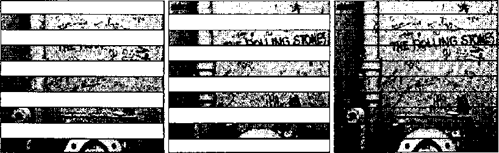
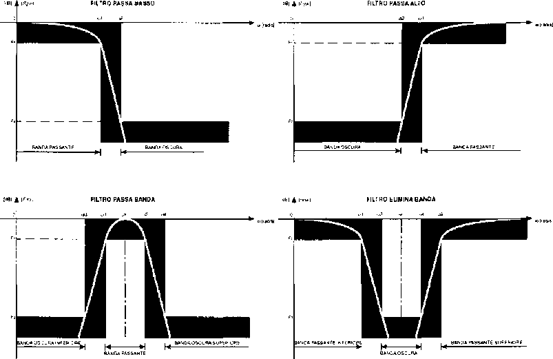
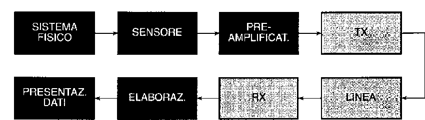
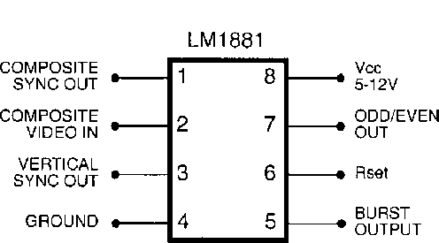
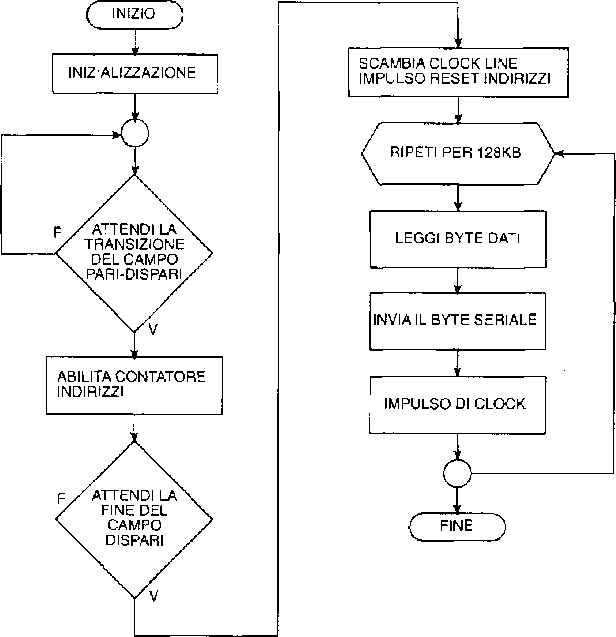

# Visual Communication and Video Acquisition


# Foreword

This is a transcription of my Diploma thesis simply titled "**Visual Communication**" written in June 2000.

The topic is woven around Visual Communication, an emerging trend in computer science in those years.
Personal computers were just beginning to gain more computing power, little by little, slowly approaching that of mainframes of the era. Digital Signal Processing was out-of-the-question for a little home computer.
But the direction was set, and soon enough, some decades later we can do the unthinkable on our notebooks now.

I was getting my Diploma, and I was all excited about video signals, sampling techniques and image compression algorithms.

I made a video digitizer card, using a PIC microcontroller and some other discrete ICs to extract the video composite timings, drive an ADC to a memory buffer and transfer a single picture frame over serial port to a PC.

Little could be found on USENET as I did not have a reliable Internet provider. Bullettin Board Systems were becoming obsolete and access to Compuserve or AOL was migrating over to modernizing universities and first data centers.
Long story short, I had only a bunch of printed out datasheets and some old paper to do my research.

It ended up well, the prototype was build and worked well. Sadly I do not possess any photographs, shot with a film camera which has since disappeared nor the hardware itself, lost in the school's archive, ended up in a landfill.


The transcript has not been completely translated and it is rendered as it was, just presented here as reference.


# Comunicazione Visiva

## <cite>Doxography[^1]</cite>
[^1]: Doxography is a term used especially for the works of classical historians, describing the points of view of past philosophers and scientists. Being this relation in conjunction with an multidisciplinar thesis, this arcaic term has been used as introduction for those old-scholars and old-teachers who were looking at such modern and untouched before topic with much suspect and refrain.


Generally, a manual of any study or discipline begins with the definition of the subject matter, illustrating all the aspects worthy of interest. In this case, however, I prefer to start by trying to motivate my choice to want to talk about visual communication by illustrating its inspiring motif by seeking help in the discipline of Philosophy, the only one, by definition, able to reach the primary principles and origins altogether.

In fact, the human need to know, to know, to find out is, for Plato and Aristotle, the wonder that a human being feels before something new, theory later taken up by Freud in childhood psychoanalysis, that in the adult state of the person evolves into an incessant mental work of seeking Truth and a need of man to communicate, fueling the importance of the concept of information.

In un tempo di conquiste come il nostro, l'uomo si è reso conto che il solo fatto di detenere la maggior quantità di informazioni può renderlo potente e se egli può disporne in modo tale da diffonderla nei modi e nelle quantità e negli aspetti a lui congeniali, di conseguenza può giungere direttamente nelle case delle persone arrivando fino a manipolarne i gusti e le scelte.
Il media che attualmente dispone di questi requisiti è la Televisione, più che un elettrodomestico, meno della Verità. Presente ormai in ogni abitazione e in quasi ogni momento della vita del singolo individuo e di una famiglia, essa ci tormenta continuamente con immagini di modi di vivere e di essere che difficilmente rispecchiano la realtà quotidiana, al contrario proponendoci miti e ideali preconfezionati da altri. Tutto ciò giocando sulla cognizione di causa che essa sfrutta, a differenza di altri media, due sensi percettivi contemporaneamente: l'udito e la vista aumentando la possibilità di cogliere l'attenzione di un osservatore.

Questa sua importanza nell'ambito socio-culturale mi ha portato alla scelta della comunicazione visiva come oggetto di questa tesi che non può essere una denuncia degli usi e abusi che se ne fanno, ma è un riconoscimento del peso che essa ha su di noi.

Chissà se Shakespeare, in Romeo e Giulietta, non intendesse riferirsi alla televisione quando nell'atto secondo, seconda scena diceva:



But soft! What light through yonder window breaks?
[...]
She speaks, yet she says nothing: what of that?

W. Shakespeare - Romeo and Juliet 


## Storia della Televisione

L'invenzione del tubo elettronico ad opera di John Fleming nel 1904 (la valvola) aveva dato inizio ad una nuova branca dell'elettrotecnica chiamata elettronica. Scoperta la possibilità di produrre, dirigere e sfruttare un flusso di elettroni, si prospettarono immediatamente numerose applicazioni. Una delle scoperte decisive fu quella dell'effetto fotoelettrico, mediante il quale si poteva convertire la luce in elettricità. Il principio della televisione in fondo è di una semplicità assoluta: trasmettere nello spazio una figura complessa può apparire piuttosto difficile, ma trasmettere un segnale elettrico è una cosa molto semplice; se si scompone dunque una immagine in una serie di piccoli punti e si trasmette ogni punto sotto forma di impulso elettrico, non resterà che ideare un apparecchio ricevente che ritraduca questi impulsi nell'ordine voluto, per avere l'immagine trasmessa in partenza. Trasformare questi punti in correnti più o meno intense, trasmetterle nello spazio e far sì che il ricevitore li riordini in sincronismo perfetto con il trasmettitore, questo era il problema che si trovarono a risolvere i pionieri della televisione. In fondo l'idea era di carpire la figura umana e di trasportarla oltre le barriere dello spazio, di vedere immagini in azione, persone e fatti nel momento stesso in cui avvengono a molti chilometri di distanza, aveva interessato più la magia che la scienza. E forse, anche quando la situazione tecnica poteva incoraggiare l'impresa, occorreva pur sempre un po' di follia e di disperazione per lanciarsi nell'avventura. Qualità che non mancarono ad una curiosa figura di scozzese, John Logie Baird, inventore ed affarista sfortunato, che inseguì a lungo le idee più paradossali e si dedicò ad operazioni finanziarie più contorte prima di dedicarsi, senza alcuna visibile speranza di successo, al problema della televisione.
Dopo essersi occupato per qualche tempo dell'effetto fotoelettrico (era riuscito ad azionare, verso gli inizi della prima guerra mondiale, un campanello avvalendosi della luce solare), Baird si dedicò per qualche tempo ad attività svariate: ideò e mise in commercio delle solette di carta per tenere caldi i piedi, inventò un lucido da scarpe, brevetto un rasoio di vetro dagli effetti disastrosi ed un calzino pneumatico per individui affetti da piattismo: l'esplosione dei suoi calzini nei momenti meno prevedibili fece naufragare anche quest'ultima impresa e lo spinse a riprendere i suoi esperimenti in elettronica.

Egli riuscì a trasmettere, con apparecchiature assolutamente improvvisate (la lampada di proiezione era fatta con una scatola da biscotti con lenti dozzinali e utilizzò un lavabo come base), l'immagine di una croce di Malta. Quindi proseguì gli esperimenti finanziato da una fabbrica di apparecchi elettrici, che lo indusse, per ragioni pubblicitarie, ad esibirsi davanti ai frequentatori di un emporio; ma le immagini trasmesse erano confuse, poco più che ombre, ed il pubblico accolse con diffidenza ed ironia l'invenzione. Egli continuò gli esperimenti finché, nel 1926, poté mostrare un esperimento piuttosto soddisfacente sulla figura umana, ad una commissione scientifica.

Nel 1929 la BBC iniziava una serie di trasmissioni televisive sperimentali. Non più una aspirazione magica, non più un progetto di un esaltato ma la televisione entrava nella fase di attuazione. Posti i principi basilari, la trasmissione televisiva era diventata un problema di ricerca industriale la cui soluzione progressiva continua tuttora, quando ormai il nuovo mezzo si è imposto come uno dei fenomeni tipici della nostra epoca. Occorre tuttavia notare che tra i primi esperimenti ed il boom televisivo vero e proprio siano trascorsi parecchi anni, più di quanti la logica stessa degli esperimenti richiedesse; ma il secondo conflitto mondiale agì da freno su queste ricerche: la televisione era ancora un gioco di lusso e non se ne potevano intravedere le enormi possibilità di direzione dell'opinione pubblica.

## Scheda di Digitalizzazione Video

Il progetto portato insieme a questo documento, è un circuito capace di digitalizzare un segnale video proveniente da una telecamera, un videoregistratore o un televisore (o qualsiasi altra fonte video composita analogica) potendo successivamente visionare l'immagine catturata sullo schermo di un comune Personal Computer, con tutti i vantaggi che derivano dalla forma digitale nella quale viene convertito il segnale video con la possibilità di salvare il fotogramma su disco fisso, riaprirlo in un secondo tempo, inviarlo ad altri utenti di una rete, stamparlo, ecc.
La realizzazione di tale scheda ha comportato lo studio della struttura del segnale video composito europeo e sviluppo di un software di controllo on-board su microcontrollore PIC per la gestione logica delle temporizzazioni del segnale da campionare nonché per la serializzazione dei dati riguardanti l'immagine, e di un software di interfacciamento seriale e visualizzazione su Personal Computer.

Il circuito dispone di un ingresso video composito PAL, ma l'elevata velocità con cui viene digitalizzato il segnale video e la estrema lentezza insita nell'interfaccia seriale RS232 utilizzata per il trasferimento su PC, scelta per la sua larga diffusione, impone l'utilizzo di tale scheda per applicazioni di video-frame capturing, quali i sistemi di allarme e videosorveglianza per l'impossibilità di trasferire in tempo reale un video full-motion direttamente all'interno della memoria del computer.

### Caratteristiche Tecniche

- Risoluzione immagine:  320x300 pixel;
- Profondità immagine:  256 toni di grigio (8 bit)
- Velocità Upload Seriale:  38400 bps
- Segnale video ingresso:  PAL video-composito
- Tensione di alimentazione:  5 Vdc

## Il Segnale Video Composito

Le immagini televisive che sullo schermo percepiamo complete in ogni loro particolare, in realtà sono formate da un solo punto, che partendo dall'angolo sinistro in alto dello schermo, si deflette velocemente da sinistra verso destra e alla fine di ciascuna riga si sposta in basso per ricostruire una seconda riga, poi una terza, ecc., fino a terminare in fondo allo schermo.
Lo standard video europeo stabilisce che un singolo fotogramma sia composta da 625 linee orizzontali; se queste 625 righe venissero riprodotte in sequenza, il nostro occhio vedrebbe ogni immagine "sfarfallare".

Per eliminare questo inconveniente si completa una immagine con righe interlacciate, cioè si forma un semiquadro con tutte le righe dispari, poi un secondo semiquadro con tutte le righe pari che, intercalandosi, formano una immagine completa.



Pertanto, il primo semiquadro risulterà formato da 312, 5 linee dispari, cioè le righe 1-3-5, ecc., ed il secondo da altre 312,5 linee pari, le 2-4-6-8, ecc.
Poiché la velocità con cui questi semiquadri appaiono sullo schermo è superiore alla velocità di risposta dell'occhio umano, quest'ultimo non risente di queste interruzioni dovute all'alternanza delle righe dell'immagine.

La durata dì una riga singola (sia essa pari o dispari) è di 64 µS ed inizia con un impulso negativo della durata di 5 µS, detto impulso di sincronismo atto ad identificare l'inizio di una riga. Finito l'impulso di sincronismo, inizia il burst colore che, ovviamente sarà assente se l'immagine è in bianco e nero.

Dopo circa 12 µS dall'inizio dell'impulso di sincronismo, inizierà il segnale della riga dell'immagine che avrà una durata di 51 µS. L'informazione della riga dell'immagine è modulata in ampiezza: ad un livello di tensione del 7,5% (sul massimo valore picco/picco del segnale video applicato all'ingresso) corrisponde il colore nero, mentre alla massima ampiezza di segnale, corrisponde il bianco e qualsiasi altro livello intermedio tra il 7,5% ed il 100% corrisponde ad una diversa tonalità di grigio.

.")

Questo per tutte le righe che compongono l'immagine (625). Ogni ultima riga di ognuno dei due semiquadri, presenta un intervallo di blanking, che identifica la transizione tra i due; in particolare l'ultimo semiquadro presenta un'ultima riga più corta, per dare spazio al cosiddetto vertical blanking interval, composto di tre parti: gli impulsi di equalizzazione, gli impulsi verticali fitti e di nuovo degli impulsi di equalizzazione, dopodiché segue uno spazio senza immagine (11 righe) contenente esclusivamente gli impulsi di sincronismo video al cui interno è possibile inserire le informazioni televideo.

## Filtri

L'utilizzo tipico dei filtri è quello di poter selezionare una ben determinata gamma di frequenze da un segnale applicatovi all'ingresso. Un filtro è caratterizzato da alcuni parametri fondamentali: innanzitutto il tipo (descritti in seguito dettagliatamente) poi l'ordine, la frequenza di taglio, la banda passante e, infine, la realizzazione circuitale dei filtri che può avvenire sia mediante componenti esclusivamente passivi, ovvero R, L, C, sia tramite l'aggiunta di dispositivi attivi quali transistor e amplificatori operazionali.

- Passa Basso (LPF) Il filtro bassa basso non altera apprezzabilmente i segnali che hanno frequenza inferiore a quella di taglio e attenua i restanti.
- Passa Alto (HPF) Il filtro passa alto non altera apprezzabilmente i segnali che hanno frequenza superiore a quella di taglio e attenua i restanti.
- Passa Banda (BPF) Il filtro passa banda non altera apprezzabilmente i segnali che hanno frequenza compresa tra le due di taglio e attenua i restanti.
- Elimina Banda (BSF) Il filtro elimina banda non attenua i segnali che hanno frequenza compresa tra le due di taglio e non altera apprezzabilmente i restanti.




Molteplici settori dell'elettronica, quali ad esempio l'audio Hi-fi, la telefonia e la strumentazione di misura, necessitano di sistemi in grado di discriminare, secondo specifiche assegnate, le diverse componenti spettrali del segnale d'ingresso. I filtri passivi assolvono tale compito, ma comportano problemi di caricamento degli stadi ad essi accoppiati; le realizzazioni attive superano questo problema mediante l'impiego di amplificatori operazionali e consentono di ottenere f.d.t. caratterizzate da poli complessi coniugati senza ricorrere all'uso di bobine che, rispetto ai condensatori, presentano maggiori deviazioni dal comportamento ideale dovute alla resistenza dell'avvolgimento.

Le realizzazioni attive trovano uso estensivo nei sistemi che operano a frequenze inferiori a qualche centinaio di KHz, mentre quelle passive vengono impiegate in reti che elaborano segnali anche a frequenze dell'ordine di centinaia di MHz.

Tali filtri, possono essere definiti mediante le specifiche di trasmissione illustrate in Fig. 3; queste individuano una zona del diagramma della risposta entro la quale deve essere compreso l'andamento di |F(jw)|, al fine di ottenere la caratterizzazione voluta.

Per offrire generalità alla rappresentazione il valore massimo del modulo è normalizzato a 0 dB: in altri termini, viene trascurata un'eventuale traslazione verticale rigida dell'intero grafico dovuta all'esistenza di una costante moltiplicativa nella f.d.t.

Ogni filtro presenta una banda passante (passband) in cui il modulo permane inalterato entro una fascia di tolleranza F1 e una banda oscura (stopband) in cui il modulo assume valori inferiori a F2 oppure a F3; l'intervallo che separa le precedenti definisce invece la banda di transizione. In tabella 1 sono indicate le pulsazioni che delimitano ciascuna banda.
È importante sottolineare che la larghezza della banda di transizione, associata alla differenza (F2 - F1) oppure (F3 - F1), qualifica la discriminazione in frequenza operata dal filtro; ciò si riflette sull'ordine della f.d.t. e quindi sulla complessità della struttura circuitale.


## Generalità sui segnali elettrici e sulla loro conversione

Nei sistemi elettronici l'informazione può essere supportata da diversi segnali in evoluzione temporale, aventi forme diverse ma identico contenuto informativo; la loro natura dipende dalla sorgente, dalle tecniche di elaborazione e dai canali di trasmissione utilizzati.

I segnali sono contraddistinti da molteplici parametri, quali l'ampiezza, la frequenza, la fase, il duty-cycle e la polarità; l'informazione viene quindi rappre-sentata in termini analitici da una funzione y = f(t) che esprime il legame tra un parametro y prestabilito ed il tempo.

E' inoltre importante distinguere fra rappresentazione di tipo analogico e di tipo numerico; in un intervallo prefissato della variabile y il segnale analogico può assumere idealmente infiniti valori significativi, mentre il segnale numerico può assumere solo un numero finito. In particolare il dominio e il codominio sono continui nel primo e discreti nel secondo.
Un importante caso di segnale numerico è quello di tipo binario, nel quale sono significativi solo due valori, denominati livelli logici.

Nei sistemi digitali, l'informazione è associata ad un codice costituito da un insieme di due simboli, quali 0 ed 1, utilizzati per rappresentare una serie di numeri in base ad una prefissata convenzione; ad esempio nel codice binario naturale 4 bit consentono di individuare 16 distinte combinazioni associabili ad altrettanti numeri, lettere o qualsivoglia notazione.
L'unità elementare di un messaggio è quindi composta da una ripetizione di simboli denominata parola; la sua lunghezza risulta funzione del numero di distinte combinazioni richieste. Il raggruppamento dei simboli che costituisce una parola può essere presentato in modo contemporaneo (forma parallela) o sequenziale (forma seriale).

Al fine di porre in luce le peculiarità dei segnali analogici e di quelli digitali, si espongono a seguito alcune considerazioni:

Poiché il segnale analogico evolve con continuità è possibile in linea teorica individuare infiniti livelli; tuttavia il rumore sempre presente nei sistemi elettronici non rende distinguibili due valori che distano tra loro di una quantità inferiore all'ampiezza del disturbo. Quest'ultimo comporta quindi un deterioramento dell'informazione e al limite la totale mascheratura dei segnali più deboli. La qualità di un segnale analogico è perciò descritta dal rapporto segnale-rumore.

Il rumore sovrapposto a un segnale digitale non compromette invece il contenuto informativo purché, a causa della sua ampiezza istantanea, non sia interessata la zona di indeterminazione; infatti ciascun livello logico ammette una fascia di valori entro la quale l'informazione è riconosciuta univocamente come stato 0 (basso) o 1 (alto).

Da quanto esposto nel punto precedente emerge che l'elaborazione e la trasmissione di segnali digitali risulta apparentemente meno problematica.

Occorre tuttavia considerare che tali operazioni condotte su una parola in forma seriale richiedono un tempo proporzionale alla lunghezza della parola stessa; invece nel caso in cui quest'ultima presenti una forma parallela le operazioni sono più rapide ma il transito dell'informazione necessita di un maggior numero di linee, rendendo in tal modo più complessa la struttura dell'hardware.

Contrariamente il segnale analogico è sempre elaborato e trasmesso in tempo reale, ovvero senza ritardi apprezzabili, e richiede un'unica linea di comunicazione.

I sistemi digitali sono caratterizzati da un'elevata versatilità in quanto, con l'avvento dei microprocessori, le funzioni svolte dai circuiti logici risultano definite da un programma facilmente modificabile; ciò è reso possibile dalla semplicità di memorizzare una notevole quantità di dati senza perdita alcuna di precisione.

La flessibilità delle strutture programmabili consente di specializzare in modo diverso il trattamento dell'informazione, senza alterare sostanzialmente l'architettura del sistema.
I sistemi analogici sono quelli che meglio si adattano all'interfacciamento con il mondo fisico, poiché i sensori e gli attuatori sono in genere interessati da segnali che variano con continuità nel tempo. Qualora si intenda operare un trattamento numerico dell'informazione è quindi necessario provvedere a una duplice conversione che adatti sia l'ingresso sia l'uscita del sistema digitale a segnali di tipo analogico.

## Processi di conversione A/D

Le precedenti osservazioni hanno sottolineato che il trattamento digitale dell'informazione presenta molteplici aspetti positivi, ma richiede di norma una conversione analogico-digitale e una conversione inversa digitale-analogica.

In tale documento si parlerà principalmente di quella A/D, utilizzata dal circuito realizzato. La conversione D/A è in effetti realizzata direttamente dal monitor del computer che converte l'immagine digitalizzata nuovamente in forma visibile. In figura 4 è riportata l'architettura di un complesso per il trattamento digitale dell'informazione analogica; i blocchi in essa evidenziati svolgono le funzioni esposte a seguito.

Il circuito campionatore (sampling circuit) provvede a generare una sequenza di impulsi vs(t) di durata teoricamente infinitesima e di ampiezza pari a quella assunta dal segnale d'ingresso vi(t) negli istanti di campionamento; viene in tal modo operato un passaggio da una rappresentazione in un dominio continuo ad una in un dominio discreto.

La memoria analogica (holding circuit) riproduce in uscita un livello di tensione vsh(t) eguale a quello campionato e lo mantiene costante sino al successivo impulso; questo blocco è necessario per presentare al convertitore A/D un valore inalterato durante l'intervallo di tempo richiesto per la conversione.

Se il segnale possiede un andamento lentamente variabile lungo l'intervallo suddetto, lo stato campionatore e la memoria analogica possono essere omessi.
Il convertitore A/D codifica l'ampiezza di vsh(t) in una parola digitale contraddistinta da un prefissato numero n di bit.

La grandezza all'ingresso di tale circuito possiede un codominio continuo, cioè può evolvere nel tempo assumendo un numero infinito di valori; l'informazione all'uscita è invece di tipo discreto, ovvero è rappresentata da un numero finito di valori. Da ciò si deduce che il convertitore A/D opera una quantizzazione del segnale campionato, suddividendo idealmente l'intervallo delle tensioni d'ingresso in un numero l di livelli che, nel caso di codifica binaria risulta pari a l = 2^n

Il sistema digitale rappresenta, nello schema a blocchi proposto, un qualsiasi trattamento numerico dell'informazione, quale ad esempio l'elaborazione o il processo di trasmissione-ricezione dei segnali.

Il convertitore D/A decodifica la parola digitale fornita dal blocco precedente e restituisce un segnale quantizzato vq(t) con dominio e codominio entrambi discreti; la forma d'onda assume quindi un andamento a gradinata.

Il filtro di ricostruzione sopprime le componenti armoniche di vq(t) estranee allo spettro associato all'informazione, producendo in uscita un segnale v0(t) analogico, ossia dotato di dominio e codominio continui.





## Acquisizione Dati

Un problema comune a molte realtà produttive consiste nella raccolta ordinata di un insieme di informazioni inerenti ad un processo industriale; sulla base dei dati acquisiti è possibile stabilire il tipo di intervento necessario al fine di condizionare l'evoluzione del processo medesimo nella direzione voluta.
Il controllo può richiedere l'azione di un operatore che deve regolare manual-mente opportuni attuatori, oppure può avvenire in modo automatico subordinando il pilotaggio di questi ultimi direttamente all'apparato di raccolta dati.

Allo stato attuale la gestione degli impianti industriali è delegata quasi esclusivamente a macchine elettroniche in virtù dell'accuratezza, della velocità, dell'affidabilità e dei bassi costi di gestione propri di tali sistemi.

Inoltre lo stato dell'arte delle logiche programmabili e dei personal computer consente di realizzare controllori di processo caratterizzati da un'elevata flessibilità; in altri termini è possibile cambiare il ciclo produttivo semplicemente apportando delle modifiche al programma implementato sul computer.


Ogniqualvolta occorra descrivere sotto il profilo scientifico un sistema in regime statico o in evoluzione temporale è necessario operare un rilievo delle grandezze fisiche che lo caratterizzano; ciò offre l'opportunità all'osservatore di intervenire successivamente sul sistema stesso al fine di modificarne il comportamento.

L'esecuzione della misura può avvenire mediante tecniche elettroniche che, rispetto a tecniche di natura diversa, consentono di raggiungere sensibilità, precisioni e rapidità di risposta considerevoli; esse inoltre rendono possibile l'elaborazione, la memorizzazione e la trasmissione dei dati acquisiti.

Nella figura 5 è illustrata la configurazione generale di una catena di misura in grado di visualizzare, su uno o più organi di presentazione dati, il valore di una grandezza fisica rilevata da un sensore remoto. La descrizione di ogni singolo blocco che compone tale schema è riportata nei punti seguenti:

Il sensore posto all'ingresso della catena provvede alla trasformazione della grandezza da misurare in una corrispondente variabile elettrica; si rammenta che la natura dei segnali prodotti è prevalentemente analogica, tranne in alcuni casi nei quali il sensore stesso opera una codifica digitale dell'informazione, come ad esempio nell'encoder.

Il segnale generato dal sensore necessita di norma di un primo condizionamento sull'ampiezza operato da un preamplificatore lineare a basso rumore; ciò eleva l'immunità ai disturbi che si sovrappongono all'informazione in transito lungo i successivi blocchi.

Nel caso in cui la variabile di uscita del trasduttore sia una corrente è talvolta necessario che questo stadio effettui anche una conversione corrente-tensione (1/ V): allo scopo viene impiegato un amplificatore di transresistenza.

Qualora al segnale sia associata una componente di modo comune, come ad esempio si verifica all'uscita di un ponte di misura, è opportuno adottare un amplificatore per strumentazione qualificato da un elevato valore di CMRR.

Si ricorda che una tensione di modo comune può insorgere anche per interfe-renze elettromagnetiche indotte sul cavetto che collega il sensore al blocco di preamplificazione; questi disturbi, particolarmente deleteri per segnai a basso livello, sono comunque minimizzati impiegando un cavetto schermato.

In talune circostanze il sensore è collocato in una posizione remota rispetto al sistema di elaborazione e presentazione dati, ovvero rispetto all'ambiente dove agisce l'operatore (control room); in tal caso si rende necessario introdurre nella catena un trasmettitore ed un corrispondente ricevitore.

La linea lungo la quale transitano le informazioni può essere costituita da un cavo elettrico, da una fibra ottica o in casi particolari dall'etere.

La soluzione più semplice e affidabile per una comunicazione via cavo a breve distanza è offerta dai convertitori V/F e F/V che effettuano rispettivamente una modulazione e demodulazione di tipo PFM.

In alternativa, sempre per collegamenti di alcune centinaia di metri, si impiega la trasmissione ad anello di corrente (current loop i cui segnali, a differenza di quelli in tensione, non risentono delle cadute lungo la linea imputabili all'impedenza dei fili. Nel ricevitore dev'essere ovviamente attuata la conversione inversa, realizzabile mediante una resistenza di precisione connessa fra gli ingressi di un amplificatore differenziale.

Un ulteriore condizionamento del segnale può essere effettuato nel blocco di elaborazione al fine di compensare le eventuali non linearità della caratteristica del sensore o di filtrare i disturbi accumulati durante il transito lungo i precedenti stadi.

L'effettiva elaborazione è invece richiesta nel caso in cui occorra svolgere particolari operazioni sul segnale: si pensi ad esempio al calcolo del valor medio o del valore efficace.

La realizzazione di questo blocco può avvalersi di tecniche analogiche, digitali o miste; come noto l'impiego di circuiti digitali agevola la memorizzazione dei dati raccolti e l'eventuale trasferimento dei medesimi a un computer.

La catena termina con uno o più organi di presentazione dati che, a seconda delle esigenze, possono essere costituiti da un indicatore a lancetta, da uno strumento digitale, da un registratore grafico, da una stampante o da un monitor.

## Trasmissione Dati

Gli attuali sistemi elettronici sono spesso predisposti per il colloquio con altre unità al fine di consentire l'acquisizione, la memorizzazione, l'elaborazione o la visualizzazione dei dati.
Un messaggio in forma digitale può essere presentato a una linea di trasmis-sione sia con un assetto parallelo, sia con un assetto seriale.
Nella forma parallela tutti gli n bit di ogni singola parola vengono trasmessi simultaneamente ed è quindi necessario l'impiego di n fili oltre a quello di massa; ne consegue un elevato costo del mezzo trasmissivo che limita l'utilizzo di questa tecnica a comunicazioni di breve distanza, quale ad esempio l'allacciamento di un plotter a un personal computer.
Inoltre l'accoppiamento induttivo e capacitivo fra i diversi conduttori, disposti in genere in un unico cavo, produce interferenze (cross-talk) di ampiezza rilevante qualora più bit presentino simultaneamente il medesimo cambiamento di stato.

Nella forma seriale tutti gli n bit di ogni singola parola vengono trasmessi in modo sequenziale, cadenzati da impulsi di clock, ed è quindi sufficiente l'impiego di un solo filo oltre a quello di massa; ne consegue una drastica riduzione dei costi, particolarmente sensibile su lunghe tratte, e un miglioramento dell'affidabilità dell'intero sistema.
Si rende tuttavia necessario l'utilizzo di registri per la conversione parallelo-serie (PISO) in sede di trasmissione e di registri serie-parallelo (SIPO) in ricezione; infatti i circuiti digitali di elaborazione manipolano in genere parole in formato parallelo che transitano sul bus dati.

Il maggior inconveniente di questa tecnica risiede nella lentezza intrinseca del trasferimento dei dati, poiché la trasmissione di ogni singola parola richiede al minimo n impulsi di clock.
Malgrado ciò l'assetto serie ha trovato una notevole diffusione in quanto si adatta ai canali di comunicazione già esistenti, quali le linee telefoniche.
Si precìsa che con il termine velocità di trasmissione si intende, per il formato seriale, il numero di bit trasferiti in un secondo; l'unità adottata è quindi il bit/s oppure, nel sistema binario, baud. Per il formato parallelo si adotta invece l'unita cps, acronimo di caratteri per secondo.

Affinché sia possibile decodificare un messaggio in forma seriale occorre che esso contenga dei segnali di riferimento utili per la sincronizzazione del ricevitore con il trasmettitore; a seconda della tecnica utilizzata si distinguono i due tipi di comunicazione seriale riportati in seguito.

Nella trasmissione asincrona il segnale di sincronismo è inviato all'inizio (bit di start) e alla fine (bit di stop) di ogni parola. Di norma, in assenza di trasmissione, la linea è posta a livello alto; il primo fronte di discesa corrisponde quindi al bit di start che attiva un clock locale con frequenza idealmente identica a quella del trasmettitore.

Fanno seguito gli n bit della parola che costituisce l'informazione, un fronte di salita corrispondente al bit di stop ed infine un livello alto che permane sino al sopraggiungere di un nuovo bit di start.

Affinché il clock locale possa scandire con precisione l'evoluzione temporale del segnale ricevuto, occorre che la sua frequenza non si discosti da quella del trasmettitore di una quantità tale da superare la larghezza di un impulso. Tale ipotesi non è assolutamente restrittiva in quanto la perdita di fase dev'essere contenuta solo per l'intervallo di tempo relativo alla trasmissione di una parola.

Nella trasmissione sincrona le parole digitali vengono raggruppate in blocchi delimitati da appositi campi, nei quali sono contenuti sia il carattere di sincronismo, sia particolari parole di controllo degli errori e della lunghezza del testo, dipendenti dal protocollo utilizzato.
Ciò riduce i tempi di trasmissione perché il carattere di sincronismo è inviato una sola volta per ciascun blocco di messaggi, oppure permane costantemente in linea in assenza di informazioni.

Di contro è richiesta una precisione del clock locale molto più elevata rispetto al caso precedente, in quanto la perdita di fase dev'essere trascurabile lungo tutto l'intervallo di tempo relativo ad un blocco.

In alternativa è comunque possibile aggiungere una linea dedicata alla tra-smissione del clock, ma la presenza di tre fili comporta un aggravio dei costi del sistema.

Per la sua semplicità realizzativa la tecnica asincrona ha assunto un ruolo preminente nella trasmissione di dati tra microprocessori, computer e loro periferiche. I sistemi di comunicazione sincrona trovano invece applicazione ove le esigenze dì velocità sia leggermente più stringenti.

Per la comunicazione seriale si utilizzano sia linee dedicate, sia linee commu-tate, la prima soluzione è adottata qualora si desideri un allacciamento permanente tra due unità, mentre la seconda risponde ad esigenze di colloquio tra diversi sistemi e si avvale di una centrale di commutazione. Il canale telefonico costituisce l'esempio più comune di linea commutata e ha assunto un'enorme rilevanza in tutti i settori industriali per la grande diffusione degli impianti e per il costo contenuto del canone.

Lo scambio di messaggi in forma digitale fra due unità può essere di tipo monodirezionale o bidirezionale', nel primo caso un'unità è predisposta per la sola trasmissione e l'altra per la sola ricezione, mentre nel secondo caso ambedue le unità sono abilitate a svolgere entrambe le funzioni.

Si elencano di seguito i tre modi di comunicazione di norma utilizzati:

- simplex è l'unico di tipo mono direzionale e trova un utilizzo limitato a causa dell'assenza di interazione tra le due unità. A titolo d'esempio si pensi a un apparecchio radio spia che capta l'informazione sonora in un luogo e ne consente l'ascolto in un altro.
- half-duplex permette il trasferimento bidirezionale non si-multaneo dell'informazione. In virtù della sua semplicità realizzativa trova larga diffusione, nonostante la presenza di ritardi a ogni inversione del flusso dei dati.
- full-duplex sostiene una comunicazione bidirezionale con-temporanea fra due unità, eliminando in tal modo i ritardi tipici della trasmissione half-duplex; questa tecnica è utilizzata in tutte le reti telefoniche e in molti sistemi di teleprocesso.

Le diverse operazioni richieste da una trasmissione seriale sono normalmente svolte da un unico circuito monolitico, che, in base alle sue capacità assume sigla di USRT, UART o USART.
Molti ambienti industriali sono caratterizzati da disturbi di natura elettroma-gnetica, prodotti ad esempio da motori elettrici e da circuiti on/off di potenza. Qualora una linea di trasmissione percorra tali ambienti è necessario salvaguardare i segnali digitali dai disturbi: a tale scopo si utilizzano particolari famiglie di circuiti integrati logici dotate di elevata immunità al rumore (HTL) o più frequentemente si ricorre a una comunicazione su linea differenziale o bilanciata.

In quest'ultima tecnica i due fili, generalmente intrecciati tra loro, sono percorsi da segnali simmetrici rispetto alla terra; gli eventuali rumori con buona probabilità si sovrappongono simultaneamente a entrambe le forme d'onda, costituendo così un disturbo di modo comune facilmente distinguibile dall'informazione trasmessa in modo differenziale.

Il pilotaggio della linea è effettuato da un invertitore di fase, mediante il quale il segnale di ingresso è riproposto alle due uscite in forma bilanciata, ovvero con due livelli di tensione uguali ma di segno opposto. In ricezione è invece posto un amplificatore differenziale che elimina i disturbi di modo comune e ripristina i livelli di tensione originari, corrispondenti agli stati 0 e 1.

Qualora la lunghezza di una tratta sia notevole, è opportuno adottare una trasmissione in banda traslata anziché in banda base; in altri termini è necessario modulare una portante sinusoidale in accordo con l'informazione digitale, utiliz-zando una delle modulazioni ASK, FSK, o PSK.

Le apparecchiature che realizzano questa funzione sono chiamate modem e comprendono sia un modulatore sia un demodulatore, rispettivamente impiegati per la trasmissione e per la ricezione dei dati digitali.

Affinché la comunicazione fra due unità possa avvenire è necessario che esista una compatibilità tra i livelli logici del trasmettitore e quelli del ricevitore remoto. A tale compito provvedono i circuiti di interfaccia, per i quali esistono standard industriali atti a garantire il rispetto di precise normative, sia elettriche che meccaniche, che regolamentano il colloquio con il mondo esterno.

L'adeguamento a standard internazionali comporta innegabili vantaggi qualora sia necessario espandere o sostituire parti di un sistema; si pensi ad esempio all'allacciamento di uno strumento di misura a un'unità di memorizzazione, oppure alla connessione di una nuova stampante a un personal computer.

Il segnale gestito da un'interfaccia può presentarsi sotto forma parallela che seriale e da ciò ne deriva una prima classificazione.
Fra le interfacce parallele ha assunto una notevole importanza la IEEE 488, sviluppata dalla società Hewlett-Packard appositamente per la strumentazione programmabile di misura comprendendo 8 linee dedicate al bus dati e 8 linee ausiliarie riservate ai comandi e al protocollo.

Prima di fornire dei brevi cenni sulle interfacce seriali è necessario introdurre la terminologia volta all'individuazione del tipo di unità interessata all'interfacciamento.
- Con la sigla DTE (Data Terminal Equipment) si identifica il terminale dati di un'apparecchiatura elettronica, quale ad esempio un computer, una stampante.
- Con la sigla DCE (Data Communication Equipment) si contraddistingue un dispositivo per la comunicazione in forma seriale dei dati, quale ad esempio il modem.

 e fra due DTE locali (B).")


Il colloquio tra due unità prevede in genere una configurazione in perfetta analogia con il modello di Shannon, fatta salva la bidirezionalità di ogni blocco.
Tuttavia è anche possibile la connessione diretta tra due DTE come avviene nell'allacciamento diretto di due PC.

Fra le varie interfacce seriali, quella che ha assunto un ruolo preminente negli ultimi anni è la RS-232C, approvata dall'EIA (Electrical Industries Association); essa prevede uno scambio di dati sia tipo sincrono che asincrono e consente trasmissioni in half e full-duplex. Il connettore standard RS-232C è composto da 25 piedini, alcuni riservati alla trasmissione e ricezione dei dati, altri ai controlli di varia natura. Tuttavia le applicazioni più comuni interessano solo un numero limitato di piedini.

Al fine di garantire un'elevata immunità ai disturbi i livelli dello standard RS- 232C sono notevolmente superiori a quelli delle famiglie logiche di comune utilizzo; tali livelli, definiti in logica negata,  valgono:

| logic level        | voltage           | description  |
| ------------- |:-------------:| -----:|
| livello 0      | +3 .. + 25V | space |
| undetermined      | -3 .. +3V      |   null |
| livello 1 | -3 .. -25V      |    mark |

I vocaboli space e mark derivano da una vecchia terminologia usata in ambito telegrafico.
Le case produttrici hanno reso disponibili circuiti integrati specifici per questo tipo di interfaccia come il dispositivo LM232 della National (Dual RS-232Transmitter/ Receiver) che, pur garantendo livelli d'uscita estesi fra -9 V e +9 V, necessita di una singola alimentazione a +5 V.



Per interfacciare due unità in ambienti rumorosi è opportuna l'adozione di standard tipo EIA RS-422 o EIA RS-423, contraddistinti da un collegamento con linea differenziale bilanciata o con cavo coassiale. Entrambi gli standard consentono velocità di trasmissione decisamente più elevate di quella ammessa dalla RS232C.

Il più vecchio standard seriale, tutt'oggi utilizzato (interfaccia MIDI per strumenti musicali digitali), è quello a loop di corrente introdotto per le comuni-cazioni fra le telescriventi; esso associa all'assenza e alla presenza di una corrente pari a circa 20 mA rispettivamente gli stati logici 0 e 1. Questo tipo di interfaccia, caratterizzata da una notevole semplicità circuitale, consente trasmissioni asincrone in half-duplex e full-duplex.

## Schema a blocchi

Lo schema a blocchi di questa scheda rappresenta ogni unità funzionale del circuito, mostrando le interconnessioni fra ogni stadio in modo semplificato. Questi sono: il separatore di sincronismi, il convertitore A/D, il microcontrollore, la SRAM, il generatore di indirizzi, il clock e lo stadio di uscita seriale.

Il primo problema da risolvere è determinare quando ha inizio l'immagine da campionare e quando finisce: per limitare lo spreco di memoria è necessario eliminare dalla digitalizzazione gli impulsi di sincronismo e la parte del burst colore lasciando in memoria solo i 320 pixel per ogni riga di un solo semiquadro, il dispari.

Per identificare ogni diverso semiquadro, e quindi l'inizio (il primo punto o riga che dir si voglia) di ogni fotogramma è necessario un separatore di sincronismi video e nel caso particolare è stato utilizzato il circuito integrato LM1881 prodotto dalla National Semiconductor, capace, dopo aver selezionato tramite un resistere ed un condensatore esterni per la scelta dello standard video da cui estrarre i segnali di sincronismo. Per agganciare la frequenza di scansione verticale dello standard europeo PAL (Phase Alternating Line) sono sufficienti una resistenza da 470 KΩ ed un condensatore da 100 nF (vedi RI e Cl).

In tal modo, è possibile estrarre quattro segnali interpolati in quello video: il sincronismo composito, il sincronismo verticale, l'identificazione del semiquadro pari/ dispari attuale e il sincronismo del burst colore.

La rete logica realizzata con opportune porte logiche, permette di operare una semplice funzione booleana sui livelli logici di uscita del LM1881 emettendo un impulso alto solo ed esclusivamente in presenza del segnale dell'immagine e non di burst o sync. Questo segnale è applicato al microcontrollore che gestisce il campionamento.

Un secondo problema riguarda la gestione della memoria SRAM. Essa deve accogliere, attivando la propria linea Write Enable, i byte provenienti dall'A/D durante la digitalizzazione del fotogramma e poi questa memoria deve venir letta dal microcontrollore, negando il segnale WE, per lasciar sì che l'immagine venga scaricata sul PC.


Queste due funzioni devono avvenire a due differenti velocità:
-   La scrittura deve essere sincronizzata al clock di campionamento, quindi a 6 milioni di campioni per secondo;
-   La lettura deve essere sincronizzata alla velocità di upload verso il PC, quindi ad un clock pilotato direttamente dal microcontrollore.

A ciò servono le linee Clock Line Select e Clock Lettura. La prima serve per tre funzioni contemporaneamente: il settaggio del modo di lettura/scrittura della memoria, l'attivazione delle uscite del convertitore A/D tramite la linea OE e la selezione della posizione dello switch analogico in modo da scegliere come clock al contatore o il clock diretto a 6 MHz o la frequenza uscente dal pin Clock Lettura.

Perché ci necessiti di un clock di 6 MHz è presto detto. Avendo scelto un formato di visualizzazione di 320 pixel/riga, e dato che una riga nel segnale video è stipata in 51 µS, ogni punto dovrà presentarsi in un tempo di 51/320 = 0,159375 µS che corrisponde ad una frequenza di 1 /0,159375 = 6,2745 MHz

Ciò significa necessitare di un transfer rate di 6 MB/s, che è quello che si trova nel bus dati che dal convertitore A/D va verso la memoria statica che fa funzione di buffer. Se fosse possibile utilizzare un bus standard per un Personal Computer con tale velocità, si avrebbe la possibilità di trasferire animazioni al posto di singoli fotogrammi, ma per mantenere la compatibilità e l'utilizzo di uno standard praticamente presente in tutti i computer, ho deciso di utilizzare la molto più lenta porta seriale.

Così il funzionamento di tale scheda è quello di memorizzare un singolo frame di un segnale video e di trasferirlo lentamente verso un computer.

Per il circuito di digitalizzazione è stato utilizzato un convertitore A/D veloce di tipo flash, dotato al suo interno di 256 comparatori e capace di funzionare con frequenze fino a 20MHz e con integrato un circuito di Sample & Hold. Tale componente, con una risoluzione di 8 bit paralleli, è gestito insieme alla SRAM da 128KB, dal microcontrollore PIC16C84 opportunamente programmato, che si occupa di gestire le linee di controllo della memoria, le linee di clock di campionamento e di lettura, l'aggancio dell'inizio del fotogramma da campionare e l'upload dell'immagine immagazzinata in memoria verso il Personal Computer tramite lo standard seriale RS232C ad una velocità di 38400 bit per secondo utilizzando un traslatore di livello ST232 che converte i livelli di tensione TTL nei livelli di tensione e logici definiti dall'EIA.

## Il software



Il programma che gestisce il PIC si occupa di attendere l'inizio e la fine del fotogramma tramite il piedino TimIn, gestire la linea Reset del generatore di indirizzi, la linea Clock Line Select, la linea Clock Lettura e la linea di uscita dei dati seriali.

Il programma inizia settando la scheda pronta al campionamento dell'imma-gine, lasciando solo la linea di reset del generatore di indirizzi (il contatore) attivata, in modo da bloccare l'indirizzo della memoria su zero e quindi l'avanzamento delle locazioni di memoria. Non appena inizia il fotogramma dispari, controllando la transizione da alto a basso della linea odd/even, il controllore, sganciando il reset del contatore, permette, alla velocità di 6 MHz, di memorizzare ogni punto dell'immagine nelle locazioni della memoria, finché il segnale di stop non si presenta in ingresso: infatti, il microcontrollore deve semplicemente attendere che la linea odd/even transiti a livello positivo; in altre parole deve attendere la fine del primo semiquadro e l'inizio del secondo, fermando così la digitalizzazione invertendo il livello logico del segnale che comanda lo scambiatore di clock e resettando il contatore,

A questo punto è sufficiente prelevare il byte sul port b, inviarlo serialmente tramite la routine di trasferimento seriale e far incrementare di una locazione l'indirizzo puntato dal contatore della memoria digitale con un semplice impulso sulla linea di clock del processore che, scambiata dallo switch, arriva direttamente all'ingresso di clock del contatore. Ripetendo questa procedura per tutti i pixel dell'immagine presenti in memoria, il software implementato su PC, provvede a visualizzare tutta l'immagine sullo schermo.

```nasm
  LIST P=16C84 INCLUDE "p16c84.inc"

        RA0        EQU 0               ;  serial  out
        Timln      EQU 1               ;  timing  input
        CKSel      EQU 2               ;  clock line out
        CKOut      EQU 3               ;  clock out
        CntRset    EQU 4               ;  counter reset
                                       ; serial tx routine declarations N_BIT  EQU  8
        BAUD       EQU 9600
        FCLOCK     EQU 4E6
        N_DELAY    EQU (FCLOCK - 64 * BAUD) /  (12 * BAUD)
        BUFFER     EQU 0x2D
        TIMER      EQU 0x2E
        COUNT      EQU 0x2F

        C0         EQU OxOC
        C1         EQU OxOD
        C2         EQU OxOE

        org        0x00
        clrf       PORTA               ;  init port  a
        movlw      0x02                ;  RA1 input  all others are outs
        bsf        STATUS, RP0
        movwf      TRISA
        bcf        STATUS, RP0

        clrf       PORTB               ;  init port  b (8 bit input)

        bsf        PORTA, CntRset      ;  pull-up counter reset line
        bcf        PORTA, CKOut        ;  keep  down  uP clock line
        bcf        PORTA, CKSel        ;  keep  down  clock line select
        bsf        PORTA, RAO          ;  keep  idle  state on serial  line

WAIT0   btfsc      PORTA, TimIn
        goto       WAITO
WAIT1   btfss      PORTA, TimIn
        goto       WAIT1

                                       ; start sampling

        bcf        PORTA, CntRset      ; clear reset line - let the clock pass
OVER    btfsc      PORTA, TimIn
        goto       OVER

                                       ; stop sampling

        bsf        PORTA, CKSel        ;  swap clock line
        bsf        PORTA, CntRset      ;  reset  counter
        nop
        nop
        bcf        PORTA, CntRset

                                       ; upload to host 128KB data block
        clrf       C0
        clrf       C1
        movlw      0x02
        movwf      C2
NEXTBYTE
        movf       PORTB, W
        movwf      BUFFER
        call       SEND
        bsf        PORTA, CKOut        ; clock pulse high
        nop
        nop
        bcf        PORTA, CKOut        ; clock pulse low
        incfsz     CO
        goto       NEXTBYTE
        incfsz     C1
        goto       NEXTBYTE
        decfsz     C2
        goto       NEXTBYTE
        sleep

SEND    bcf        PORTA, RA0          ;  bit start (basso)
        call       DELAY               ;  10 cycles
        nop
        nop
        nop
        nop
        movlw      N_BIT               ;  load data bit count
        movwf      COUNT               ;  into COUNT
LOOP    btfsc      BUFFER, 0           ;  check LSB byte to send
        goto       ONE
        nop
ZERO    bcf        PORTA, RAO          ; send 0
        goto       AWAY
ONE     bsf        PORTA, RAO          ; send 1
        nop
        nop
AWAY    call       DELAY
        rrf        BUFFER, F           ;  shift data on LSB
        decfsz     COUNT               ;  decrementa n bit trasmessi
        goto       LOOP
        nop
        nop
        nop
        nop
        bsf        PORTA, RAO          ; stop bit (high)
        call       DELAY               ;  frame delay
        nop
        nop
        nop
        nop
        nop
        return
DELAY   movlw      N_DELAY
        movwf      TIMER
AGAIN   decfsz     TIMER
        goto       AGAIN
        nop
        return
END
```

La routine di trasferimento seriale necessita di essere eseguita con temporizzazioni ben precise per evitare di incorrere in errori di frame durante la ricezione da parte di un computer. In effetti tale procedura realizza esattamente 26 cicli di clock per ogni bit da trasmettere, sia esso di start, di stop o di dati.

Questa temporizzazione permette di ottenere 9600 bps usando un clock di 1 MHz e ben 38400 bps al clock di 4 MHz con 1 µS di tempo necessario per eseguire una istruzione.

Il secondo programma si occupa di ricevere i byte provenienti dalla porta seriale e di memorizzarli in una struttura preallocata in memoria cui fa riferimento un puntatore. Durante la fase di download esso provvede alla visualizzazione del frame semplicemente creando righe di 320 punti ad ognuno dei quali è associato una tonalità di grigio corrispondente al valore del byte stesso del pixel.

Questo metodo permette di mantenere una buona corrispondenza tra i grigi della luminosità campionata di ogni punto e la relativa rappresentazione sul video del computer tranne che per il nero pieno dal momento che la linearità della scala di grigi originaria inizia con un quasi-nero (7,5%) che per le applicazioni a cui è destinata la scheda non diviene un problema di taratura dei livelli.

Ogni punto è visualizzato come colore RGB: ciò permette di disporre dell'intera palette di colori della scheda video montata sul computer host senza le limitazioni dovute all'utilizzo dei colori standard.

La struttura utilizzata dal software per memorizzare ogni punto grigio in RGB è la seguente:

```delphi
type RGBColor = record
  red:  Integer;  { red   component}
  green:  Integer;  { green   component}
  blue: Integer; { blue component}
end;
```

Questa struttura, presa a prestito dal sistema operativo MacOS™, permette l'accesso a palette di colori di 48 bit (includendo il supporto per l'alfa-video), ma per standardizzare il programma ed evitare l'utilizzo di CLUT (Color Look-Up Table) indicizzate a 256 colori che limiterebbero il numero di grigi (non di colori), la struttura suddetta è stata ridotta utilizzando solo gli otto bit più significativi del tipo di dati Integer.

Assegnando ad ogni componente di colore RGB lo stesso valore (quello proveniente dalla scheda) è facilmente ottenibile un grigio o, meglio, un diverso livello di luminosità del punto visualizzato su monitor.

Il programma provvede inoltre semplici funzioni di salvataggio e apertura dei file.

## Multimedia Compression Algorithms

Taking an image in digital form may occupy many bytes on memories, so it had been to find a way to compress the images to be space savvy. On the other way, making image files smaller is a win for transmitting files across networks (the Internet) and for archiving libraries of images. Being able to compress a 2 Mbyte full color image down to, say, 100 Kbytes makes a big difference in disk space and transmission time. Many graphics compression algorithm standard have been written during last year, the most important is JPEG (pronounced "jay-peg") JPEG stands for Joint Photographic Experts Group, the original name of the committee that wrote the standard JPEG can easily provide 20:1 compression ratio but it takes longer to decode and view an image, thus it's essentially a time/space tradeoff.

A lot of people are scared off by the term lossy compression but when it comes to representing real-world scenes, no digital image format can retain all the information that impinges on your eyeball. The real disadvantage of lossy compression is that if you repeatedly compress and decompress an image, you lose a little more quality each time becoming a serious objection for some applications but matters not at all for many others.

It would be nice if, having a compressed image with JPEG, you could decompress it, view and manipulate it (crop off the border, say) and recompress it without any further image degradation beyond what you lost initially. Unfortunately, this is not the case: in general, recompressing an altered image loses more information. Hence, it's important to minimize the number of generations of JPEG compression between initial and final versions of an image.

But there are a few specialised operations that can be done on a JPEG file without incurring the generational loss that you'd normally get from loading and re-saving the image in a regular image editor. In particular it is possible to do 90-degree rotations and flips lossless but only in particular file format/image size ratios.


### About JPEG Algorithm

JPEG is designed for compressing either full-colour or grayscale images of natural, real world scenes. It works well on photographs, not so well on line drawing, charts and similar.
This algorithm is "lossy" meaning that the decompressed image isn't quite the same as the one you started with. In fact, JPEG is designed to exploit known limitations of the human eye, notably the fact that small colour changes are perceived less accurately than small changes in brightness. Thus, JPEG is intended for compressing images that will be looked by humans and if you plan to machine-analyse them, the small errors introduced by JPEG may be a problem for you, even if they are quite invisible to the eye.

A useful property of JPEG is that the degree of looseness can be varied by adjusting compression parameters directly by the image maker meaning that he can trade off file size against output image quality making, in this way, extremely small files if you don't mind poor quality or you can jack up the quality until you are satisfied and accepting lesser compression.

JPEG images can be stored in files called JFIF (JPEG File Interchange Format) saving it in two forms: Baseline JPEG and Progressive JPEG. This is very important while on the Net, because the images in a baseline format are stored as one top-to-bottom scan while progressive format does a series of scans. This implies that while downloading a photo, and assume that only one third of it has been loaded, the first format let us see only a truncated photo at exactly one third of it, leaving under only a blank space; instead, the progressive format let us see the entire frame but at a lesser resolution like it's blurred, increasing the definition while it's still downloading, giving the viewer, the ideas about the image if it can be of interesting for him before downloading the entire file, JPEG is only for still images. Nonetheless, you will frequently see references to motion JPEG or MPEG for video. This is the recognised standard for motion picture compression. It uses many of the same techniques as JPEG, but adds mid-frame compression to exploit the similarities that usually exists between successive frames. To do such operation, it needs far more computation to generate the compressed sequence (since detecting visual similarities is hard for a computer) and it's difficult to edit an MPEG sequence on a frame-by-frame basis (since each frame is intimately tied to the ones around it).

This standard can be used, with the needed modifications, also for audio storage applications, having full motion video and/or audio movies stored on disks or Cd roms. Audio is another space consuming data format so the MPEG standard has to be modified, giving it the name of MPEG Layer 3, or MP3, the last frontier in Audio exchange/storage on the Net.


#### Legal Stuff regarding JPEG compression

The JPEG Spec defines two different "back-end" modules for the final output of compressed data: either Huffman coding and arithmetic coding is allowed. The choice has no impact on image quality, but arithmetic coding usually produces a smaller compressed file. On typical images, arithmetic coding produces a file 5 to 10 percent smaller than Huffman coding.
Unfortunately, the particular variant of arithmetic coding specified by the JPEG standard, is subject to patents owned by IBM, AT&T and Mitsubishi. Thus, you cannot legally use JPEG arithmetic coding unless you obtain licenses from these companies. Patent law's experimental use exception allows people to test a patented method in the context of scientific research, but any commercial or routine personal use is infringement.

It's recommendable that people not use JPEG arithmetic coding: the space savings isn't great enough to justify the potential legal hassles. In particular, arithmetic coding should not be used for any images to be exchanged on the Internet.


